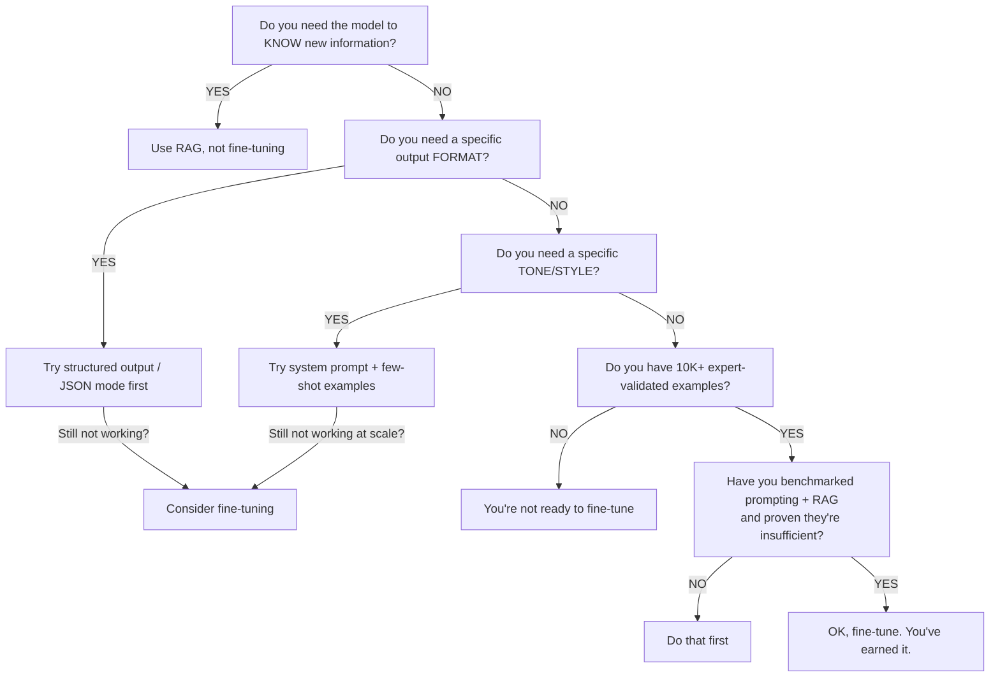

# The Fine-Tuning Trap

Picture this: your team just spent $47K fine-tuning Llama 2 on customer support data. Three months later, GPT-4 with a good system prompt beats it. Then GPT-4o comes out and crushes both. Your fine-tuned model is now a monument to sunk cost fallacy.

This happens all the time. And it's almost always avoidable.

---

**TL;DR:** 95% of fine-tuning projects are a waste of money. Not because fine-tuning doesn't work — it does, in very specific circumstances — but because most teams reach for it when prompting, few-shot examples, or RAG would work better, faster, and cheaper.

---

## The Pitch vs. The Reality

Fine-tuning sounds *amazing* in a pitch deck. "We'll train the model on OUR data! It'll be customized for OUR domain! It'll be a competitive moat!" Executives nod. Budgets get approved. ML engineers start curating datasets.

Then reality hits.

## Why Most Fine-Tuning Projects Fail

### The treadmill problem

Foundation models keep getting better — faster than you can fine-tune. [EclipseSource nailed this](https://eclipsesource.com/blogs/2025/05/08/why-not-fine-tune-llms/): "By the time you've completed your fine-tuning pipeline, a new model release may leapfrog your efforts entirely."

This isn't hypothetical. Teams that fine-tuned GPT-3.5 in early 2024 watched GPT-4o obliterate their specialized model six months later — at the *base* level, without any fine-tuning. Teams that fine-tuned Llama 2 watched Llama 3 make their work obsolete overnight.

You're running on a treadmill. The foundation model providers have billions of dollars and thousands of researchers. Your fine-tuning advantage has a half-life of 3–6 months.

### You can't "teach" an LLM new facts

This is the single most common misconception. Teams think: "We'll fine-tune on our internal docs and the model will *know* our product."

No. Fine-tuning adjusts model *behavior* — tone, format, style. It does NOT reliably inject *knowledge*. As [CBTW's analysis states](https://cbtw.tech/insights/when-to-fine-tune-llms): "Trying to 'teach' an LLM new facts through fine-tuning is unreliable."

If you need the model to know your docs → **use RAG**.
If you need the model to answer in a specific format → **use a system prompt**.
If you need the model to use your terminology → **use few-shot examples**.

### Catastrophic forgetting is real

Fine-tuning on narrow data can make models *worse* at everything else. [Machine Learning Mastery documents this](https://machinelearningmastery.com/5-problems-encountered-fine-tuning-llms-with-solutions/) as a top problem: "Catastrophic forgetting arises when an LLM being fine-tuned loses part of its previously learned language capabilities upon being exposed to new data."

You wanted a model that's great at medical coding. You got a model that's great at medical coding and now can't write a grammatically correct email.

### Data quality is harder than you think

A developer on [r/LocalLLaMA confessed](https://www.reddit.com/r/LocalLLaMA/comments/1ov7ogq/stop_finetuning_your_model_for_every_little_thing/): "I just wasted three weeks and a chunk of my compute budget trying to fine-tune a model" — only to realize their training data was the problem, not the model.

Fine-tuning requires:
- Hundreds to thousands of high-quality examples
- Consistent formatting
- Expert-validated outputs
- No contradictions in the dataset
- Proper train/test splits

Most teams don't have this. They have a messy Notion database and vibes.

## The Real Cost Breakdown

| Approach | Setup Cost | Time to Production | Ongoing Cost | Model Portability |
|---|---|---|---|---|
| Prompt engineering | $0 | Days | Per-token API costs | Switch models anytime |
| Few-shot examples | $0 | Days | Slightly higher token costs | Switch models anytime |
| RAG | $5–15K | 2–4 weeks | Infra + per-token | Switch models anytime |
| Fine-tuning (API) | $1–10K | 2–6 weeks | Per-token (dedicated) | Locked to provider |
| Fine-tuning (self-hosted) | $20–100K+ | 2–6 months | GPU hosting $2–10K/mo | Locked to model family |

The hidden cost nobody mentions: **fine-tuned models are the ultimate vendor lock-in.** You can't take an OpenAI fine-tuned model to Anthropic. You can't take your Llama fine-tune and run it on a different architecture. Every dollar you spend on fine-tuning is a dollar that locks you deeper into one provider or one model family.

## When Fine-Tuning ACTUALLY Makes Sense

Fine-tuning isn't *always* wrong. It earns its keep when:

1. **Consistent output format.** You need structured JSON output in a very specific schema, every single time, at high speed. Fine-tuning can hardwire this.
2. **Style/tone at scale.** You need every response to sound like your brand voice across millions of interactions. Few-shot works but burns tokens.
3. **Latency-critical narrow tasks.** You can fine-tune a small model (7B) to match a large model (70B+) on ONE specific task, then serve it 10x faster.
4. **You have 10K+ expert-validated examples.** Not scraped data. Not generated data. Human-expert-reviewed, gold-standard training pairs.
5. **You've already exhausted prompting and RAG.** And you have eval results proving they're not good enough.

As a [Hacker News discussion noted](https://news.ycombinator.com/item?id=44242737): fine-tuning works for "one hyper specific task" like hardware verification — not for general-purpose improvements.

## The Decision Tree

## The Espresso Machine Analogy

[EclipseSource's analogy](https://eclipsesource.com/blogs/2025/05/08/why-not-fine-tune-llms/) is perfect: Foundation models are like buying a world-class espresso machine. Most teams immediately disassemble it and start recalibrating the pressure valves (fine-tuning). Meanwhile, someone else plugs it in, picks good beans (prompting), and starts serving customers.

**Use the machine before you modify the machine.**

## The Bottom Line

The fine-tuning trap is seductive because it *feels* like real engineering work. Curating datasets, training runs, evaluating loss curves — it's intellectually satisfying. But satisfaction isn't ROI.

Before you spend a single dollar on fine-tuning, exhaust these in order:

1. Better prompts
2. Few-shot examples
3. System instructions
4. RAG with simple retrieval
5. Structured output modes

If all five fail, and you have the data to prove it, *then* fine-tune. Not before.

---

## Further Reading

- [Why NOT Fine-Tune LLMs](https://eclipsesource.com/blogs/2025/05/08/why-not-fine-tune-llms/) — EclipseSource's thorough breakdown of why most teams should resist the urge, with the espresso machine analogy.
- [When to Fine-Tune LLMs](https://cbtw.tech/insights/when-to-fine-tune-llms) — CBTW's balanced analysis of the narrow conditions where fine-tuning pays off.
- [5 Problems Encountered Fine-Tuning LLMs](https://machinelearningmastery.com/5-problems-encountered-fine-tuning-llms-with-solutions/) — Machine Learning Mastery covers catastrophic forgetting, data quality, and other common pitfalls.
- [Stop Fine-Tuning Your Model for Every Little Thing](https://www.reddit.com/r/LocalLLaMA/comments/1ov7ogq/stop_finetuning_your_model_for_every_little_thing/) — Community war stories from developers who learned the hard way.
- [Is Fine-Tuning Still Worth It?](https://www.kadoa.com/blog/is-fine-tuning-still-worth-it) — Kadoa's 2025 take on the rapidly shifting cost-benefit calculation.
