# Over-Engineering Your RAG Pipeline

You know the story. Your team spends three months building a RAG system with HyDE, query decomposition, reranking, and a shiny vector database. Then an intern beats your retrieval accuracy with Elasticsearch and a decent system prompt. It happens more often than anyone on AI Twitter wants to admit.

---

**TL;DR:** BM25 still wins on most enterprise workloads. Start with full-text search. Add complexity only when your eval suite *demands* it. Your vector database can wait.

---

## The Uncomfortable Truth

Most RAG implementations are over-engineered. The AI hype cycle has convinced teams they need a vector database, embedding models, rerankers, HyDE (Hypothetical Document Embeddings), query decomposition, parent-child chunking strategies, and agentic retrieval loops — all before they've tried the boring thing that's worked for 30 years: **full-text search**.

Here's what nobody putting "Advanced RAG Architecture" in their LinkedIn bio wants you to hear: **BM25 still wins on most real-world enterprise workloads.** Especially when your documents contain technical terms, error codes, product names, legal citations, or financial data — you know, the stuff businesses actually care about.

## When BM25 Crushes Vectors (And Why)

Jo Bergum from Vespa/Yahoo put it bluntly in a [2025 talk](https://interestingengineering.substack.com/p/from-bm25-to-agentic-rag-the-evolution): RAG is simply "augmenting the model with relevant context" — it **does not require embeddings**. He positioned BM25 as a "highly realistic and cost-effective solution" for reasoning-intensive retrieval at scale.

BM25 beats vectors when:

- **Your queries contain specific terms.** Error codes (`ECONNREFUSED`), product SKUs, legal case numbers, API endpoints. Vector embeddings smear these into "similar-ish" semantic space. BM25 nails them.
- **Your domain has jargon.** Medical codes, financial tickers, engineering specs. Embeddings trained on general corpora literally don't understand `ICD-10` or `CUSIP`.
- **You need explainability.** BM25 can tell you *why* a document matched — these terms, this frequency. Vector similarity is "trust me, cosine distance says so."
- **Your corpus is under 1M documents.** At this scale, BM25 on a single Elasticsearch node is faster, cheaper, and more accurate than any vector DB setup.

Or as one developer [put it perfectly](https://medium.com/@ThinkingLoop/when-to-ditch-your-vector-db-for-simple-bm25-b4f044f1076b): "You spun up a shiny new vector database, wired up embeddings, slapped 'semantic search' on the roadmap… and then realized your results are meh, your infra bill is weirdly high, and the old full-text search keeps quietly winning head-to-head tests."

GitHub itself found that [BM25 is generally faster and more computationally efficient](https://www.zenml.io/llmops-database/bm25-vs-vector-search-for-large-scale-code-repository-search) than vector search for large-scale code repository search. Let that sink in.

## The Cost of Complexity

Here's a realistic cost comparison for a 500K document corpus:

| Component | Simple RAG (BM25 + LLM) | "Advanced" RAG |
|---|---|---|
| Search infrastructure | Elasticsearch (~$200/mo) | Pinecone/Weaviate ($400–2,000/mo) |
| Embedding generation | $0 | $500–2,000/mo (API or GPU) |
| Reranker | $0 | $300–800/mo |
| Engineering time to build | 2–3 weeks | 2–4 months |
| Engineering time to maintain | ~4 hrs/week | ~20 hrs/week |
| Debugging "why did it retrieve that?" | Easy (term matching) | Good luck |
| **Total first-year cost** | **~$15K** | **~$80–150K** |

And here's the kicker: the accuracy difference is often **single digits**. Sometimes the simple system is *more* accurate because BM25 doesn't hallucinate relevance the way embeddings do with out-of-distribution queries.

## The RAG Complexity Ladder

Stop climbing until you can *measure* that the current rung isn't good enough.

```mermaid
graph TD
    A["🪜 Rung 1: Stuff the context window<br/>128K–1M tokens. If your corpus fits, just dump it in."] --> B
    B["🪜 Rung 2: BM25 / full-text search + LLM<br/>Elasticsearch, Typesense, SQLite FTS5. Handles 80% of use cases."] --> C
    C["🪜 Rung 3: Hybrid search (BM25 + vectors)<br/>When you genuinely need semantic AND keyword precision."] --> D
    D["🪜 Rung 4: Add reranking<br/>Only when eval proves top-k retrieval is the bottleneck."] --> E
    E["🪜 Rung 5: HyDE, query decomposition, agentic RAG<br/>You probably don't need this. If you do, you'll know."]
```

Seriously — Rung 1 catches more teams than you'd think. Modern LLMs have 128K–1M token windows. If your corpus fits, there's no retrieval problem to solve.

## Real Examples of Simplification Wins

**Perplexity AI** — one of the most successful RAG products on the planet — [reportedly favors traditional retrieval algorithms like BM25](https://www.reddit.com/r/LocalLLaMA/comments/1ds30l9/perplexity_seems_to_favor_the_traditional/) over pure embedding-based approaches. If the company *literally built on search* isn't going all-in on vectors, maybe you shouldn't either.

**Microsoft's own engineers** published "[Doing RAG? Vector Search Is Not Enough](https://techcommunity.microsoft.com/t5/microsoft-developer-community/doing-rag-vector-search-is-not-enough/ba-p/4161073)" — arguing that hybrid retrieval with BM25 is essential and that pure vector approaches miss critical exact-match cases.

## The Decision Framework

Before you reach for a vector database, ask yourself:

1. **Have I tried putting the whole corpus in the context window?** You'd be surprised how often this just works.
2. **Have I tried BM25 with a good chunking strategy?** Paragraph-level chunks + BM25 is shockingly effective.
3. **Do I have an eval suite that proves retrieval is my bottleneck?** Not vibes. Numbers.
4. **Is my problem actually a retrieval problem?** Often it's a chunking problem, a prompt problem, or a "the LLM is just bad at this" problem.

If you answered "no" to any of these, you don't need a vector database yet. You need to do the boring work first.

## The Bottom Line

The best RAG system is the simplest one that meets your accuracy requirements. Every component you add is a component that can break, drift, cost money, and confuse the next engineer who inherits your codebase.

Start simple. Measure. Add complexity only when the numbers demand it. Your future self (and your AWS bill) will thank you.

---

## Further Reading

- [From BM25 to Agentic RAG](https://interestingengineering.substack.com/p/from-bm25-to-agentic-rag-the-evolution) — Jo Bergum's evolution of retrieval, from keyword search to agentic loops, with a clear case for starting simple.
- [When to Ditch Your Vector DB for Simple BM25](https://medium.com/@ThinkingLoop/when-to-ditch-your-vector-db-for-simple-bm25-b4f044f1076b) — A practical walkthrough of when vector search actively hurts your results.
- [BM25 vs. Vector Search for Code Repositories](https://www.zenml.io/llmops-database/bm25-vs-vector-search-for-large-scale-code-repository-search) — GitHub's experience at scale, via ZenML.
- [Doing RAG? Vector Search Is Not Enough](https://techcommunity.microsoft.com/t5/microsoft-developer-community/doing-rag-vector-search-is-not-enough/ba-p/4161073) — Microsoft's argument for hybrid retrieval over pure vector approaches.
- [Hybrid RAG in the Real World](https://community.netapp.com/t5/Tech-ONTAP-Blogs/Hybrid-RAG-in-the-Real-World-Graphs-BM25-and-the-End-of-Black-Box-Retrieval/ba-p/464834) — NetApp's deep dive into combining graphs, BM25, and vectors for production systems.
