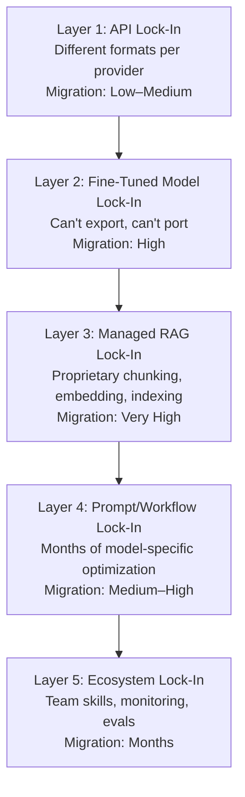

# AI Vendor Lock-In

You built your entire product on Azure OpenAI. Then they retired your model variant in your region. No replacement available. No migration path. Your production system had a countdown clock to death.

Think it can't happen to you? It already has — to dozens of teams in 2025.

---

**TL;DR:** Every major AI provider is designing their platform to lock you in. An abstraction layer takes a day to implement and covers 80% of switching costs. Build one before you need one, or pay dearly when you do.

---

## You're Already Locked In (You Just Don't Know It Yet)

Every major AI provider is designing their systems to make leaving painful. This isn't a conspiracy theory — it's a business strategy, and they're not even subtle about it.

[Forrester's 2025 analysis](https://www.computerweekly.com/news/366628293/Be-wary-of-enterprise-software-providers-AI) is blunt: large enterprise vendors are "keenly aware of the monumental organizational effort associated with switching vendors" and are using AI to **deepen platform lock-in**, often timing pricing increases to contract renewals.

## The Five Layers of AI Lock-In

Most teams think about lock-in as an API problem. It goes much deeper than that.



### Layer 1: API lock-in (the obvious one)
Every provider has a different API format. OpenAI's chat completions API ≠ Anthropic's messages API ≠ Google's generateContent API. Your code is coupled to one provider's schema.

**Migration cost**: Low-medium. Abstraction layers like LiteLLM and OpenRouter exist. But they don't cover everything — function calling, structured outputs, vision, and tool use all have provider-specific quirks.

### Layer 2: Fine-tuned model lock-in (the expensive one)
Fine-tuned an OpenAI model? That model lives in OpenAI. You can't export it. You can't run it elsewhere. Your training data went in; nothing portable comes out.

**Migration cost**: High. You'd need to re-fine-tune on a different provider from scratch — if you even kept your training data in a reusable format.

### Layer 3: Managed RAG lock-in (the sneaky one)
Azure AI Search, Amazon Bedrock Knowledge Bases, Google Vertex AI Search — they all offer "managed RAG" where you upload docs and they handle chunking, embedding, indexing, and retrieval. Convenient! Also: completely proprietary.

**Migration cost**: Very high. Your chunks, embeddings, and index structures are in a proprietary format. Rebuilding means re-ingesting everything.

### Layer 4: Prompt/workflow lock-in (the invisible one)
The most dangerous lock-in is in your prompts. Months of prompt engineering, optimized for one model's quirks, tokenization, and behavior patterns. Switch models and your carefully tuned prompts perform differently — sometimes dramatically worse.

**Migration cost**: Medium-high. Every prompt needs retesting and likely rewriting. If you have 50+ prompts in production, that's weeks of work.

### Layer 5: Ecosystem lock-in (the organizational one)
Your team knows the OpenAI SDK. Your monitoring uses Azure AI metrics. Your evals are built around GPT-4's behavior. Your entire workflow assumes one provider.

**Migration cost**: Months of retraining, retooling, and rebuilding institutional knowledge.

## Horror Stories From 2025

### Azure model retirement: the region trap
Azure announced retirement dates for older GPT-4 "0613" variants with a June 2025 deadline. Teams in Switzerland North discovered [there was no in-region replacement available](https://learn.microsoft.com/en-us/azure/ai-foundry/openai/concepts/models) — and Azure wasn't budging. Production systems that required data residency in that region were simply stuck.

### OpenAI's June 2025 outage: single point of failure
On June 10, 2025, OpenAI had a [global disruption affecting ChatGPT and API endpoints](https://www.theverge.com/news/684141/openai-chatgpt-sora-outage-issues-june-2025). Hours of elevated errors and latency. Zendesk's AI features broke. Perplexity posted a partial outage. Every product built on a single provider experienced the same failure simultaneously.

### GPT-4o API retirement
In late 2025, OpenAI announced plans to retire GPT-4o API access in 2026, forcing an "immediate migration strategy" for dependent businesses. [The Silicon Review called vendor lock-in](https://thesiliconreview.com/2025/11/the-silicon-reviewnov-2025openai-retires-gpt-4o-api-access) with any single AI provider "an existential risk."

### Builder.ai: when your vendor dies
[Builder.ai](https://tryfusion.ai/blog/the-2025-ai-vendor-lock-in-trap-and-how-to-build-your-exit), once backed by Microsoft and valued over $1B, entered insolvency. Every customer built on their platform had to scramble. This isn't just a big-vendor risk. Startups fail. APIs get discontinued. The AI landscape is littered with dead products.

### The pricing whiplash
Google cut Gemini 1.5 Pro API prices by ~50–64%. OpenAI launched 4o-mini at $0.15/1M input tokens. If you were locked into one provider with no abstraction layer, you couldn't arbitrage these price drops. Teams with multi-provider setups [saved 40–60%](https://tryfusion.ai/blog/the-2025-ai-vendor-lock-in-trap-and-how-to-build-your-exit) by routing to the cheapest adequate model.

## The Abstraction Strategy (What Actually Works)

### Level 1: API abstraction layer
Use LiteLLM, OpenRouter, or a custom adapter to normalize API calls. This takes a day to implement and covers 80% of switching costs.

```python
# Instead of this (locked in):
from openai import OpenAI
client = OpenAI()
response = client.chat.completions.create(model="gpt-4o", ...)

# Do this (portable):
from litellm import completion
response = completion(model="gpt-4o", ...)  # or "claude-3-opus" or "gemini-pro"
```

### Level 2: Prompt versioning per model
Maintain prompt variants tested against multiple models. When you switch, you switch to a pre-tested prompt — not a hope and a prayer.

### Level 3: Own your data pipeline
Never let a vendor own your document processing. Chunk, embed, and index yourself. Use open formats. Store raw documents alongside processed versions.

### Level 4: Model-agnostic eval suite
Build evals that test *your requirements*, not *model behavior*. When a new model comes out, run your evals. If it passes, switch. If it doesn't, don't.

### Level 5: Multi-provider routing
Route requests to different providers based on cost, latency, and capability. Use the best model for each task. Fall back automatically on outages.

## When Lock-In Is Actually Fine

Not all lock-in is bad. Accept it when:

- **You're pre-product-market-fit.** Speed matters more than portability. Pick one provider and ship.
- **The vendor's unique feature is your core differentiation.** If OpenAI's specific function calling behavior is what makes your product work, own that dependency intentionally.
- **The switching cost is low relative to your scale.** If you're spending $500/mo on AI APIs, the abstraction layer costs more in engineering time than the lock-in risk.
- **You have a contractual guarantee.** Enterprise agreements with SLAs, price locks, and migration support.

## The Self-Audit Checklist

Ask yourself today:

- [ ] Can I switch AI providers within 2 weeks without rewriting core business logic?
- [ ] Do I have my training/fine-tuning data in a provider-independent format?
- [ ] Have I tested my prompts against at least 2 different model families?
- [ ] Do I own my document processing pipeline, or does my vendor?
- [ ] Do I have a fallback provider configured for outages?
- [ ] Do I know my contract's renewal terms and price escalation clauses?

If you checked fewer than 3: you're locked in. Start planning your exit strategy.

## The Bottom Line

The AI vendor landscape is moving faster than any technology market in history. Models get deprecated. Providers have outages. Prices swing wildly. Companies go bankrupt.

Building on a single provider with no abstraction is like building your house on a foundation that the landlord can change without notice. It might be fine. It might be fine for years. But when it's not fine, it's *really* not fine.

Invest a little in portability now, or invest a lot in migration later. Your choice.

---

## Further Reading

- [The 2025 AI Vendor Lock-In Trap](https://tryfusion.ai/blog/the-2025-ai-vendor-lock-in-trap-and-how-to-build-your-exit) — TryFusion's comprehensive guide to the lock-in landscape and escape strategies.
- [Be Wary of Enterprise Software Providers' AI](https://www.computerweekly.com/news/366628293/Be-wary-of-enterprise-software-providers-AI) — Forrester's analysis of how vendors weaponize AI for deeper lock-in, via Computer Weekly.
- [AI Vendor Lock-In: The Hidden Costs](https://www.cloudzero.com/blog/ai-vendor-lock-in/) — CloudZero breaks down the financial impact of vendor dependency.
- [OpenAI Retires GPT-4o API Access](https://thesiliconreview.com/2025/11/the-silicon-reviewnov-2025openai-retires-gpt-4o-api-access) — A real-world case study of what forced migration looks like.
- [Vendor Lock-In Prevention for AI](https://www.truefoundry.com/blog/vendor-lock-in-prevention) — TrueFoundry's practical playbook for building portable AI systems.
- [The Hidden Costs of Vendor Lock-In](https://www.stack-ai.com/insights/the-hidden-costs-of-vendor-lock-in-for-ai-infrastructure) — Stack AI's analysis of the full cost spectrum beyond just API fees.
