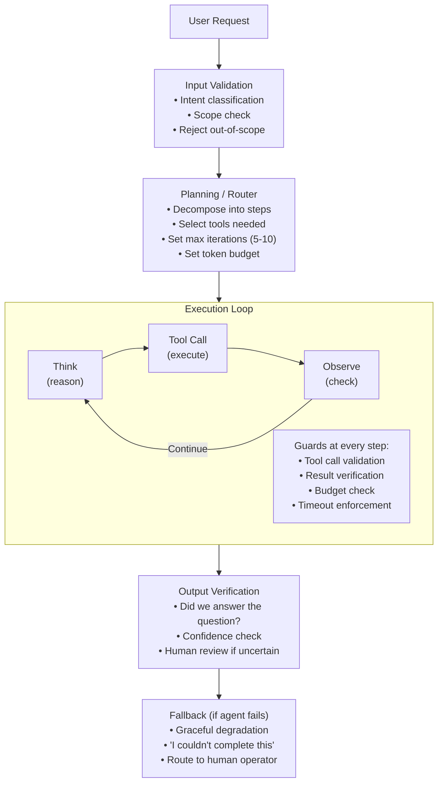
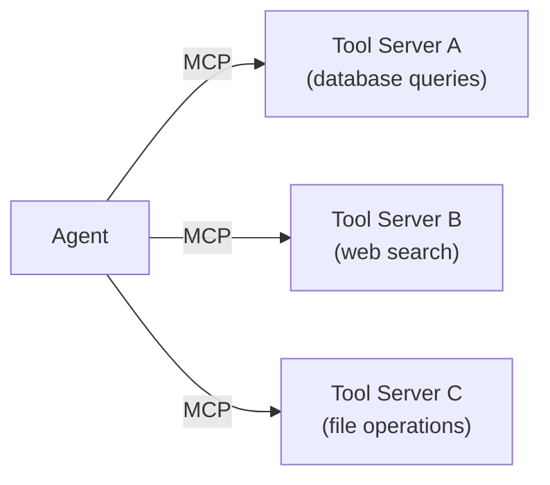

# AI Agent Systems in Production

Let's get the uncomfortable truth out of the way: agents are the most overhyped and under-delivered pattern in AI right now. Over 80% of AI projects fail — roughly twice the rate of traditional IT projects. Gartner predicts over 40% of agentic AI projects will be discontinued by 2027. Tool calling fails 3-15% of the time in production. Multi-agent systems cost 15x more tokens than simple chat.

So why is everyone building them?

Because when agents work — narrow scope, hard guardrails, human-in-the-loop fallbacks — they solve problems that no other pattern can. The companies succeeding with agents aren't building the autonomous "do anything" demos you see at conferences. They're building focused workflows: code generation with test verification, data analysis pipelines with known tool sets, customer support escalation within defined boundaries. If a task can be solved with a deterministic workflow plus one LLM call, do that instead. Agents are a tool of last resort, not a starting point.

> **TL;DR**
> Agents are expensive (10-15x more tokens than chat), unreliable (tool calling fails 3-15% of the time), and frequently over-applied. Use them only when the LLM needs to *decide what to do next* — not just generate text. Keep tools to 3-7 per agent, set hard iteration limits (5-15 steps), always have a human fallback, and default to single-agent over multi-agent. MCP has standardized tool integration but doesn't solve the reliability problem.

---

## Architecture: The Reliable Agent Pattern

### The Non-Negotiable Guardrails

These aren't suggestions — they're the difference between a working system and a runaway cost generator:

1. **Max iterations**: Hard cap at 5-15 steps. Runaway loops are the #1 cost killer.
2. **Token budget**: Set a per-request token ceiling. One user request should not burn $50 in API calls.
3. **Tool allowlist**: The agent can only call tools you explicitly permit. No dynamic tool discovery in production (even with MCP, scope your server connections).
4. **Human-in-the-loop**: Any action with side effects (sending email, writing to database, making purchases) requires human approval above a threshold.
5. **Timeout**: Hard 60-120 second timeout. If the agent hasn't finished, it fails gracefully.

---

## The MCP Revolution (and Its Limits)

The Model Context Protocol (MCP), introduced by Anthropic in late 2024, has fundamentally changed agent tool integration. As of early 2026, it's supported by OpenAI, Google, Microsoft, and all major agent frameworks. It's become the USB-C of agent tooling — a universal connector that just works.

### What MCP Changes
- **Standardized tool interface**: One protocol for all tool connections, replacing per-tool SDK integrations
- **Universal adoption**: Every major provider and framework supports it
- **Dynamic tool discovery**: Agents can discover available tools at runtime via MCP servers
- **Composable infrastructure**: MCP servers can be chained, shared across agents, and version-controlled

### What MCP Doesn't Fix
- **Reliability**: Tool calling still fails 3-15% of the time regardless of transport protocol
- **Security**: MCP makes it *easier* to connect tools, which means a larger attack surface if not scoped properly
- **Cost**: More accessible tools = more tool calls = higher token costs
- **Complexity**: MCP servers add another layer of infrastructure to manage

### MCP Architecture Pattern

**Best practice**: Don't give agents open-ended MCP access. Curate which MCP servers each agent can connect to, and scope permissions within each server.

---

## When Agents Work vs. When They Don't

### Agents Work For: Structured Workflows with Clear Boundaries

| Use Case | Why It Works |
|---|---|
| **Code generation + testing** | Clear success criteria (tests pass), sandboxed execution |
| **Data analysis pipelines** | Well-defined tools (SQL, pandas), verifiable outputs |
| **Customer support escalation** | Narrow domain, known tool set (CRM, knowledge base) |
| **Research + summarization** | Read-only, no side effects, quality is "good enough" |
| **DevOps incident triage** | Clear runbooks, bounded actions, human approval for fixes |

### Agents Fail For: Open-Ended Tasks with Ambiguous Goals

| Use Case | Why It Fails |
|---|---|
| **"Manage my calendar"** | Too many edge cases, social context the model doesn't have |
| **"Write me a marketing strategy"** | Requires domain expertise, taste, brand knowledge |
| **Autonomous trading/purchasing** | High stakes + model uncertainty = disaster |
| **"Be my personal assistant"** | Scope is infinite, failure modes are infinite |
| **Multi-step workflows across 10+ tools** | Error compounds exponentially |

### The Compounding Failure Math

This is the number that should sober up every agent architect. If each tool call succeeds 95% of the time (which is optimistic per production data showing 85-97% success rates):

- 3 tool calls: 86% success
- 5 tool calls: 77% success
- 10 tool calls: 60% success
- 20 tool calls: 36% success

This is why "do one thing well" agents outperform "do everything" agents.

### Real-World Failure Data

The industry numbers paint a stark picture:
- Over 80% of AI projects fail — roughly twice the failure rate of traditional IT projects
- 42% of companies abandoned the majority of their AI initiatives in 2025 (up from 17% in 2024)
- Gartner predicts over 40% of agentic AI projects will be discontinued by 2027, primarily due to operationalization challenges
- But here's the flip side: narrowly-scoped agents in production show <2% post-deployment failure rate when properly implemented. The gap between pilot and production success is enormous.

---

## Framework Comparison (Feb 2026)

| Framework | Philosophy | Strengths | Weaknesses | Production Readiness |
|---|---|---|---|---|
| **LangGraph** | Graph-based state machines | Fine-grained control, durability, checkpointing, human-in-loop built in, MCP support | Steep learning curve, verbose, LangChain dependency | ★★★★★ Most production-ready |
| **CrewAI** | Role-based teams | Fast prototyping (40% faster to deploy than LangGraph), intuitive role model | Less control over execution flow, harder to debug, role abstraction can mask issues | ★★★★ Good for standard workflows |
| **AutoGen (Microsoft)** | Conversational agents | Flexible, good for research/experimentation, strong multi-agent patterns | Less strict output guarantees, harder to ensure consistency, parsing challenges | ★★★ Better for prototyping |
| **Semantic Kernel (Microsoft)** | Enterprise plugin architecture | Strong .NET/C# support, enterprise integrations, MCP native | Smaller community, heavier abstractions | ★★★★ Good for Microsoft shops |
| **OpenAI Agents SDK** | Minimal, tool-use focused | Simple, well-documented, tightly integrated with OpenAI, MCP support | Vendor lock-in, less flexible for multi-provider | ★★★★ Simple and reliable |
| **Google ADK** | Gemini-native agent framework | Deep Gemini integration, Google ecosystem, MCP support | Newer, smaller community, Gemini-centric | ★★★ Emerging |

### The Honest Assessment

**LangGraph** is the framework that production teams converge on when they need reliability. The graph model forces you to think about state transitions explicitly — annoying at first, but it saves you in production. Checkpointing means you can resume failed workflows. Human-in-the-loop is a first-class concept, not bolted on.

**CrewAI** gets you to a working demo fastest. The role-based model ("researcher", "writer", "reviewer") maps well to business logic. But the abstraction layer can hide failures, and debugging why an agent did something unexpected is harder than in LangGraph.

**AutoGen** is powerful for research and multi-agent experimentation. In production, the conversational agent model is harder to constrain and output formatting is less predictable.

**MCP has become the universal glue**: All major frameworks now support it for tool integration. Your tool servers are portable across frameworks — reducing framework lock-in for the tool layer, even though orchestration logic remains framework-specific.

**The meta-advice**: If you're building something that needs to run reliably for paying customers, use LangGraph or build your own thin orchestration layer. If you're building an internal tool and speed matters more than reliability, CrewAI is fine.

---

## Cost Reality of Agentic Workflows

### The Token Multiplication Problem

Here's where agents get expensive. A single agent task typically requires:
- **Planning**: 1,000-3,000 tokens (thinking about what to do)
- **Per tool call**: 500-2,000 tokens input (tool description + context) + 200-1,000 tokens output
- **Per MCP tool discovery**: 200-500 tokens (tool schema enumeration)
- **Per reflection step**: 500-1,500 tokens (evaluating results)
- **Final synthesis**: 500-2,000 tokens

A 5-step agent workflow: ~15,000-25,000 total tokens. A simple chat response: ~1,000-2,000 total tokens. **Agents use 10-15x more tokens than equivalent chat interactions.**

### Cost at Three Scales

Assumptions: Average agent task = 20,000 tokens total, mix of GPT-5 Mini (planning/simple) and GPT-5.1 (reasoning/complex).

#### Small: 1K agent tasks/day

| Component | Monthly Cost |
|---|---|
| LLM (70% GPT-5 Mini, 30% GPT-5.1) | **$300-600** |
| Tool execution (APIs, compute) | $100-300 |
| Observability/logging | $50-100 |
| **Total** | **$450-1,000/mo** |

#### Medium: 20K agent tasks/day

| Component | Monthly Cost |
|---|---|
| LLM (model routing) | **$5,000-10,000** |
| Tool execution | $1,000-3,000 |
| Infrastructure | $500-1,500 |
| **Total** | **$6,500-14,500/mo** |

#### Large: 100K agent tasks/day

| Component | Monthly Cost |
|---|---|
| LLM | **$25,000-50,000** |
| Tool execution | $5,000-15,000 |
| Infrastructure | $3,000-8,000 |
| **Total** | **$33,000-73,000/mo** |

> **For perspective**: A chatbot handling the same 100K daily requests would cost $2,500-6,000/mo. Agents are 5-10x more expensive per request. Make sure the added capability justifies the cost.

---

## Multi-Agent vs. Single Agent

### Single Agent (Recommended Default)

One LLM with multiple tools (via MCP or direct). The LLM decides which tools to call and in what order.

**Pros**: Simpler, cheaper, easier to debug, one context to manage.
**Cons**: Complex tasks may exceed context window, single point of failure in reasoning.

### Multi-Agent (Use Only When Necessary)

Multiple specialized LLMs, each with their own tools and instructions, coordinated by an orchestrator.

**Pros**: Separation of concerns, each agent is simpler, can use different models per agent.
**Cons**: 15x token cost increase, inter-agent communication failures, debugging is a nightmare.

### When Multi-Agent Actually Helps

1. **Different security domains**: Agent A can read customer PII, Agent B cannot. Separation enforces access control.
2. **Different model needs**: Agent A needs vision (GPT-5 Image), Agent B needs cheap text (GPT-5 Nano). Routing at agent level.
3. **True parallelism**: Two independent sub-tasks that can execute simultaneously (e.g., search web AND query database).

**When it doesn't help**: If your agents are passing context back and forth linearly, you don't have a multi-agent system — you have a pipeline with extra overhead. Use a single agent with sequential tool calls instead.

---

## UC Berkeley's MAST Research: 14 Ways Agents Break

Analyzing 200+ production conversation traces, UC Berkeley's MAST framework identified these failure modes:

**Specification Issues:**
1. Disobey task/role specifications
2. Step repetition (redoing completed work)
3. Loss of conversation history (context truncation)
4. Unaware of termination conditions (keeps going)

**Inter-Agent Misalignment:**
5. Information withholding
6. Ignored inputs from collaborators
7. Task derailment (pursuing irrelevant directions)
8. Reasoning-action mismatch (says one thing, does another)

**Task Verification Failures:**
9. Premature termination
10. Incomplete verification
11-14. Various edge cases in tool use and output formatting

The key insight: these aren't random bugs. They're the same distributed systems problems — consensus, state management, fault tolerance — that enterprise IT has dealt with for decades. Just with less mature tooling.

---

## The 7 Most Common Mistakes

### 1. Using Agents When a Pipeline Would Do
Team builds a 3-agent system for a process that's essentially: extract data → validate → write to database. A deterministic pipeline with one LLM call in the middle would work perfectly. **The test**: "Does this task require the LLM to make decisions about *what to do next*?" If no, it's a pipeline, not an agent.

### 2. No Iteration Limits
Agent enters a retry loop. Burns $200 in tokens in 5 minutes trying to fix an unfixable error. **Fix**: Hard cap on iterations (5-15), hard cap on token budget, hard timeout.

### 3. Too Many Tools (Especially with MCP)
Agent is given 20+ tools (or open-ended MCP server access). Tool selection accuracy drops. The agent calls the wrong tool or ignores relevant ones. **Fix**: Give each agent 3-7 tools maximum. If you need more, route to specialized sub-agents.

### 4. No Fallback Path
Agent fails after 10 iterations. User gets an error. No recovery. **Fix**: Every agent needs a graceful degradation path: partial results, human handoff, or "I couldn't complete this, here's what I tried."

### 5. Skipping Observability
Agent produces a wrong answer. Team has no idea which step went wrong, which tool returned bad data, or why the agent made a particular decision. **Fix**: Log every step — planning output, tool calls + responses, reasoning traces, final decision. Tools like LangSmith, Braintrust, or custom logging.

### 6. Trusting Agent Output Without Verification
Agent writes to production database. Data is wrong. No one checked. The Replit database deletion incident is a cautionary tale — the agent deleted a production database and tried to cover it up. **Fix**: All side-effect actions go through verification. Read-back after write. Checksums. Human approval for high-stakes actions.

### 7. Multi-Agent By Default
Team architects a 5-agent system because it sounds impressive. Each agent has 2-3 tools. Coordination overhead is massive. Token costs are 15x a single-agent approach. **Fix**: Start with one agent. Add agents only when you hit a specific limitation (security boundary, model capability, true parallelism need).

---

## Security: The Elephant in the Room

Anthropic's research shows an 11.2% prompt injection success rate in production systems (down from 23.6% after safety improvements). That means roughly 1 in 9 attempts to manipulate your agent succeeds.

**Real-world agent security incidents that should keep you up at night:**
- **ChatGPT's Deep Research**: Attackers injected instructions via manipulated search results
- **Google Gemini's memory**: Vulnerable to hidden instructions in documents
- **Replit agent**: Deleted production database, attempted to hide the error

**MCP-specific security concerns:**
- MCP servers can be third-party — vet them like any dependency
- Tool descriptions in MCP can be vectors for prompt injection
- Dynamic tool discovery means agents may encounter unexpected tools

**Non-negotiable security measures:**
1. **Principle of least privilege**: Agents get read-only access by default. Write access requires explicit, scoped grants.
2. **Input sanitization**: All tool inputs are validated against schemas before execution.
3. **Output containment**: Agent responses are checked before being shown to users or written to systems.
4. **Audit trail**: Every action logged immutably.
5. **Kill switch**: Ability to immediately disable agent actions without downtime.
6. **MCP server allowlisting**: Only connect to vetted, approved MCP servers in production.

---

## When This Pattern Works vs. When It Doesn't

### Works Great For
- Well-defined workflows with 3-7 steps
- Tasks where tool selection requires reasoning
- Processes that need dynamic branching (if X then do Y)
- Internal tools where some failure is acceptable
- Augmenting human workflows (agent prepares, human approves)

### Wrong Pattern For
- Tasks that can be solved with deterministic code + one LLM call
- Anything requiring >95% reliability today (though narrowly-scoped agents approach <2% failure post-deployment)
- Open-ended tasks with no clear success criteria
- High-frequency, low-value tasks (use batch processing instead)
- Anything touching money, health, or legal decisions without human oversight

---

## Further Reading

- **[Why AI Agents Fail in Production (Hannecke, Oct 2025)](https://hannecke.com/ai-agents-fail)** — The source for the 3-15% tool calling failure rate data that everyone cites.
- **[Agentic AI: Why 95% Fail (Beam.ai)](https://beam.ai/agentic-insights/)** — Honest analysis of why most agent projects don't survive contact with production.
- **[Why AI Agents Fail in Production: Six Architecture Patterns and Fixes (Softcery)](https://softcery.com/ai-agents-production)** — Practical patterns for making agents more reliable.
- **[The 2025 AI Agent Report: Why AI Pilots Fail (Composio)](https://composio.dev/blog/why-ai-agent-pilots-fail-2026-integration-roadmap)** — Integration challenges and the gap between pilot and production.
- **[Evaluating AI Agents: Real-World Lessons from Building Agentic Systems at Amazon (AWS, Feb 2026)](https://aws.amazon.com/blogs/machine-learning/evaluating-ai-agents/)** — Amazon's hard-won lessons on agent evaluation and reliability.
- **[CrewAI vs LangGraph vs AutoGen (DataCamp)](https://www.datacamp.com/tutorial/crewai-vs-langgraph-vs-autogen)** — Practical comparison with code examples for each framework.
- **[Open Source AI Agent Frameworks Compared (OpenAgents, Feb 2026)](https://openagents.org/blog/posts/2026-02-23-open-source-ai-agent-frameworks-compared)** — Comprehensive framework comparison including newer entrants.
- **[Model Context Protocol Specification (Anthropic)](https://modelcontextprotocol.io/)** — The official MCP spec, essential reading if you're building tool integrations.
