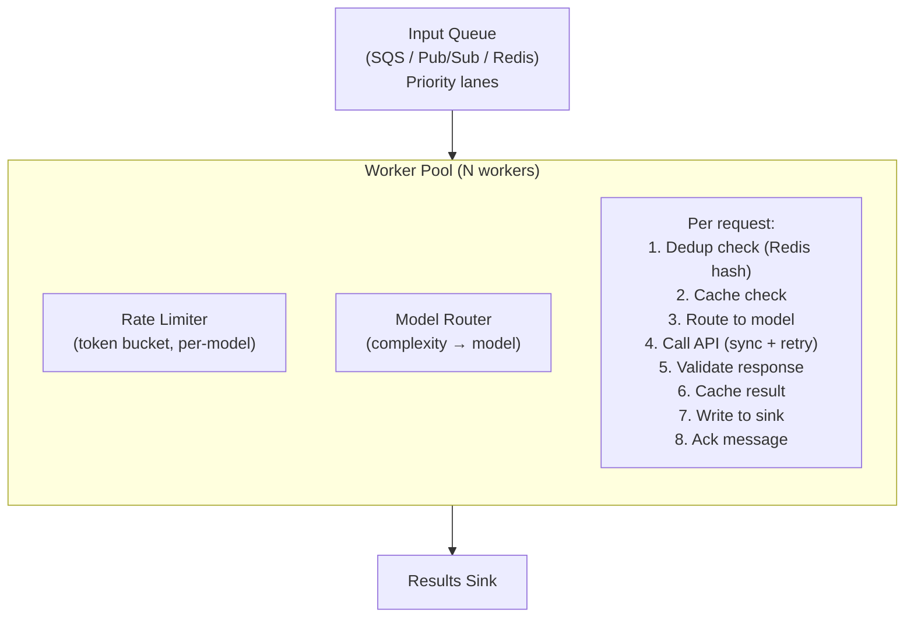
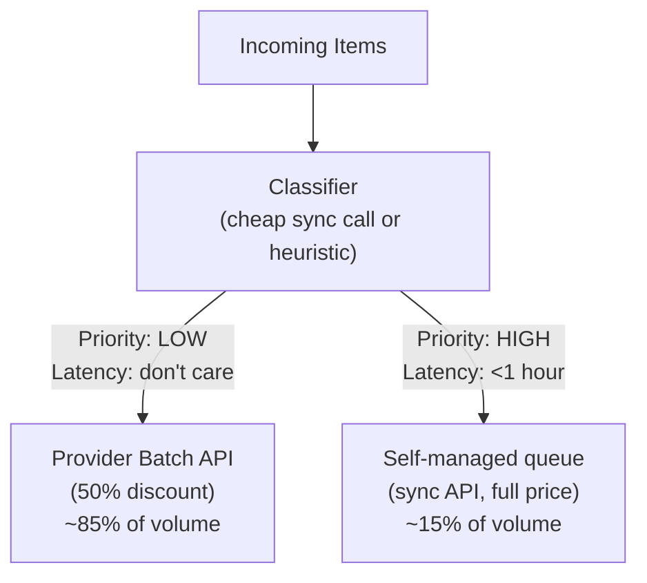
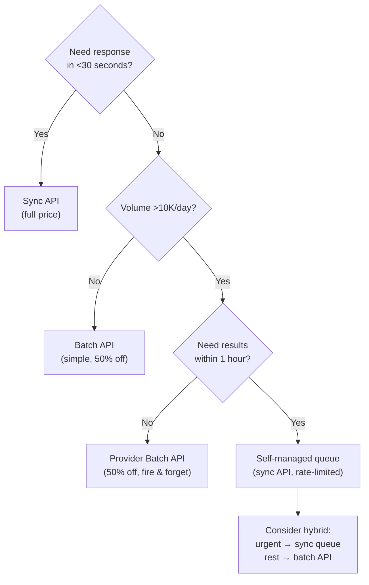

# Batch Processing with LLMs

Here's a scenario that plays out at every growing AI company: you're running 5M classification calls a month through the synchronous API, paying full price, and one day an engineer asks, "wait — doesn't OpenAI have a batch mode?"

Yes. And so does everyone else. Every major LLM provider now offers batch APIs with a 50% discount. But the discount is only the beginning. The real savings come from the architecture *around* it: deduplication (10-30% of inputs are often duplicates), model routing (send 80% of items to cheap models), caching, and failure isolation. A well-built batch pipeline processing 10M items/month typically costs 25-40% of a naive synchronous approach — not just 50%.

This guide covers the production architectures, failure patterns, and cost math that vendor docs won't tell you.

> **TL;DR**
> Every major provider offers 50% off for batch: OpenAI, Anthropic, Google Vertex AI, AWS Bedrock. If your workload doesn't need sub-second responses, you're burning money on synchronous calls. But the real wins come from stacking optimizations: model routing (10-20x on cheap items), batch discount (2x), dedup (10-30%), caching (10-20%), and prompt optimization (20-50% token reduction). Combined, a well-architected pipeline costs 25-40% of the naive approach.

---

## The Landscape: Every Provider Offers 50% Off (Feb 2026)

| Provider | Batch Discount | Max Wait | Max Batch Size | Supported Endpoints | Key Limitation |
|---|---|---|---|---|---|
| **OpenAI** | 50% off all tokens | 24h | 50K requests or 200MB JSONL | Chat, Responses, Embeddings, Moderations, Images | Single model per file |
| **Anthropic** | 50% off all tokens | 24h | 100K requests | Messages API | No streaming in batch |
| **Google Vertex AI** | 50% off all tokens | 24h (typical) | BigQuery/GCS input | Gemini 2.5 Pro/Flash, implicit caching included | Must use GCS/BigQuery I/O |
| **AWS Bedrock** | 50% (Flex tier) | 24h | S3-based I/O | Claude, Llama, Titan, Mistral | Regional pricing varies |
| **Azure OpenAI** | 50% (Global Batch) | 24h | Same as OpenAI | Same as OpenAI | Limited region availability |

### Actual Model Pricing: Batch vs Sync (per 1M tokens, Feb 2026)

| Model | Sync Input | Sync Output | **Batch Input** | **Batch Output** |
|---|---|---|---|---|
| GPT-4.1 | $2.00 | $8.00 | **$1.00** | **$4.00** |
| GPT-4.1-mini | $0.40 | $1.60 | **$0.20** | **$0.80** |
| GPT-4.1-nano | $0.10 | $0.40 | **$0.05** | **$0.20** |
| GPT-5-mini | $0.25 | $2.00 | **$0.125** | **$1.00** |
| Claude Sonnet 4 | $3.00 | $15.00 | **$1.50** | **$7.50** |
| Claude Haiku 4.5 | $1.00 | $5.00 | **$0.50** | **$2.50** |
| Claude Opus 4.5 | $5.00 | $25.00 | **$2.50** | **$12.50** |
| Gemini 2.5 Flash | $0.15 | $0.60 | **$0.075** | **$0.30** |
| Gemini 2.5 Pro | $1.25 | $10.00 | **$0.625** | **$5.00** |

**A stacking trick worth knowing**: Anthropic's batch discount stacks with prompt caching. Cache hits at $0.10/MTok for Haiku 4.5 become $0.05/MTok in batch mode. This is the cheapest way to run repetitive prompts at scale.

---

## Architecture: Production Batch Pipeline

There are two fundamentally different approaches, and most production systems combine both.

### Approach 1: Provider Batch API (Submit-and-Wait)

Best for bulk workloads where 1-24 hour latency is acceptable.

```mermaid
flowchart LR
    subgraph Input
        DS["Data Source<br/>(S3 / DB / Stream)"]
    end

    subgraph Assemble["Batch Assembler"]
        A1["Partition items"]
        A2["Dedup by hash"]
        A3["Format JSONL"]
        A4["Budget gate"]
    end

    subgraph Provider["Provider Batch API"]
        P1["OpenAI / Anthropic<br/>Vertex AI / Bedrock"]
    end

    subgraph Poll["Completion Poller"]
        PO1["Exponential backoff<br/>(60s → 300s → 600s)"]
        PO2["Timeout alert at 20h"]
    end

    subgraph Parse["Result Parser"]
        PA1["Validate JSON"]
        PA2["Match by custom_id"]
        PA3["Schema check"]
    end

    subgraph Failures["Failure Router"]
        F1["Retry batch (2x)"]
        F2["Sync fallback"]
        F3["Dead letter queue"]
    end

    subgraph Sink
        S1["DB upsert"]
        S2["S3 parquet"]
        S3["Downstream API"]
    end

    DS --> Assemble --> Provider --> Poll --> Parse
    Parse --> Sink
    Parse --> Failures
```



### Approach 2: Self-Managed Queue (Rate-Limited Sync Calls)

Best when you need control over timing, mixed-model routing, or sub-hour latency.



### Hybrid: The Production Sweet Spot

Most teams at scale use **both approaches simultaneously**:



This hybrid typically achieves 40-45% overall savings vs. all-synchronous.

---

## Error Handling: The Patterns That Actually Work

Batch processing fails in ways synchronous doesn't. Here's what you'll run into and what to do about it.

### Failure Taxonomy

| Failure Type | Frequency | Example | Correct Response |
|---|---|---|---|
| **Transient API error** | 5-15% of batches | 500, 503, rate limit | Retry entire batch (exponential backoff) |
| **Individual request error** | 1-5% of items | Content policy, malformed input | Extract failed items, retry individually |
| **Timeout/Expiry** | <1% of batches | Batch exceeds 24h window | Resubmit; investigate if recurring |
| **Partial results** | 2-8% of batches | 95% succeed, 5% fail | Parse successes, retry failures separately |
| **Silent corruption** | <0.1% | Valid JSON but wrong/empty content | Schema validation + sampling QA |
| **Budget exceeded** | Operator error | Runaway job hits spend limit | Pre-flight cost estimation + hard caps |

### The Three-Strike Retry Pattern

The logic: **Batch → Batch → Sync → Dead Letter.** Most failures are transient, so batch retries cost 50% less and usually work. Remaining failures are item-specific, so individual sync calls isolate the problem. Anything that survives all three strikes goes to human review.

```
Strike 1: Resubmit failed items as a new batch (wait 60s)
Strike 2: Resubmit again (wait 300s)
Strike 3: Call each remaining item via sync API individually
Still failing → Dead letter queue + alert if >5% failure rate
```

**Key implementation details:**
- Poll batch status with exponential backoff (60s → 120s → 240s → 300s cap). Don't poll every 5 seconds — you'll hit rate limits on the status endpoint.
- Validate every output against your expected schema. Silent corruption (valid JSON but wrong/empty content) happens in <0.1% of items but causes downstream chaos if uncaught.
- Checkpoint after each phase so you can resume without reprocessing on crash.
- Alert if failure rate exceeds your threshold (5% is a reasonable default).

### Idempotency: Process Once, Exactly Once

The #1 production bug in batch systems is **duplicate processing**. Three strategies, in increasing strength:

**Strategy 1: Input Hash Deduplication (Simplest)** — Hash each input (SHA-256 of the canonicalized JSON), check against a Redis set before processing. Mark as processed after success. O(1) per lookup, typically filters 10-30% of items. **Critical: include the model version in the hash** — upgrading from `gpt-4.1` to `gpt-4.1-2025-12-17` may produce different outputs for the same input.

**Strategy 2: Database Upsert (Strongest Guarantee)** — Use `INSERT ... ON CONFLICT DO UPDATE` with a timestamp guard. This gives you atomic idempotency at the storage layer — no separate dedup step needed. Last-write-wins with the timestamp guard prevents stale overwrites.

```sql
INSERT INTO batch_results (item_id, input_hash, output, model, processed_at)
VALUES ($1, $2, $3, $4, NOW())
ON CONFLICT (item_id) DO UPDATE SET
    output = EXCLUDED.output,
    model = EXCLUDED.model,
    processed_at = EXCLUDED.processed_at
WHERE batch_results.processed_at < EXCLUDED.processed_at;
```

**Strategy 3: Checkpoint + WAL (For Ordered Processing)** — Persist a checkpoint (last completed batch index + total count) after each batch completes. On restart, resume from the checkpoint position. Essential for ordered pipelines where you can't re-process earlier items.

---

## Cost Comparison: Batch vs Sync at Three Scales

Assumptions: 500 input tokens, 200 output tokens per item. Mixed model = 80% cheap model + 15% mid-tier + 5% premium.

### Small: 100K items/month

| Approach | Model Mix | LLM Cost | Infra | **Total** |
|---|---|---|---|---|
| Sync, single model | GPT-4.1-mini | $82 | $20 | **$102** |
| **Batch, single model** | GPT-4.1-mini | **$41** | $20 | **$61** |
| Batch + dedup (20%) | GPT-4.1-mini | $33 | $25 | **$58** |

**Verdict**: Batch saves ~$40/mo. Worth it for the simplicity alone (fire and forget).

### Medium: 5M items/month

| Approach | Model Mix | LLM Cost | Infra | **Total** |
|---|---|---|---|---|
| Sync, single model | GPT-4.1 | $6,000 | $300 | **$6,300** |
| Batch, single model | GPT-4.1 | $3,000 | $300 | **$3,300** |
| **Batch + routing** | 80% nano/15% mini/5% 4.1 | $480 | $500 | **$980** |
| **Batch + routing + dedup** | Same + 25% dedup | $360 | $550 | **$910** |

**Verdict**: Model routing is a bigger lever than the batch discount at this scale. Combined: **85% savings** vs naive sync.

### Large: 50M items/month

| Approach | Model Mix | LLM Cost | Infra | **Total/mo** |
|---|---|---|---|---|
| Sync, single model | GPT-4.1 | $60,000 | $3,000 | **$63,000** |
| Batch, single model | GPT-4.1 | $30,000 | $3,000 | **$33,000** |
| Batch + routing | Mixed | $4,800 | $5,000 | **$9,800** |
| **Batch + routing + dedup + cache** | Mixed, 25% dedup, 15% cache | $2,900 | $6,000 | **$8,900** |

**Verdict**: Full optimization stack saves **$54,100/month ($649K/year)** vs naive sync. Infra costs go up but are dwarfed by LLM savings.

> **The hierarchy of cost levers** (in order of impact):
> 1. **Model routing** (10-20x savings on 80%+ of items)
> 2. **Batch API discount** (2x savings on everything)
> 3. **Deduplication** (10-30% reduction)
> 4. **Caching** (10-20% reduction on repetitive workloads)
> 5. **Prompt optimization** (reduce token count 20-50%)

---

## Real-World Case Studies

### Case 1: E-Commerce Product Enrichment (5M SKUs)

A mid-size marketplace needed to generate descriptions, categories, and search keywords for 5M products. They partitioned by category into batches of 2,000, used GPT-4.1-nano for keyword extraction (80% of items) and GPT-4.1-mini for descriptions (20%), all through OpenAI's Batch API with PostgreSQL for dedup.

**Results**: 5M items processed in 3 days. Total cost: ~$800 (vs. estimated $6,000 sync with GPT-4.1-mini for everything). 4.2% failure rate on first attempt, 0.3% after retries. Key learning: product images in the prompt (multimodal) increased description quality 40% but cost 8x more — they reserved it for high-value items only.

### Case 2: Legal Document Classification (2M documents/month)

Streaming ingestion from a document management system into SQS, with two-stage classification: a fast heuristic filter (regex + keyword), then LLM for ambiguous docs. Only 35% of documents actually needed LLM classification. Claude Haiku 4.5 batch for bulk, Claude Sonnet 4 sync for urgent/complex.

**Results**: Effective LLM cost: $180/month (700K items at Haiku batch pricing). 99.2% classification accuracy validated against human reviewers on a 1% sample. Key learning: the pre-filter was the biggest cost saver — more impactful than the batch discount itself.

### Case 3: Synthetic Training Data Generation

Goal: generate 500K labeled examples for fine-tuning a custom classification model. Starting from 10K seed examples from human annotators, they used GPT-4.1 batch to generate 50 variations per seed, then Anthropic Claude Sonnet 4 batch for quality scoring (accept/reject).

**Results**: Generation cost: ~$2,500. Filtering cost: ~$400. The fine-tuned model hit 94% of GPT-4.1 accuracy at 1/50th the per-request cost — it paid for itself in 2 weeks. Key learning: batch API makes the "generate synthetic data → fine-tune" loop economically viable.

### Case 4: Content Moderation Pipeline (10M items/month)

Three-tier moderation: keyword blocklist (free) → embedding similarity (cheap) → LLM review (expensive). Only 8% of content reaches the LLM tier. OpenAI Moderations endpoint in batch mode for the LLM tier. Results fed back to improve the embedding classifier.

**Results**: Effective cost: $45/month for LLM moderation (800K items at batch pricing). False positive rate: 0.8% (vs 2.1% with embeddings-only). Key learning: cascading filters before LLM batch is the pattern — most items don't need an LLM at all.

---

## Rate Limiting Strategies for Production

### Token Bucket Per Provider

Each provider has different batch limits. Track them independently:

| Provider | Max Enqueued Tokens | Max Concurrent Batches |
|---|---|---|
| **OpenAI** | 250M input tokens | 100 |
| **Anthropic** | Varies by tier (typically 100M) | 50 |
| **Vertex AI** | GCS/BigQuery-based (no token limit) | 10 concurrent jobs |

Implement a token bucket per provider that checks available capacity before submission and decrements on completion. Reject submissions that would exceed limits rather than letting the provider throttle you — provider-side throttling can stall your entire pipeline.

### Budget Guard

Every batch submission should pass a pre-flight cost check:

1. **Estimate tokens** for the batch (input tokens are predictable; add 20-30% buffer for output tokens)
2. **Calculate estimated cost** using batch pricing for the target model
3. **Check against daily and monthly spend limits** (query your spend tracking store)
4. **Reject if over budget** — this is your last defense against runaway jobs

This is especially important because batch jobs are fire-and-forget: once submitted, you're committed to the cost. A runaway cron job submitting duplicate batches at 3 AM has ruined more than one team's month.

---

## 9 Gotchas That Bite in Production

### 1. Single Model Per Batch File (OpenAI)
OpenAI requires each JSONL file to contain requests for only one model. If you're routing across models, you need separate batch submissions per model. Annoying, but non-negotiable.

### 2. The 24-Hour Clock Is Not a Guarantee
"Within 24 hours" means "usually 1-6 hours, occasionally 20+." Don't build pipelines that assume fast completion. One team had a nightly pipeline that needed results by 6 AM — batches submitted at midnight sometimes didn't complete until 8 AM during high-load periods. Design for the worst case.

### 3. Batch API Doesn't Support Streaming
You can't get partial results as they complete. It's all or nothing. For very large batches (50K items), this means you might wait hours for the last 1% to finish.

### 4. Content Policy Rejections Are Per-Item, Not Per-Batch
One flagged item doesn't kill your batch — it just fails that item. But if you don't parse the error file, you'll silently lose data. **Always parse both the output file AND the error file.**

### 5. Deduplication Must Include Model Version
An input hash alone isn't enough. If you upgrade from `gpt-4.1` to `gpt-4.1-2025-12-17`, cached results from the old version may differ. Include the model identifier in your dedup key: `hash(input + model_version)`.

### 6. Batch Results Can Be Unordered
Results may not come back in the same order as inputs. Always match by `custom_id`, never by position. This seems obvious but has caused bugs in production when teams assumed ordering.

### 7. Vertex AI Batch Has Different I/O Requirements
Unlike OpenAI/Anthropic (JSONL upload), Google Vertex AI batch requires inputs in BigQuery tables or GCS JSONL files with a specific schema. The output goes to BigQuery or GCS. If you're multi-cloud, you need adapter layers for each provider's I/O format.

### 8. Retry Logic Must Handle Partial Successes
A batch of 5,000 items might return 4,800 successes and 200 failures. If you naively retry the entire batch, you'll re-process (and re-pay for) the 4,800 successes. **Always extract only the failed items for retry.**

### 9. Cost Estimation Is Harder Than You Think
Batch pricing is 50% off, but token counts are hard to predict before submission (especially output tokens). Build in a 20-30% buffer in your cost estimates. For reasoning models (o3, o4-mini), hidden reasoning tokens can 5-10x your expected output costs.

---

## Decision Framework: When to Use What



### Batch Works Great For
- Content generation at scale (descriptions, summaries, translations)
- Classification and labeling (sentiment, category, intent, moderation)
- Data extraction and transformation (structured data from unstructured text)
- Embedding generation (always batch — it's just matrix math)
- Evaluation and scoring (LLM-as-judge, quality scoring)
- Synthetic data generation for fine-tuning

### Batch Is the Wrong Pattern For
- Interactive applications (chat, search, agents)
- Time-sensitive processing (fraud detection, real-time moderation)
- Tasks requiring iterative refinement (agent loops, multi-turn reasoning)
- Very small volumes (<1K items/month) — the engineering overhead isn't worth the savings

---

## Advanced Patterns

### Multi-Provider Failover

Define a priority list of provider/model/mode combinations and try them in order:

```
1. OpenAI gpt-4.1-nano (batch)     ← cheapest, preferred
2. Anthropic claude-haiku-4.5 (batch) ← fallback if OpenAI at capacity
3. Vertex AI gemini-2.5-flash (batch) ← second fallback
4. OpenAI gpt-4.1-nano (sync)      ← last resort, full price
```

For each option, check rate limiter capacity before attempting. If the provider is unavailable or at capacity, move to the next. If all providers are exhausted, queue the items for later retry rather than failing loudly — batch workloads can almost always tolerate a delay.

### Batch + Fine-Tuning Flywheel

The most cost-effective long-term pattern — and it's one of those things that only becomes viable with batch pricing:

```
Month 1: Process 1M items via GPT-4.1 batch ($3,000)
         ↓ Collect high-quality results
Month 2: Fine-tune GPT-4.1-nano on results ($150 training)
         Process 1M items via fine-tuned nano batch ($150)
         ↓ Spot-check 1% with GPT-4.1 ($30)
Month 3+: $180/month instead of $3,000/month
          93-97% quality retention
```

### Prompt Caching + Batch (Anthropic-Specific)

Anthropic's prompt caching stacks with the batch discount. For workloads with shared system prompts, the math gets wild:

```
Standard:     $3.00/MTok input (Sonnet 4)
Cached:       $0.30/MTok (cache hit)
Batch:        $1.50/MTok input  
Batch+Cache:  $0.15/MTok input  ← 95% savings on cached portions

For a 4,000-token system prompt across 100K requests:
  Standard: 400M tokens × $3.00/MTok = $1,200
  Batch+Cache: 400M tokens × $0.15/MTok = $60
```

---

## Further Reading

- **[OpenAI Batch API Documentation](https://platform.openai.com/docs/guides/batch)** — The official guide to submitting batch jobs, including JSONL format requirements and completion polling.
- **[OpenAI API Pricing](https://platform.openai.com/docs/pricing)** — Current pricing for all models, including batch discounts.
- **[Anthropic Pricing](https://platform.claude.com/docs/en/about-claude/pricing)** — Claude model pricing with batch and prompt caching details.
- **[Google Vertex AI Batch Inference](https://docs.cloud.google.com/vertex-ai/generative-ai/docs/multimodal/batch-prediction-gemini)** — How to set up batch predictions with Gemini on Vertex AI.
- **[Google Vertex AI Pricing](https://cloud.google.com/vertex-ai/generative-ai/pricing)** — Gemini pricing tiers including batch discounts.
- **[AWS Bedrock Pricing](https://aws.amazon.com/bedrock/pricing/)** — Flex tier (batch) pricing across all supported models.
- **[Azure OpenAI Batch Pricing](https://azure.microsoft.com/en-us/pricing/details/cognitive-services/openai-service/)** — Global Batch pricing and region availability.
- **[Anthropic Challenges OpenAI with Affordable Batch Processing (VentureBeat)](https://venturebeat.com/ai/anthropic-challenges-openai-with-affordable-batch-processing)** — Coverage of Anthropic's Message Batches launch and the competitive dynamics.
