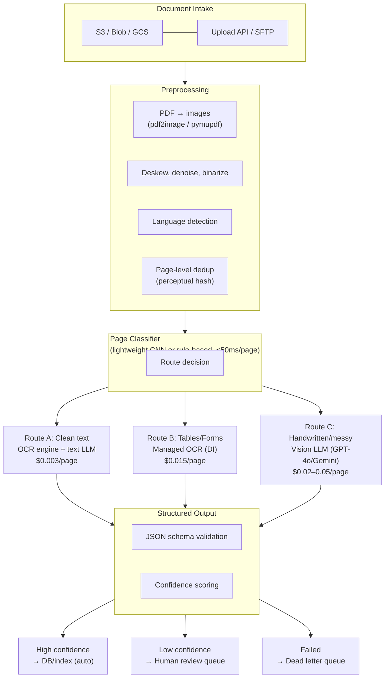
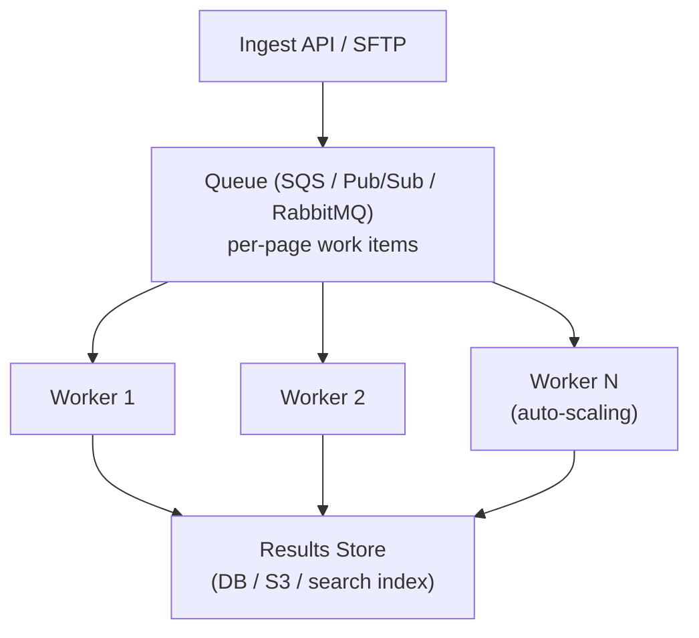

# Document Processing with LLMs

You've got a pile of PDFs — invoices, contracts, scanned forms — and someone on the team says, "Can't we just throw these at GPT-4o?" You can. It works. And at 500K pages/month, it'll cost you $75,000.

The teams getting document processing right in 2026 aren't picking one approach and praying. They're building hybrid routers — a cheap classifier that sends clean printed pages through OCR + GPT-4o Mini ($0.003/page), complex tables through Azure Document Intelligence ($0.015/page), and messy or handwritten pages through a vision model ($0.02–0.05/page). At 5M pages/month, this hybrid approach costs roughly $8K vs $80K for vision-only.

The biggest mistake teams make: sending every page through a vision model when 90% of pages are clean printed text that OCR handles perfectly.

That said, Gemini Flash 2.0 changed the economics significantly. It can extract roughly 6,000 pages per dollar with near-perfect OCR accuracy, as Vellum's December 2025 benchmark showed. That makes "just use a vision model for everything" viable at small scale. But at enterprise volume, the hybrid still wins.

> **TL;DR**
> Three viable paths: managed OCR services ($1–4/1K pages), OCR + text LLM ($2–8/1K pages), and vision LLMs reading documents directly ($5–60/1K pages). The winning pattern is a hybrid router that classifies each page and sends it down the cheapest path that maintains accuracy. Start with Gemini 2.0 Flash for everything, measure where it struggles, then add specialized routes.

---

## Architecture Overview

### The Full Production Pipeline



### Pipeline A: OCR + Text LLM (High Volume)

For the 85–90% of pages that are clean printed text. OCR extracts text and layout; a cheap text LLM structures and interprets it.

```
PDF page → pdf2image → [optional: deskew/denoise] → OCR engine → raw text + bounding boxes
  → prompt template + raw text → GPT-4o Mini / Gemini Flash → structured JSON
```

**Cost**: $1–5 per 1,000 pages
**Latency**: 1–4 seconds per page
**Best for**: Invoices, receipts, contracts, forms, printed reports

### Pipeline B: Vision LLM Direct (Low-Medium Volume, High Complexity)

Send the page image directly to a multimodal model. No OCR step. The model "sees" the page.

```
PDF page → pdf2image → resize to ≤2048px → vision LLM → structured JSON
```

**Cost**: $5–60 per 1,000 pages (model-dependent)
**Latency**: 2–10 seconds per page
**Best for**: Handwritten docs, mixed media, charts/diagrams, variable layouts

---

## OCR vs. Vision Models: When to Use Which

The key insight from Vellum's 2025 analysis: LLMs approach documents as a *contextual understanding* task (like a human reading), while OCR treats it as a *character recognition* task. LLMs understand that a document is an invoice and apply background knowledge about invoice structure. OCR just sees characters.

This matters when layouts vary — but it doesn't matter when every page is the same W-2 form.

A telling example: a Vellum customer processing resumes found that even the best vision LLMs would mix job descriptions between positions. OCR's structured, deterministic extraction was more reliable for documents with repeated similar sections. The lesson — LLMs understand content but can lose positional precision.

| Factor | Use OCR + Text LLM | Use Vision LLM |
|---|---|---|
| **Volume** | >10K pages/month | <5K pages/month (or for hard pages only) |
| **Document type** | Consistent layout (forms, invoices) | Variable, messy, handwritten |
| **Table extraction** | Managed OCR excels here | Works but more expensive |
| **Charts/diagrams** | OCR gives nothing useful | Only option |
| **Cost sensitivity** | Critical — 10-20x cheaper at scale | Acceptable |
| **Latency needs** | <2s per page achievable | 3-10s typical |
| **Setup effort** | Higher (OCR + prompt engineering + routing) | Lower (just prompt + image) |
| **Accuracy on clean docs** | 98-99% with good OCR | 97-99% (overkill) |
| **Accuracy on messy docs** | 70-85% (degrades fast) | 90-95% |

---

## Managed OCR Services: Head-to-Head (Feb 2026)

| Feature | Azure Document Intelligence | AWS Textract | AWS Bedrock Data Automation | Google Document AI |
|---|---|---|---|---|
| **Pricing (per 1K pages)** | $1.50 (prebuilt) / $10 (custom) | $1.50 (text) / $15 (forms+tables) | $10 (standard) / $40 (custom output) | $1.50 (OCR) / $30 (custom) |
| **Table extraction** | ★★★★★ Best in class | ★★★★ Good | ★★★★ Good (GenAI-powered) | ★★★ Adequate |
| **Handwriting** | ★★★★ Strong | ★★★ Decent | ★★★★ Strong (vision models) | ★★★ Decent |
| **Custom models** | Easy to train, few-shot | No custom training | Prompt-based customization | AutoML-based, clunkier |
| **Language support** | 300+ languages | 100+ languages | Depends on underlying FM | 200+ languages |
| **Latency** | 1–3 sec/page | 1–5 sec/page | 2–8 sec/page | 1–3 sec/page |
| **Layout analysis** | Excellent (paragraphs, sections, headers) | Good (lines, words, tables) | Good (GenAI-inferred structure) | Good (blocks, paragraphs) |
| **Multimodal** | Documents + images | Documents only | Documents, images, audio, video | Documents + images |
| **Best for** | General purpose, especially forms & invoices | AWS-native stacks, simple extraction | AWS stacks needing GenAI extraction + multimodal | Google Cloud stacks, multilingual |

**The honest take:**

- **Azure Document Intelligence** has pulled ahead for most use cases. Prebuilt models for invoices, receipts, and ID documents are best-in-class. Custom model training requires only 5 labeled examples. If you're not locked into AWS/GCP, start here.
- **AWS Textract** is still solid for basic OCR extraction and isn't going anywhere — it remains the cheapest option for pure text extraction on AWS at $1.50/1K pages. But it still lags on customization.
- **AWS Bedrock Data Automation (BDA)** is the newer, higher-level play. It's a GenAI orchestration layer that handles documents, images, audio, and video through a single API. Think of it as "Textract + LLM interpretation" in one managed service. The catch: at $10/1K pages for standard output, it's 6x more expensive than raw Textract. Use Textract when you just need OCR; use BDA when you need the LLM to interpret and structure the output for you. For pure document processing cost efficiency, Textract + your own LLM layer is usually cheaper.
- **Google Document AI** has good OCR quality but custom processor pricing ($30/1K) is painful. The workflow for training custom processors is also clunkier than Azure's.

**Open-source alternative**: Tesseract 5.x with LSTM is free and handles clean printed text well (90-95% accuracy). Pair it with a text LLM for structured extraction and you have a $0 OCR layer. Not viable for handwriting or complex layouts.

---

## Vision LLM Comparison for Document Processing

| Model | Cost per 1K pages (est.) | Strengths | Weaknesses |
|---|---|---|---|
| **GPT-4o** | $15–30 | Best overall accuracy, strong structured output | Most expensive |
| **GPT-4o Mini** | $1.50–3 | Great price/performance for simple docs | Struggles with dense tables |
| **Gemini 2.5 Pro** | $10–25 | Strong on complex layouts, tables | Slower |
| **Gemini 2.0 Flash** | $0.15–0.50 | ~6,000 pages/$1, near-perfect on clean docs | Less reliable on handwriting |
| **Claude Sonnet 4** | $8–20 | Excellent at following extraction schemas | Higher latency |
| **Claude Haiku 4.5** | $1–3 | Fast, cheap | Misses details on complex docs |
| **Qwen2.5-VL-72B** | Self-host cost only | Best open-source option | Requires GPU infrastructure |

**The Gemini Flash surprise**: At roughly $0.17 per 1,000 pages for clean documents, Gemini 2.0 Flash makes "vision model for everything" economically viable at small-to-medium scale (<100K pages/month). This has genuinely disrupted the "always use OCR first" conventional wisdom.

---

## PDF Parsing Libraries: Head-to-Head

Before any LLM touches your documents, you need to extract content from PDFs. Based on the Procycons benchmark (March 2025) and community testing:

| Library | Table Accuracy | Speed | Open Source | Best For |
|---|---|---|---|---|
| **Docling** (IBM) | 97.9% cell accuracy | Moderate (20-40s) | Yes | Complex tables, structured reports |
| **LlamaParse** | Good on simple, weak on complex | Fast (~6s regardless of size) | Paid API | Speed-sensitive, simple docs |
| **Unstructured.io** | 100% simple / 75% complex | Slow (51–141s) | Partial (OSS + paid) | ETL pipelines, enterprise |
| **Reducto** | Strong overall | Fast | Paid API | Production SaaS, traceability |
| **PyMuPDF/fitz** | Text only (no table parsing) | Very fast | Yes | Clean PDFs, text extraction |
| **pdf2image + OCR** | Depends on OCR engine | Moderate | Yes | Scanned PDFs |

**Recommendations**:
- **Default choice**: Docling for accuracy, especially if you have complex tables. IBM open-sourced it and it uses DocLayNet + TableFormer models.
- **Speed matters**: LlamaParse if you can afford the API cost. Consistently around 6 seconds regardless of document size.
- **Enterprise pipeline**: Unstructured.io if you need a full ETL pipeline with connectors for S3, databases, etc. Strong OCR but slow and expensive on complex structures.
- **Budget/simple docs**: PyMuPDF for text extraction from native (non-scanned) PDFs — it's the fastest by far and free.

---

## Chunking Strategies for Document Processing

How you chunk OCR output before sending to an LLM matters enormously for accuracy:

| Strategy | When to Use | Chunk Size | Gotchas |
|---|---|---|---|
| **Page-based** | Default starting point | 1 page | Multi-page tables get split |
| **Section-based** | Reports, manuals with headers | By H1/H2 sections | Needs reliable header detection |
| **Table-aware** | Financial docs, data-heavy | Keep tables atomic + surrounding context | Variable chunk sizes |
| **Semantic** | Long narrative (legal, medical) | 500-1000 tokens, split on topic shift | Computationally expensive |
| **Fixed-size + overlap** | Fallback/brute-force | 500-1000 tokens, 100-200 overlap | Worst accuracy, easiest to implement |
| **Sliding window with metadata** | RAG pipelines | 512 tokens, 128 overlap + page/section metadata | Best for retrieval, not extraction |

**The #1 chunking war story**: Splitting a table across two chunks. The LLM will hallucinate the missing rows or misinterpret column alignment. Every team learns this the hard way. Detect table boundaries (most OCR services return them) and treat tables as atomic units, even if it means one chunk is 3x the normal size.

**Pro tip**: For RAG use cases, attach metadata (page number, section header, document ID) to every chunk. This lets your retrieval step filter by page range and your generation step cite sources accurately.

---

## Table and Structured Data Extraction

Tables are the hardest part of document processing. Here's what actually works:

### Approach Comparison

| Method | Accuracy | Cost | Handles Multi-page Tables |
|---|---|---|---|
| **Azure DI table extraction** | 95-98% | $15/1K pages | No — manual stitching required |
| **Docling (TableFormer)** | 97.9% cell accuracy | Free (self-hosted) | Partial |
| **Vision LLM (send table image)** | 90-95% | $20-50/1K pages | No — each page is separate |
| **Vision LLM + prompt engineering** | 93-97% | Same as above | Yes, with multi-turn prompting |
| **Hybrid: OCR table → LLM cleanup** | 96-99% | $5-20/1K pages | Yes, with custom logic |

### Multi-Page Table Stitching (The Hard Problem)

No managed service handles multi-page tables automatically. You need custom logic:

```python
# Pseudocode for multi-page table detection
def detect_table_continuation(page_n, page_n_plus_1):
    """Check if a table continues across pages."""
    table_n = extract_table(page_n)
    table_n1 = extract_table(page_n_plus_1)

    if not table_n or not table_n1:
        return False

    # Heuristic: same number of columns + no header row on page n+1
    same_cols = len(table_n.columns) == len(table_n1.columns)
    has_header = looks_like_header(table_n1.rows[0])  # check for bold, ALL CAPS, etc.

    return same_cols and not has_header
```

### Image and Chart Extraction

Only vision models can process charts and diagrams meaningfully. Best practice:
1. Detect image/chart regions (layout analysis from OCR or a detection model)
2. Crop just that region from the page image
3. Send the cropped region to a vision LLM — cheaper than sending the full page
4. Ask for structured description + any data points visible

---

## Cost at Three Scales

### Small: 10K pages/month (startup, single use case)

| Approach | Monthly Cost | Notes |
|---|---|---|
| Gemini 2.0 Flash direct (vision) | **$1.70** | Best option at this scale |
| OCR (Azure DI prebuilt) + GPT-4o Mini | **$15 + $8 = $23** | Overkill unless you need OCR |
| Vision LLM (GPT-4o) direct | **$150–300** | Only if you need max accuracy |

### Medium: 500K pages/month (enterprise, multiple doc types)

| Approach | Monthly Cost | Notes |
|---|---|---|
| Hybrid router (OCR 85% + vision 15%) | **$1,200–2,000** | Best cost/accuracy tradeoff |
| Gemini 2.0 Flash for all | **$85–250** | Viable if accuracy is sufficient |
| Vision LLM (GPT-4o) for all | **$7,500–15,000** | Hard to justify unless accuracy-critical |

### Large: 5M pages/month (fintech, insurance, government)

| Approach | Monthly Cost | Notes |
|---|---|---|
| Hybrid: Textract + GPT-4o Mini batch | **$6,300** | Proven at scale, cheapest on AWS |
| Hybrid: Azure DI + Gemini Flash batch | **$8,400** | Good if already on Azure |
| Gemini 2.0 Flash for all | **$850–2,500** | Surprisingly viable — test accuracy first |
| GPT-4o for all | **$75,000–150,000** | No. |

### Batch API Savings

Both OpenAI and Anthropic offer 50% discounts on batch API calls (24-hour turnaround). At 5M pages/month:
- GPT-4o Mini batch: $1,800 → **$900/mo**
- Claude Haiku batch: $2,400 → **$1,200/mo**

**If you can tolerate 24-hour turnaround, always batch.** Most document processing is not real-time.

### Cost Estimation Formula

```
Monthly cost = Σ (pages_per_route × cost_per_page_for_route)

Where:
  Route A (clean text):     pages × $0.003  (OCR $0.0015 + LLM $0.0015)
  Route B (tables/forms):   pages × $0.015  (managed OCR)
  Route C (vision):         pages × $0.03   (vision LLM average)
  Route D (human review):   pages × $0.50   (outsourced) or $2.00 (in-house)
```

---

## Queue-Based Architecture for Scale

At >100K pages/month, you need a queue-based architecture. Serial processing doesn't scale.



**Key design decisions**:
- **Fan-out per page**, not per document. A 500-page document should be 500 independent work items.
- **Dead letter queue** for pages that fail 3x. Don't let one bad scan block the pipeline.
- **Idempotency**: Workers should be safe to retry. Store results keyed by `(document_id, page_number)`.
- **Backpressure**: Rate-limit API calls to OCR/LLM providers. Azure DI has a 15 TPS limit on S0 tier.
- **Save intermediate outputs**: Store raw OCR text separately from final structured extraction. When your schema changes (it will), you re-run only the LLM step.

---

## Preprocessing: The 15-30% Accuracy Boost Nobody Talks About

Bad scans go straight to OCR → accuracy drops 20-30%. Ten hours of preprocessing pipeline work pays for itself on the first batch.

| Step | Tool | Impact |
|---|---|---|
| **Deskew** | `deskew`, OpenCV | +5-10% on skewed scans |
| **Denoise** | OpenCV `fastNlMeansDenoising` | +5-15% on noisy scans |
| **Binarize** | OpenCV adaptive threshold | +5-10% on low-contrast |
| **Increase DPI** | `waifu2x`, bicubic upscale | +10-20% on low-res scans |
| **Remove borders/stamps** | OpenCV contour detection | Prevents OCR confusion |
| **Straighten** | `unpaper` | +5% on photocopied docs |

**Quick preprocessing pipeline** (OpenCV + Python, ~200 lines):
```python
import cv2
import numpy as np

def preprocess_page(image_path):
    img = cv2.imread(image_path, cv2.IMREAD_GRAYSCALE)
    # 1. Deskew
    coords = np.column_stack(np.where(img > 0))
    angle = cv2.minAreaRect(coords)[-1]
    if angle < -45: angle = -(90 + angle)
    else: angle = -angle
    (h, w) = img.shape[:2]
    M = cv2.getRotationMatrix2D((w // 2, h // 2), angle, 1.0)
    img = cv2.warpAffine(img, M, (w, h), flags=cv2.INTER_CUBIC, borderValue=255)
    # 2. Denoise
    img = cv2.fastNlMeansDenoising(img, h=10)
    # 3. Adaptive binarization
    img = cv2.adaptiveThreshold(img, 255, cv2.ADAPTIVE_THRESH_GAUSSIAN_C,
                                 cv2.THRESH_BINARY, 11, 2)
    return img
```

---

## The 9 Most Common Gotchas

### 1. Vision Models for Everything at Scale
Works great in the prototype. Bill is $15K/month at 500K pages. OCR + text LLM: $1,500. **Fix**: Hybrid router. Vision only for the 10-15% of pages that need it.

### 2. Ignoring Preprocessing
Skewed, noisy scans → OCR accuracy drops 20-30%. Nobody notices until extraction quality tanks. **Fix**: Build a preprocessing pipeline. 10 hours of OpenCV work. Biggest ROI investment in the whole system.

### 3. Breaking Tables During Chunking
Financial table split across chunks → LLM hallucinates missing rows. Every team has this war story. **Fix**: Detect table boundaries from OCR output. Keep tables atomic. Accept variable chunk sizes.

### 4. No Confidence Scoring
Low-quality extractions go to your database. Bad data propagates. Nobody notices for weeks. **Fix**: Have the LLM output a confidence score per field. Route anything <0.9 to human review. Also: validate against schema (e.g., dates are valid dates, amounts are numeric).

### 5. Sequential Processing
5M pages × 2 seconds = 115 days. Team builds serial pipeline, realizes too late. **Fix**: Queue-based architecture from day one. Fan-out per page. Auto-scale workers.

### 6. Not Saving Intermediate OCR Output
Schema changes. Need to reprocess corpus. But you only saved final extraction, not the raw OCR text. Storage is cheap ($0.01/GB/mo on S3). Re-running OCR on 5M pages costs $7,500. Re-running just the LLM step on cached text: $900. **Fix**: Always persist raw OCR output.

### 7. Forgetting Rate Limits
Spin up 50 workers, blast Azure DI at 50 TPS. Get throttled. Workers retry. Exponential backoff cascades. Throughput drops to near zero. **Fix**: Token bucket rate limiter in front of all API calls. Know your provider's limits:
- Azure DI S0: 15 TPS
- AWS Textract: 5-25 TPS depending on API
- AWS Bedrock Data Automation: varies by region and account — request quota increases early
- OpenAI: Varies by tier (20K-100K TPM)

### 8. PDF Encryption and DRM
5-10% of enterprise PDFs have some form of protection. Your pipeline silently returns empty results. **Fix**: Check for encryption before processing. Use `qpdf --decrypt` or `pikepdf` for password-removable protection. Flag truly encrypted docs for manual handling.

### 9. Language Detection Failures
Multilingual document corpus. OCR engine defaults to English. Non-Latin scripts get garbled. **Fix**: Run language detection on a sample of each page (use `langdetect` or the first OCR pass). Route to language-appropriate OCR models. Vision LLMs handle multilingual much better than traditional OCR.

---

## Quality Evaluation

### Field-Level Metrics

| Metric | What It Measures | Target |
|---|---|---|
| **Field accuracy** | % of fields extracted correctly | >95% |
| **Character error rate (CER)** | Edit distance at character level | <2% for clean, <5% for handwritten |
| **Table cell accuracy** | % of cells with correct value | >95% |
| **Schema compliance** | % of outputs that pass JSON schema validation | >99% |
| **Null rate** | % of expected fields returned as null/empty | <5% |

### Building a Test Set

1. **Sample 200-500 documents** spanning your document types, quality levels, and edge cases
2. **Human-label the ground truth** — this is the expensive but essential step. Pay for quality annotators.
3. **Run your pipeline** on the test set
4. **Compute metrics** per field, per document type, per quality tier
5. **Re-run on every pipeline change** — this is your regression test

### Automated Monitoring in Production

```python
# Alert on extraction quality degradation
def monitor_extraction_quality(batch_results):
    null_rate = sum(1 for r in batch_results if r.has_nulls) / len(batch_results)
    schema_fail_rate = sum(1 for r in batch_results if not r.valid_schema) / len(batch_results)
    avg_confidence = mean(r.confidence for r in batch_results)

    if null_rate > 0.10:  alert("Null rate spike — check input quality")
    if schema_fail_rate > 0.05:  alert("Schema failures — model may have drifted")
    if avg_confidence < 0.85:  alert("Low confidence — review document quality")
```

### LLM-as-Judge for Spot Checks

Use a stronger model (GPT-4o, Claude Sonnet) to evaluate extractions from your cheaper model:
```
Given this document image and this extraction result, rate each field:
- CORRECT: Extracted value matches document exactly
- PARTIAL: Close but has errors (typos, truncation)
- WRONG: Incorrect value
- MISSING: Field present in document but not extracted
```

This catches drift that aggregate metrics miss. Run it on 1-5% of production output.

---

## Putting It All Together: Reference Architecture

For a team starting a new document processing system in 2026:

1. **Start with Gemini 2.0 Flash** for everything (cheapest, simplest). Get end-to-end working.
2. **Build a test set** of 200+ labeled documents. Measure accuracy.
3. **Identify failure modes**: Which document types does Flash struggle with?
4. **Add managed OCR** (Azure DI) for table-heavy documents where Flash accuracy drops.
5. **Add GPT-4o or Claude Sonnet** as a premium route for the hardest pages.
6. **Build the router** — start with simple rules (page has table → Azure DI, page is handwritten → GPT-4o, else → Flash).
7. **Add queue-based processing** when volume exceeds 50K pages/month.
8. **Monitor everything**: confidence scores, null rates, schema compliance, cost per page.

**Timeline**: Steps 1-2 = 1-2 weeks. Steps 3-5 = 2-4 weeks. Steps 6-8 = 2-4 weeks. Full production pipeline in 6-10 weeks.

---

## When This Pattern Works vs. When It Doesn't

### Works Great For
- Invoice/receipt processing at scale
- Contract analysis and clause extraction
- Medical/insurance document intake
- Regulatory compliance document scanning
- Digitizing paper archives
- ESG/sustainability report data extraction

### Wrong Pattern For
- Real-time processing (<500ms latency per page) — pre-extract or use traditional OCR only
- Extremely low volume (<100 pages/month) — manual processing is cheaper
- Documents requiring legal judgment (discovery, diagnosis) — human-in-the-loop is primary, not secondary
- Pure image content (photographs) — that's computer vision, not document processing

---

## Further Reading

- **[Document Data Extraction in 2026: LLMs vs OCRs (Vellum)](https://www.vellum.ai/blog/document-data-extraction-llms-vs-ocrs)** — The benchmark that showed Gemini Flash extracting 6,000 pages per dollar. Essential reading for understanding the OCR vs. vision model tradeoff.
- **[PDF Data Extraction Benchmark 2025 (Procycons)](https://procycons.com/en/blogs/pdf-data-extraction-benchmark/)** — Head-to-head comparison of Docling, Unstructured, and LlamaParse on real-world PDFs.
- **[OCR Benchmark (Omni AI)](https://getomni.ai/ocr-benchmark)** — Comprehensive accuracy comparison across OCR engines and vision models.
- **[Azure Document Intelligence Pricing](https://azure.microsoft.com/en-us/pricing/details/ai-document-intelligence/)** — Current pricing tiers for prebuilt and custom models.
- **[AWS Textract Pricing](https://aws.amazon.com/textract/pricing/)** — Per-page costs for text, forms, and table extraction. Still the cheapest AWS option for pure OCR.
- **[AWS Bedrock Data Automation](https://aws.amazon.com/bedrock/bda/)** — AWS's GenAI-powered document/image/audio/video processing service. Higher-level than Textract, with a unified multimodal API.
- **[Google Document AI Pricing](https://cloud.google.com/document-ai/pricing)** — Pricing for OCR, custom processors, and specialized extractors.
- **[AI in Accounts Payable (Ramp)](https://ramp.com/blog/ai-in-accounts-payable)** — Real-world case study of document processing in finance.
- **[8 Top Open-Source OCR Models Compared (Modal)](https://modal.com/blog/8-top-open-source-ocr-models-compared)** — If you're considering self-hosted OCR, start here.
- **[Best Open Source LLM for Document Screening (SiliconFlow)](https://www.siliconflow.com/articles/en/best-open-source-LLM-for-Document-screening)** — Guide to open-source alternatives for document processing.
- **[OpenAI API Pricing](https://openai.com/api/pricing/)** — Current vision and text model pricing.
- **[Google Gemini API Pricing](https://ai.google.dev/pricing)** — Current Gemini Flash and Pro pricing tiers.
