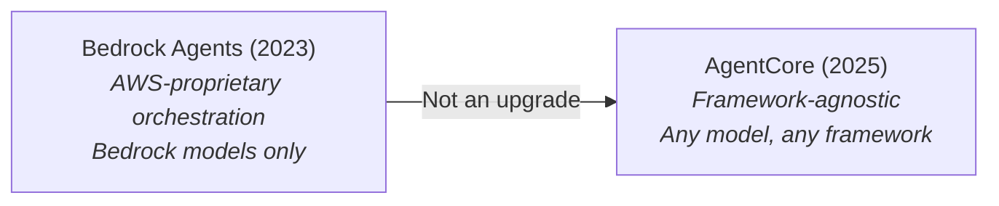
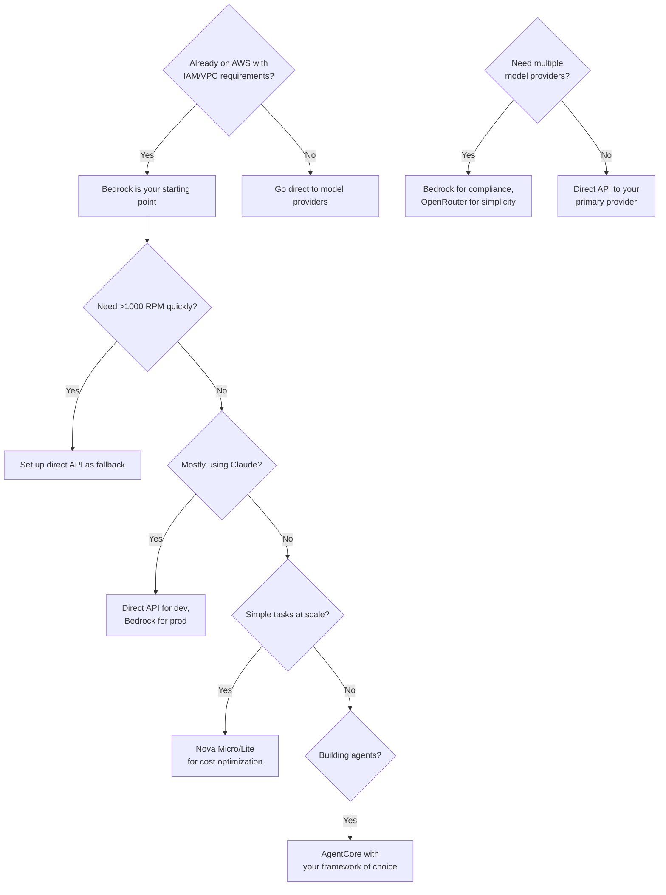

# AWS Bedrock — The Real Guide

You've been on AWS for years. Your IAM policies are a work of art. Your VPCs are locked down tighter than Fort Knox. And now someone wants to add AI. You could wire up API keys to a dozen different model providers, explain to security why you're sending data to external endpoints, and set up separate billing for each one. Or you could use Bedrock and get everything behind your existing IAM/VPC with one invoice. That convenience is real — but so are the rate limit nightmares, the documentation that lies to your face, and the quota increase process that may make you miss your launch date.

> **TL;DR**
>
> Bedrock is the "I'm already on AWS and need to check a compliance box" choice for LLM inference. You get a unified API across 18+ model providers with IAM/VPC integration, but you fight soul-crushing rate limits, deal with documentation not up to date with service/feature changes, and navigate a service tier system that's more complex than it appears. The big 2025–2026 shift: **AgentCore** is AWS's new agent platform — framework-agnostic, serverless, and separate from the old Bedrock Agents. If you're building production agents on AWS, learn AgentCore, not Bedrock Agents. If you're not already deep in AWS, go direct to the providers. If you are, Bedrock's compliance story and model breadth are genuinely hard to replicate.

---

## Strategic Context

Understanding where Bedrock fits in AWS's AI strategy explains many of its quirks.

**Bedrock is AWS's model-agnostic marketplace play.** Unlike Azure (deeply coupled to OpenAI) or Google Cloud (Gemini-first), AWS bet on being the Switzerland of foundation models — host everything, let customers choose. This was initially a weakness (no flagship model), but has become a strength as the market fragments across dozens of competitive models.

**The Anthropic partnership is the crown jewel.** AWS invested $4B+ in Anthropic, making Claude the de facto "premium" option on Bedrock. Claude models get first-class treatment: fastest availability, deepest feature integration (prompt caching, batch, all service tiers), and the most quota capacity. If you're using Bedrock, you're probably using Claude.

**Amazon Nova is the hedge.** AWS launched Nova (late 2024) and Nova 2 (re:Invent 2025) as their own model family — aggressively priced to undercut third-party models and reduce AWS's dependency on Anthropic. Nova isn't frontier-quality, but it's "good enough" for a surprising number of tasks at a fraction of the cost.

**re:Invent 2025 was the "agents" pivot.** The headline announcements:
- **Amazon Nova 2 family** — Lite, Pro, Sonic (speech-to-speech), and Omni (multimodal). Nova 2 Lite and Pro now include extended thinking with configurable budget levels, 1M token context, built-in web grounding, and code interpreter.
- **Amazon Bedrock AgentCore** (announced re:Invent Dec 2025, preview July 2025) — A completely new platform for deploying, operating, and scaling AI agents. Not an upgrade to Bedrock Agents — a separate, framework-agnostic service.
- **Nova Act** — A browser automation agent claiming 90%+ reliability on web tasks.
- **Nova Forge** — An "open training" service for building custom Nova variants.
- **Reinforcement fine-tuning** in Bedrock, synthetic data generation, and checkpointless training recovery.

The message is clear: AWS wants to own the full stack from model training to production agent deployment.

---

## Pricing Model

Bedrock's pricing has two key things going for it: per-token rates that **match the providers' direct APIs** (the "Bedrock tax" is dead), and a tier system that lets you trade latency for cost. The complexity is in navigating 18+ model providers × 4 tiers × regional variations.

> For exact per-model pricing, see the [official Bedrock pricing page](https://aws.amazon.com/bedrock/pricing/). Prices shift frequently — what matters here is understanding the *pricing structure* so you can optimize.

### The Four Tiers

| Tier | Price Modifier | Latency | Use When |
|------|---------------|---------|----------|
| **Standard** | 1.0x (baseline) | Normal | Default for everything. Start here. |
| **Priority** | 1.75x (+75%) | ~25% better | Customer-facing chatbots where 100ms matters. Do the ROI math first. |
| **Flex** | 0.5x (-50%) | Higher, variable | Agent inner loops, evals, any synchronous call that can tolerate slowness. |
| **Batch** | 0.5x (-50%) | Async (hours) | Bulk processing — submit to S3, retrieve later. |

**Flex vs Batch:** Both are 50% off. Flex is synchronous (real-time call, just slower); Batch is fully async. Use Flex for agent inner loops, Batch for bulk offline jobs.

**Critical caveat: Claude models do NOT support Flex/Priority tiers** — only Standard and Batch. For Claude latency optimization, you need Provisioned Throughput or cross-region inference profiles.

Tier selection is per-request — mix tiers within the same app. Route user-facing responses through Standard and background summarization through Flex with a single parameter change.

### Key Pricing Callouts

| What | Why It Matters |
|------|---------------|
| **Bedrock = direct API pricing** | Claude Sonnet 4.6 is $3/$15 per M tokens on both Bedrock and Anthropic direct. No markup on global endpoints. |
| **Regional endpoints carry a 10% premium** | Starting with Claude Sonnet 4.5 and Haiku 4.5, regional endpoints cost 10% more than global. |
| **Nova is the cost play** | Nova Micro at $0.035/$0.14 is the cheapest capable model on any major platform. Nova 2 Lite at $0.30/$2.50 is 10x cheaper than Claude Sonnet on input. |
| **Extended Access = forced migration tax** | Claude 3.5 Sonnet moved to "Extended Access" Dec 1, 2025 — prices doubled overnight. Budget for this happening to models you depend on. |
| **Prompt caching: 2 TTL options** | Default 5-min TTL is free to read (just pay 25% more for the write). The 1-hour TTL option costs 2x the write price but keeps caches alive longer. |
| **Cross-region pricing uses source region** | When cross-region inference routes your request elsewhere, you pay the price of your *source* region, not the destination. |

### Nova 2: Honest Assessment

Amazon claims Nova 2 Pro is "equal or better on 10 out of 16 benchmarks compared to Claude Sonnet 4.5" — take that with a grain of salt. AWS cherry-picks benchmarks where Nova wins. In real-world coding, creative writing, and complex reasoning, Claude 4+ and GPT-5 class models still clearly lead. Nova 2 Lite is genuinely impressive for structured tasks at its price tier, but Nova 2 Pro is still in preview with inconsistent results on complex reasoning.

---

## Cross-Region Inference

This is one of Bedrock's genuinely useful features that other providers don't offer natively, and it directly addresses the #1 pain point (rate limits).

### How It Works

Instead of calling a model in a specific region, you use an **inference profile** that spans multiple regions. Bedrock automatically routes requests to the region with the most available capacity.

Two flavors:
1. **Geographic (Geo) cross-region** — Routes within a geography (e.g., US regions only). Data stays within the geographic boundary.
2. **Global cross-region** — Routes across all AWS regions worldwide. ~10% cheaper than Geo for some models. Data may cross geographic boundaries.

### The Trade-offs

**What you gain:**
- Dramatically improves throughput and reduces throttling
- No infrastructure changes — just swap your model ID for an inference profile ID
- AWS handles all routing logic transparently
- Price is calculated based on the **source region**, not the destination

**What you lose:**
- **Latency predictability:** Requests routed to distant regions add network latency.
- **Data residency guarantees:** Global cross-region means your prompts may be processed in any region. Compliance-sensitive workloads must use Geo profiles or stick to single-region.
- **Debugging simplicity:** When a request fails, which region handled it? CloudWatch metrics tell you, but it adds an investigation layer.
- **Requests route to regions you haven't opted into** — SCPs and IAM policies can restrict this, but it's opt-out, not opt-in.

### When to Use It

- **Always for throughput-sensitive workloads.** If you're hitting rate limits, cross-region inference is the first thing to try — it's a free throughput increase.
- **Geo for regulated industries.** Data stays in your geography.
- **Global for cost-optimized, non-sensitive workloads.** The 10% savings add up at scale.
- **Avoid for ultra-low-latency requirements.** The routing adds unpredictable latency.

---

## Rate Limits & Quotas

**This is the #1 pain point. Full stop.** Every Bedrock thread on Reddit mentions it. If you take away one thing from this guide, let it be this section.

### The Default Quota Problem

New accounts get absurdly low limits for any production workload:
- ~100–500 RPM for popular models (varies by model and region)
- ~50K–200K TPM
- These defaults are designed for experimentation, not production

### Getting Quota Increases: The Two-Track Reality

The experience here depends entirely on **how much you matter to AWS**.

**If you're a regular account** (most startups, small teams, dev accounts):
1. Submit a Service Quotas request via the AWS console
2. Wait days to weeks for a human review team to respond
3. Justify your usage with projected volumes
4. Get counter-offered with a lower increase than requested
5. Non-production accounts are routinely deprioritized or denied — multiple teams report AWS refusing quota increases for dev/staging environments entirely

The catch-22 is brutal: you can't load test at production volumes without production quotas, but you can't demonstrate production need without load testing.

**If you're a strategic/enterprise account** (large spend, named account team):
The experience is completely different — but it still requires effort. Strategic customers don't hit the self-service form; they go through their **Technical Account Manager (TAM)** or **Solutions Architect** who advocates internally. Large accounts can get quota bumps in days rather than weeks, and the counter-offers are more generous. But even here, it's not automatic — your account team needs to make the case to the Bedrock capacity team, and during high-demand periods (new model launches, re:Invent aftermath), even strategic accounts queue up. The key difference: you have a human who answers the phone and fights for your allocation. Everyone else has a ticket in a queue.

**The workarounds (for everyone):** Cross-region inference helps by distributing load across regions. Some teams use multiple AWS accounts to multiply their effective quotas (at the cost of billing complexity).

### Provisioned Throughput

For guaranteed capacity:
- Requires 1–6 month commitments
- "Contact your account team" pricing (i.e., bring your checkbook)
- Necessary for serving fine-tuned models
- Worth it for predictable, high-volume workloads. Not worth it for spiky traffic.

---

## Bedrock AgentCore — The New Agent Platform

This is the biggest strategic shift in Bedrock since launch. **AgentCore is NOT an upgrade to Bedrock Agents — it's a separate, fundamentally different service.**

### The Evolution

| | Bedrock Agents (Old) | AgentCore (New) |
|---|---|---|
| **Framework** | AWS-proprietary orchestration | **Framework-agnostic** — bring CrewAI, LangGraph, LlamaIndex, or anything |
| **Model** | Bedrock models only | Any model — Bedrock, self-hosted, external APIs |
| **Deployment** | AWS-managed, opaque | Serverless runtime with session isolation, you control the code |
| **Memory** | Basic session state | Managed session + long-term memory with context retrieval |
| **Observability** | CloudWatch (basic) | Step-by-step visualization, metadata tagging, trajectory inspection |
| **Identity/Auth** | IAM only | Dedicated identity service — OAuth to GitHub, Salesforce, Slack on behalf of users |
| **Tool integration** | Lambda action groups | AgentCore Gateway — transforms any API/Lambda into MCP-compatible tools |
| **Pricing model** | Per-model-invocation (hidden model calls) | Consumption-based: vCPU-seconds + GB-seconds of actual usage |

### Why This Matters

**Bedrock Agents was AWS trying to be the orchestrator.** You gave it tools and a model, and AWS's proprietary orchestration decided when to call what. It was a black box — hard to debug, limited in flexibility, and locked to Bedrock models.

**AgentCore is AWS getting out of the orchestration business.** Instead, they provide the *infrastructure*: compute isolation, memory, identity, observability, and tool connectivity. You bring your own framework and your own models. AWS handles the hard infra problems (scaling to thousands of sessions, session isolation, identity delegation).

This is the right architectural bet. The agent framework space is evolving too fast for any cloud provider to own the orchestration layer.

### AgentCore Components

**Runtime** — Serverless compute with per-session isolation. Deploy your agent code (any framework), and Runtime handles scaling and lifecycle. **$0.0895/vCPU-hour** for active processing + **$0.00945/GB-hour** for memory. You only pay for active CPU time — I/O wait (waiting for LLM responses, API calls) is free. This is huge for agents that spend 60–80% of their time waiting.

**Memory** — Managed session and long-term memory. Stores conversation history, user preferences, and learned context. Retrieves relevant memories at inference time.

**Gateway** — Transforms existing APIs and Lambda functions into MCP-compatible tools. **$25/million Search API calls** + **$5/million InvokeTool calls** + $0.02 per 100 tools indexed.

**Identity** — OAuth-based identity delegation. Your agent can access GitHub, Salesforce, Slack, and AWS services on behalf of users with their consent.

**Observability** — Step-by-step execution visualization, metadata tagging, custom scoring, trajectory inspection.

**Browser** — Managed headless browser instances for web automation. Same vCPU/GB pricing as Runtime.

**Code Interpreter** — Isolated sandbox environments for executing agent-generated code (Python, JavaScript, TypeScript).

**Policy (Preview)** — Cedar-based policy enforcement on tool calls. **$0.025 per 1,000 authorization requests**.

### AgentCore Pricing Example

A customer support agent handling 10M sessions/month, each running 60 seconds with 70% I/O wait:
- CPU: 18s active × 1 vCPU × $0.0895/3600 = **$0.00045/session**
- Memory: ~2GB average × 60s × $0.00945/3600 = **$0.00028/session**
- **Total: ~$0.00072/session → ~$7,235/month for 10M sessions**

Compare to Bedrock Agents (old): the same workload would trigger 5–10 model invocations per session at full per-token pricing, easily $0.01–0.05/session for the orchestration alone. AgentCore's consumption-based pricing is dramatically cheaper for the infrastructure layer.

### Which Should You Use?

**Use AgentCore if:** you're building new agents in 2026, need framework flexibility, need session isolation for multi-tenant deployments, or want real observability into agent execution.

**Use Bedrock Agents (old) if:** you have existing agents deployed and working, or you need simple 2–3 step tool-calling workflows where managed orchestration is "good enough."

**Migration path:** AWS hasn't announced deprecation of Bedrock Agents, but the investment is clearly going to AgentCore. The [Strands Agents](https://github.com/strands-agents/strands-agents) framework (AWS open-source) provides a natural bridge.

---

## Bedrock-Specific Features (Honest Assessment)

### Guardrails — 7/10

Content filtering, PII detection/redaction, topic blocking, and contextual grounding checks as a managed service.

**What works:** Define policies declaratively, enforced on both input and output, contextual grounding checks can detect RAG hallucinations. Good for regulated industries where you need auditable content policies.

**What doesn't:** Adds ~100–200ms latency per assessment, has its own pricing on top of model costs, false positives on legitimate content, limited customization of the underlying classification models.

### Knowledge Bases — 5/10

Managed RAG pipeline: point at S3, Confluence, SharePoint, or web URLs → automatic chunking, embedding, and vector storage.

**What works:** Fast to prototype — upload documents, get a working RAG system in an hour. Handles document parsing, chunking, and embedding automatically.

**What doesn't:** **Hidden cost floor** — OpenSearch Serverless underneath requires minimum 2 OCUs = **~$350/month** even with zero queries. Limited chunking strategies. Mediocre retrieval quality by default. No streaming for the combined RetrieveAndGenerate API.

**When to use:** POCs and internal tools. For production RAG at scale, most serious teams build their own pipeline.

### Bedrock Agents (Legacy) — 4/10

Multi-step reasoning with tool use.

**What works:** Conceptually sound for simple tool-using agents. Built-in session management.

**What doesn't:** Debugging is painful. Multi-agent collaboration is unreliable. A single user query can trigger 5–10+ internal model invocations — every step is a billable model call. Framework lock-in. Being superseded by AgentCore.

### Intelligent Prompt Routing — 6/10

Automatically routes between models in the same family based on prompt complexity (e.g., Claude Sonnet for complex queries, Haiku for simple ones).

Can save 30–50% on mixed workloads if the routing is accurate, but it's a black box — no visibility into routing decisions, no custom criteria, and limited to same-family routing.

### Prompt Caching — 7/10

Available for Claude models. Cache system prompts, few-shot examples, or long context reused across calls.

| Operation | Price Modifier |
|-----------|---------------|
| Cache write (5-min TTL) | 1.25x input price |
| Cache write (1-hour TTL) | 2.0x input price |
| Cache read (hit) | 0.1x input price |

Genuine money-saver for applications with repetitive system prompts. If your system prompt is 4K+ tokens and you're making frequent calls, caching pays for itself quickly.

---

## Model Availability & Freshness

### Who's On Bedrock (Feb 2026)

**18+ providers**: AI21 Labs, Amazon (Nova, Titan), Anthropic, Cohere, DeepSeek, Google (Gemma only), Luma AI, Meta, MiniMax, Mistral AI, Moonshot (Kimi), NVIDIA, OpenAI (gpt-oss only), Qwen, Stability AI, TwelveLabs, Writer, Z AI.

### What's Notably Missing

- **OpenAI GPT-4o / o1 / o3 / o4-mini / GPT-5** — Only open-source gpt-oss models (20B, 120B). The flagship commercial models are Azure/OpenAI-exclusive.
- **Google Gemini** — Only Gemma (open-weight). Gemini Pro/Ultra/Flash are Vertex AI-exclusive.
- **xAI Grok** — Not available.

### The "Extended Access" Trap

AWS moves older models to "Extended Access" with **doubled pricing** as a migration incentive. Claude 3.5 Sonnet went from $3/$15 to $6/$30 on Dec 1, 2025. You get advance notice, but it's a forced choice: migrate or pay 2x. Budget for model transitions and test new models proactively.

---

## The Gotchas Nobody Tells You

These are sourced from real production teams and engineering communities. They're the kind of thing that costs you a weekend.

1. **The documentation is wrong.** Not outdated — actively incorrect. CDK constructs behave differently than documented. SDK methods have undocumented parameters. Budget extra debugging time for every integration.

2. **Model parameter conflicts.** Claude Sonnet 4.5 doesn't allow `temperature` AND `top_p` simultaneously, but Bedrock sets `temperature=1` by default. You can't use `top_p` alone without explicitly unsetting temperature. This isn't documented.

3. **"Extended Access" pricing surprises.** AWS can double the price of a model you're running in production with ~30 days notice.

4. **Quota increases for non-prod = good luck.** You literally cannot load test your application without prod quotas. AWS's quota policy makes proper pre-production testing nearly impossible.

5. **Observability is an afterthought (for base Bedrock).** CloudWatch metrics are coarse-grained. LangSmith/Langfuse integration requires manual instrumentation. AgentCore Observability is better, but only for agents deployed on AgentCore.

6. **Agent cost multiplication (Bedrock Agents).** A "simple" agent query can trigger 5–10+ model invocations behind the scenes. Without careful instrumentation, your first bill will be 5–10x what you expected.

7. **us-east-1 stability.** Multiple reports of random invocation errors during 2024–2025. Cross-region inference helps but doesn't eliminate the risk. Diversify.

8. **Prompt management API gaps.** You can't retrieve a prompt by ARN via API — only through the console or within a Bedrock agent. Basic CRUD operations that should exist simply don't.

9. **Regional pricing is wildly inconsistent.** London charges up to **55% more** than us-east-1 for the same model. Mumbai and Tokyo are 15–20% more. Always check regional pricing before deploying.

10. **OpenSearch Serverless minimum cost for Knowledge Bases.** The $350/month floor catches everyone by surprise. If you spin up a Knowledge Base for a demo and forget about it, you'll discover this on your next bill.

11. **No streaming for RetrieveAndGenerate.** The combined RAG API doesn't support streaming, forcing you to either wait for the full response or build a custom pipeline with separate Retrieve + InvokeModelWithResponseStream calls.

12. **Cross-region inference routes to regions you haven't opted into.** Your prompts may be processed in regions you didn't explicitly enable. Use SCPs to restrict this if data residency matters.

13. **Batch inference has no SLA on completion time.** Jobs can take hours. Don't rely on it for time-sensitive pipelines.

14. **CloudWatch log costs.** Bedrock logs full prompts + responses by default. At $0.50/GB ingestion, high-volume apps generate **hundreds of dollars in log costs** per month. Disable model invocation logging unless you specifically need it, or use sampling.

15. **The Bedrock SDK is a moving target.** InvokeModel vs Converse API have different parameter formats. The Converse API is the recommended path forward, but many tutorials still use InvokeModel. Standardize early.

16. **AgentCore is still partially in preview (Feb 2026).** Runtime and Gateway are furthest along. Memory, Identity, Browser, Code Interpreter, and Policy are at various stages. Don't bet your production launch on a preview component without a fallback.

17. **AgentCore cold starts.** Serverless compute means cold starts. Pre-warming helps but increases baseline cost.

18. **AgentCore Gateway search costs add up.** At $25/million search calls, an agent making 5 tool-discovery searches per session across millions of sessions becomes a meaningful cost line. Cap tool searches per session and cache tool metadata.

---

## Bedrock vs Direct Anthropic API

Since Claude is the primary reason most teams use Bedrock, this comparison deserves its own section.

| Dimension | Bedrock | Direct Anthropic API |
|-----------|---------|---------------------|
| **Per-token pricing** | Identical for current models (global endpoints) | Identical |
| **Regional endpoint premium** | 10% for regional (Claude 4.5+) | N/A (global only) |
| **Rate limits** | Lower defaults, painful increase process | Higher defaults, faster increases |
| **New model access** | Days to weeks after Anthropic release | Day of release |
| **Prompt caching** | Available, same pricing | Available, same pricing |
| **Batch inference** | 50% discount, async to S3 | 50% discount via Message Batches API |
| **IAM/VPC integration** | Native | Requires API gateway + custom auth |
| **Data residency** | Stays in your AWS account/region | Data processed by Anthropic |
| **Multi-model** | 18+ providers, one API | Claude only |
| **AgentCore** | Full platform for agent deployment | N/A |

**The verdict:** If you need IAM, VPC endpoints, CloudTrail, data residency, or AgentCore — Bedrock is the clear choice. If you primarily use Claude and want the best developer experience, highest rate limits, and fastest model access — go direct. Many teams use both: Bedrock for production (compliance), direct API for development (speed).

---

## When to Use Bedrock

**Go for it when:**
- You're **already all-in on AWS** and need IAM, VPC endpoints, PrivateLink, and CloudTrail
- You need **multiple model providers** behind a single API and billing relationship
- You're in a **regulated industry** where data residency and auditable content policies matter
- You want the **cheapest inference possible** for simple tasks — Nova Micro at $0.035/$0.14 is hard to beat
- You need **cross-region resilience** — no other provider offers automatic multi-region routing for LLM inference
- You're building **production agents** and want managed infrastructure via AgentCore

**Look elsewhere when:**
- You need to **scale fast** — the quota increase process will block your launch
- You **primarily use one model provider** — going direct is simpler and equally priced
- You're doing **high-volume production with open models** — self-hosting is 5–10x cheaper
- You need **cutting-edge models day one**
- You need **reliable non-prod environments** for load testing
- You're **cost-sensitive about managed RAG** — the Knowledge Bases $350/month floor hurts

---

## Decision Framework

---

## Further Reading

- **[AWS Bedrock Pricing](https://aws.amazon.com/bedrock/pricing/)** — The source of truth for all model pricing
- **[AWS Bedrock AgentCore](https://aws.amazon.com/bedrock/agentcore/)** — Product page with architecture overview and current GA/preview status
- **[AgentCore Pricing](https://aws.amazon.com/bedrock/agentcore/pricing/)** — Detailed pricing with worked examples
- **[Introducing Amazon Bedrock AgentCore (AWS Blog)](https://aws.amazon.com/blogs/aws/introducing-amazon-bedrock-agentcore-securely-deploy-and-operate-ai-agents-at-any-scale/)** — The launch announcement with architecture details
- **[Anthropic Claude API Pricing](https://platform.claude.com/docs/en/about-claude/pricing)** — Compare direct vs. Bedrock pricing, including global vs. regional endpoint differences
- **[AWS Bedrock Quotas](https://docs.aws.amazon.com/bedrock/latest/userguide/quotas.html)** — Know your limits before you hit them
- **[Cross-Region Inference Docs](https://docs.aws.amazon.com/bedrock/latest/userguide/cross-region-inference.html)** — How to set up the most useful Bedrock feature
- **[AWS re:Invent 2025 Top Announcements](https://aws.amazon.com/blogs/aws/top-announcements-of-aws-reinvent-2025/)** — AgentCore, Nova 2, and the full re:Invent recap
- **[Amazon Nova 2 Announcement](https://www.aboutamazon.com/news/aws/aws-agentic-ai-amazon-bedrock-nova-models)** — Nova 2 family details and benchmark claims
- **[Service Tiers Documentation](https://aws.amazon.com/bedrock/service-tiers/)** — Standard, Priority, Flex, and Batch explained
- **[Scalevise: AgentCore Pricing Analysis](https://scalevise.com/resources/agentcore-bedrock-pricing-self-hosting/)** — Third-party cost analysis comparing AgentCore to self-hosting
- **[Price Per Token: AWS Bedrock](https://pricepertoken.com/endpoints/bedrock)** — Useful aggregated pricing across all models and regions
- **[Caylent: Every AI Announcement at re:Invent 2025](https://caylent.com/blog/aws-reinvent-2025-every-ai-announcement-including-amazon-nova-2-and-kiro)** — Comprehensive recap if you missed re:Invent
- **[Reddit: "Does AWS Bedrock suck or is it just a skill issue?"](https://www.reddit.com/r/aws/comments/1pe72an/)** — Honest engineer thread worth reading before committing
