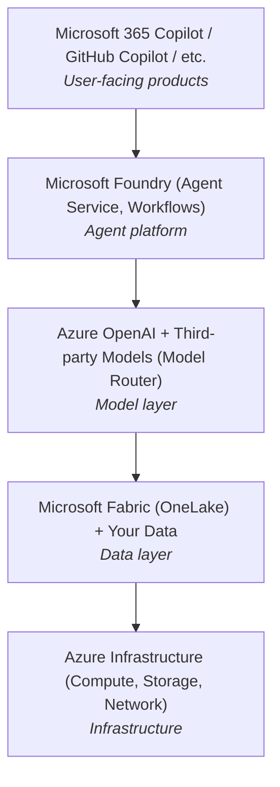
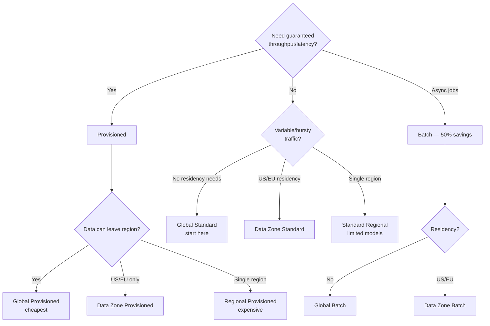
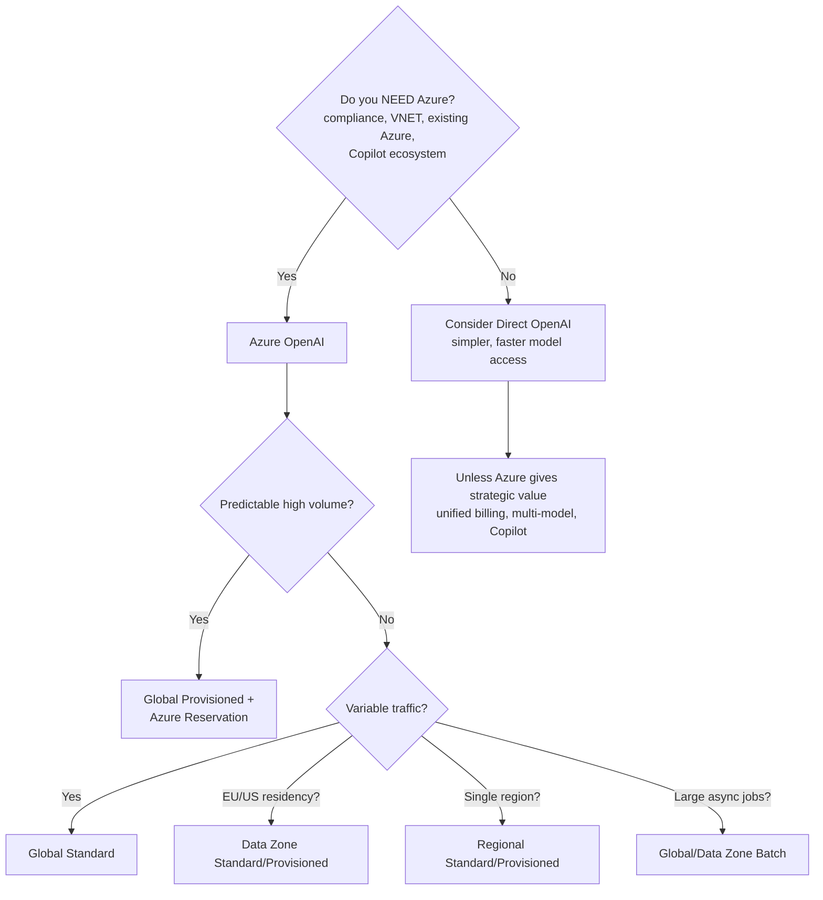

# Azure OpenAI Service (via Microsoft Foundry)

You're an enterprise architect. Your CTO just said "we need AI." Your procurement team won't approve sending data to `api.openai.com`. Your security team demands VNETs and managed identity. Your finance team wants everything on one Azure invoice. Sound familiar? That's exactly the scenario Azure OpenAI was built for — and exactly the trap it's designed to spring.

> **TL;DR**
>
> Azure OpenAI gives you the full OpenAI model lineup wrapped in enterprise-grade compliance, networking, and identity management. Pricing matches OpenAI's direct API for Global Standard deployments. The trade-offs: mandatory content filtering that adds latency, models arriving 2–8 weeks late, and a rate limiting system that will make you question your career choices. If you're already on Azure and need compliance, it's the obvious pick. If not, the direct OpenAI API is simpler and faster.

---

## Strategic Context

Azure OpenAI exists because Microsoft invested $13B+ in OpenAI and needs to monetize that relationship through its cloud platform. The strategic logic is straightforward:

1. **Lock enterprise AI workloads into Azure.** If your LLM runs on Azure, your vector DB, app hosting, and data lake follow.
2. **Differentiate Azure from AWS/GCP.** Exclusive (or early) access to OpenAI models is Azure's strongest competitive moat.
3. **Power the Copilot ecosystem.** Microsoft 365 Copilot, GitHub Copilot, and Dynamics Copilot all run on Azure OpenAI internally. Enterprise customers who customize Copilots need Azure OpenAI.
4. **Compliance wrapper.** Many enterprises can't send data to a third-party API endpoint. Azure provides the VNET, RBAC, and data residency story that procurement teams require.

### The Foundry Rebrand: What Actually Happened

The naming has gone through three iterations:
- **Azure OpenAI Studio** (2023) → **Azure AI Foundry** (Ignite 2024) → **Microsoft Foundry** (Ignite November 2025)

The November 2025 rebrand was more than cosmetic. Microsoft elevated Foundry to sit alongside **Microsoft 365** (productivity) and **Microsoft Fabric** (data) as one of three strategic pillars. The January 2026 Product Terms officially renamed "Azure AI Foundry Models" to "Microsoft Foundry Models (includes Azure OpenAI)."

What's new under the Foundry umbrella:
- **Foundry Models & Model Router** — unified endpoint for 11,000+ models (OpenAI, Anthropic, Cohere, NVIDIA, Meta, Mistral, open-source). Automated routing to cheapest/best model per task with claimed ~50% cost savings.
- **Foundry Agent Service** — managed agent runtime (replaces DIY orchestration). Manages conversations, tool calls, safety, identity, and observability.
- **Foundry IQ** — next-gen RAG that connects to OneLake, S3, Snowflake, and more. Dynamic reasoning over retrieval, not just vector lookup.
- **Foundry Tools (MCP Catalog)** — discover and connect Model Context Protocol servers for SaaS integrations (Salesforce, SAP, your own OpenAPI services).
- **Foundry Workflows** — visual, declarative builder for multi-agent, multi-step flows with built-in patterns (sequential, human-in-the-loop, group chat).
- **Built-in Observability** — OpenTelemetry tracing, evaluation runs, agent fleet monitoring in the portal.

**Practical impact for Azure OpenAI users:** The REST API, SDKs, and deployment model are unchanged. Your existing `openai` Python SDK code still works. The portal URL is still `ai.azure.com`. You'll see "Microsoft Foundry" branding everywhere, and the docs are now under `learn.microsoft.com/en-us/azure/ai-foundry/`. Don't let the branding churn distract you from the unchanged fundamentals.

### The Agent Story: Agent Service vs. Assistants API

This is actively confusing, so let's untangle it:

| | **OpenAI Assistants API** | **Azure AI Agent Service (Foundry)** | **OpenAI Responses API** |
|---|---|---|---|
| **Status** | Deprecated by OpenAI, sunset by August 2026 | GA under Microsoft Foundry | OpenAI's replacement for both Chat Completions and Assistants |
| **State management** | Server-side threads | Server-side threads | Stateless (you manage state) |
| **Available on Azure?** | Yes (still works, but sunsetting) | Yes (recommended path) | Coming to Azure (timeline unclear) |
| **Multi-model** | OpenAI models only | Any Foundry model (OpenAI, Claude, Llama, etc.) | OpenAI models only |
| **Tools** | Code interpreter, file search, function calling | Same + MCP tools, Azure Functions, Logic Apps | Built-in web search, code interpreter, function calling |

**Recommendation:** If you're on Azure, use **Foundry Agent Service** for new projects. Don't build on the Assistants API — it's being deprecated. Watch the Responses API for Azure availability; Microsoft hasn't committed to a date yet.

### Copilot Stack Context

Here's how Azure OpenAI fits into Microsoft's broader architecture:

If you're building Copilot extensions, custom Copilots for M365, or Teams-based AI experiences, Azure OpenAI via Foundry is the only supported path. This is where the vendor lock-in is real and intentional.

---

## Pricing Model

Azure OpenAI pricing matches OpenAI's direct API for **Global Standard** deployments — there's no "Azure tax" on per-token rates. The complexity isn't in the per-token price; it's in *how* you buy.

> For the full model-by-model pricing table, see the [official Azure OpenAI pricing page](https://azure.microsoft.com/en-us/pricing/details/azure-openai/). Prices change frequently — what matters here is understanding the *pricing model* so you can optimize.

### The Three Ways You Pay

**1. Pay-per-token (Global Standard)** — The default. You pay per million input/output tokens, no commitment. Start here.

**2. Provisioned Throughput Units (PTUs)** — Reserved compute capacity billed hourly. You buy PTUs (~$1/PTU/hr for Global), then deploy any supported model against them. Minimum 15 PTUs. The key insight: **reservation discounts are massive (60–70%)**. A 1-year reservation drops ~$730/PTU/month to ~$260. If you're spending >$10K/month consistently, run the [PTU calculator](https://www.ptucalc.com/).

**3. Batch API** — 50% discount on Global Standard pricing. Async processing, results within 24 hours. Perfect for bulk classification, embedding generation, or anything that doesn't need real-time response.

### Key Pricing Callouts

| What | Why It Matters |
|------|---------------|
| **Reasoning tokens are invisible but billed** | o3, o4-mini, and o1 models generate internal "thinking" tokens that don't appear in the response but count as output tokens. A response that *looks* like 500 tokens might cost you for 5,000. Monitor `usage.completion_tokens` carefully. |
| **Cached input tokens = 10x savings** | If you're sending the same system prompt repeatedly, prompt caching cuts input costs dramatically (e.g., GPT-4.1 drops from $2.00 to $0.50/M for cached portions). |
| **Fine-tuning has a hosting trap** | On Azure, fine-tuned model deployments incur ~$1.70/hour hosting fees **24/7** once deployed. On direct OpenAI, there's no hosting fee — you pay per inference only. This is one of the few areas where Azure genuinely costs more. |
| **Regional deployments cost more** | Global Standard is cheapest. Data Zone adds a small premium. Regional (single-region) is the most expensive pay-per-token option, and has the lowest quota. |
| **Content filter errors still bill you** | If filtering triggers mid-stream, you're billed for all tokens generated before the filter fired. |
| **Audio/Realtime models are expensive** | Audio output runs $64/M tokens — 6x the cost of text output on the same model. Budget carefully for voice use cases. |

### Cost Optimization Rules of Thumb

- **< $1K/month** → Pay-per-token (Global Standard)
- **$1K–$10K/month** → Pay-per-token + Batch API for async work
- **$10K–$50K/month** → Evaluate PTUs vs pay-per-token with the [Azure pricing calculator](https://azure.microsoft.com/en-us/pricing/details/azure-openai/)
- **> $50K/month** → PTUs with Azure Reservation (1-year for ~65% discount)

---

## Deployment Types Explained

Azure OpenAI has **9 deployment types** across two axes: billing model (pay-per-token vs. provisioned) × data processing location (global vs. data zone vs. regional). It sounds overwhelming, but the decision logic is actually clean.

### Pay-Per-Token Deployments

| Type | Data Processing | Best For |
|------|----------------|----------|
| **Global Standard** | Any Azure region worldwide | Default choice. Highest quota, fastest model availability, lowest latency on average. No data residency guarantees for inference. |
| **Data Zone Standard** | US or EU only | EU/US data residency compliance. Same pay-per-token model. Slightly lower quota than Global. |
| **Standard (Regional)** | Single Azure region | Strictest data residency. Data never leaves your chosen region. Lowest default quota. Many newer models unavailable. |
| **Global Batch** | Any region | Non-interactive workloads. 50% discount. Results within 24 hours. |
| **Data Zone Batch** | US or EU only | Batch + data residency. Same 50% discount. |

### Provisioned Deployments

| Type | Data Processing | Best For |
|------|----------------|----------|
| **Global Provisioned** | Any region | Predictable throughput + latency for production workloads. Cheapest PTU rate. |
| **Data Zone Provisioned** | US or EU only | Provisioned + data residency compliance. |
| **Regional Provisioned** | Single region | Maximum data control + guaranteed throughput. Most expensive. |
| **Developer** | Any region | Fine-tuned model evaluation only. No SLA. Cheapest. |

### How to Pick

**Critical detail**: Global deployments get new models **first**. Regional deployments can lag by weeks to months. If you need the latest model on day one, you must use Global.

---

## Rate Limiting Deep Dive

Now that you understand the pricing, let's talk about what actually bites you in production.

### How It Works

- Limits are expressed as **Tokens Per Minute (TPM)** and **Requests Per Minute (RPM)**.
- RPM is derived from TPM: roughly `RPM = TPM / 6` for most models.
- Rate limiting uses a **sliding window** (not a fixed 60-second window). Internally, it's a 10-second sliding bucket.
- Both **input and estimated output tokens** count against your limit. Azure estimates output tokens *before* generation and deducts them upfront, then adjusts after.

### The Real Problems

**Documented limits ≠ actual limits.** Multiple engineers report hitting 429 errors well below their documented TPM quota. GPT-4.1 deployments across all zones simultaneously get 429'd before reaching configured limits. There appear to be undocumented internal rate limits beyond what the portal shows.

**Quota ≠ capacity.** Having 1M TPM quota approved doesn't mean you'll get 1M TPM throughput. Quota is permission; capacity is what's actually available in the region. During high-demand periods, you'll get throttled even under your quota limit.

**Getting high quota is bureaucratic.** Default pay-as-you-go quota tops out around 200K–450K TPM. Getting to 1M+ requires quota increase forms (often no response for weeks), support tickets, or engaging a Microsoft account manager.

**The RPM/TPM mismatch trap.** Many short requests → RPM ceiling first. Few long requests → TPM first. Know your token-per-request distribution.

### Mitigation Strategies

- **Multi-region deployment**: Deploy the same model in 3–5 regions, load-balance across them.
- **Global Standard first**: Highest default quotas, routes across Microsoft's entire fleet.
- **Exponential backoff with jitter**: Essential. Don't retry immediately on 429.
- **PTU for predictable workloads**: Guaranteed capacity, not just quota.
- **Batch API for non-interactive**: 50% cheaper and no rate limit headaches.
- **API Management gateway**: Deploy Azure API Management in front of multiple Azure OpenAI backends for automatic failover on 429s.

---

## Content Filtering

Azure OpenAI runs **mandatory content filtering** on all requests and responses. This is the single biggest functional difference from the direct OpenAI API, and it's the one thing that will either make Azure perfect for your use case or completely disqualify it.

### How It Works

- Every prompt is checked against categories: hate, sexual, violence, self-harm, jailbreak attempts, protected material.
- Every response is checked before delivery.
- In **default streaming mode**, content is buffered into chunks, filtered, then released. You don't get token-by-token streaming — you get filtered chunk-by-chunk.
- This adds **measurable latency**: typically 50–200ms for time-to-first-token, and variable delays throughout streaming.

### Asynchronous Filter Mode

Token-by-token streaming with content filtering running in parallel (available since late 2024):
- **Pro**: Near-zero latency from filtering. Smooth streaming.
- **Con**: Harmful content can be displayed briefly before the async filter catches it (~1,000 characters). Stream is then terminated.
- **Con**: Retroactively flagged content may not be covered by Microsoft's Customer Copyright Commitment.
- Requires explicit opt-in through the Foundry portal.

### Disabling Content Filters

You **cannot fully disable** content filters. However:
1. **Custom configurations** can set all categories to the most permissive level (allowing low/medium severity).
2. **Exemption requests** for specific use cases (medical, legal, security research) via a Microsoft form. Approval takes weeks and isn't guaranteed.
3. The **jailbreak/prompt-injection filter** and **protected material filter** can only be disabled via exemption.

### Impact on Real Workloads

- **False positives** are common in medical, legal, and security domains.
- **Latency impact is worst for short responses** where filtering overhead is proportionally larger.
- **Batch API** still applies content filtering but latency is irrelevant.

---

## Engineer Gotchas

These are the hard-won lessons from production Azure OpenAI deployments — the stuff you won't find in the docs.

### 1. Model Availability Lag
Azure trails direct OpenAI by **2–8 weeks** for new model releases. GPT-4.1 was available on `api.openai.com` weeks before Azure. GPT-5.2 (released on OpenAI in early 2026) may not be on Azure yet as you read this. Regional deployments lag even further behind Global.

### 2. API Version Pinning
Azure OpenAI requires an `api-version` query parameter. You must explicitly manage version upgrades. Old API versions get deprecated with ~90 days notice. If you don't track this, production will break.

### 3. The "Resource Not Found" Surprise
Your Azure OpenAI resource, deployment name, and model version are all separate concepts. A deployment named `gpt-4o` doesn't auto-update when a new GPT-4o version ships. You must create a new deployment or update the model version manually.

### 4. Quota Is Per-Subscription-Per-Region
Deploy GPT-4o in East US with 300K TPM quota — that only applies to East US. Separate quota in West US, Sweden Central, etc. Both a limitation (fragmented) and an opportunity (multiply effective capacity).

### 5. PTU Minimum Commitments Are Steep
Global Provisioned minimum is 15 PTUs (~$730/month without reservation). Regional minimums can be 50–300 PTUs. Don't start with PTUs unless you've validated your workload needs them.

### 6. The Portal Is Slow and Unreliable
The Foundry portal (renamed twice in two years) is notably sluggish. Deployment creation takes 5–15 minutes. Use REST API, Bicep, or Terraform for production — you'll thank yourself later.

### 7. Content Filter Errors Consume Tokens
If content filtering triggers mid-stream (`finish_reason: "content_filter"`), you're **still billed** for all prompt tokens and all completion tokens generated before the filter fired.

### 8. Managed Identity Setup Is Non-Obvious
Entra ID auth requires: managed identity + `Cognitive Services OpenAI User` role + token credential config. RBAC propagation delay (up to 10 minutes) and the different role names (`Cognitive Services User` vs. `Cognitive Services OpenAI User`) catch everyone.

### 9. VNET Integration Has Caveats
Private endpoints work but: (a) no portal playground access without a VM/Bastion inside the VNET, (b) DNS configuration is fiddly (private DNS zones), (c) Global Standard deployments may not fully honor VNET restrictions since traffic routes globally.

### 10. Fine-Tuning Hosting Costs Run 24/7
Fine-tuned models on Azure incur ~$1.70/hour hosting whether you're using them or not. On direct OpenAI, there's no hosting fee. Do the math before committing.

### 11. The "Estimated Tokens" Pre-Deduction
Azure deducts your **estimated** output tokens from rate limits *before* generation (based on `max_tokens`). Set `max_tokens: 4096` but generate 200 tokens? That's 4096 tokens of rate limit consumed for ~30 seconds. Set `max_tokens` as low as practical.

### 12. Disaster Recovery Requires Manual Setup
No built-in failover between regions. You need multi-region deployment, your own health checks, and routing logic. Microsoft's DR docs essentially say "do it yourself."

### 13. Billing Granularity Lag
Azure Cost Management data for OpenAI can lag **24–72 hours**. By the time you see a spending spike, it's already happened.

### 14. The 429 Retry-After Header Is Unreliable
The `Retry-After` header in 429 responses often leads to another 429 if followed exactly. Add jitter and increase your backoff multiplier.

### 15. Assistants API Is Being Deprecated
OpenAI is sunsetting the Assistants API by August 2026 in favor of the Responses API. On Azure, Microsoft says "continue building as usual" but hasn't provided a clear migration path yet. Don't start new projects on the Assistants API.

### 16. Reasoning Tokens Are Invisible but Billed
o3, o4-mini, and o1 models generate reasoning tokens that don't appear in the API response but count as output tokens for billing. A response that looks like 500 tokens might actually be 5,000 tokens with reasoning. Monitor `usage.completion_tokens` carefully.

---

## Enterprise Features: Honest Assessment

| Feature | Reality |
|---------|---------|
| **VNET / Private Endpoints** | Works. Setup is painful (DNS, RBAC, no portal from inside VNET without Bastion). Once configured, traffic stays private. Global deployments complicate the story. |
| **Managed Identity (Entra ID)** | Works well once set up. Eliminates API key rotation. Propagation delays are the main gotcha. Strongly recommended over API keys. |
| **RBAC** | Granular roles (`Cognitive Services OpenAI User`, `Contributor`, etc.). Can restrict deploy vs. call permissions. Works with Azure PIM for just-in-time access. |
| **SLA** | **99.9% uptime** for Standard and Provisioned. Developer tier: no SLA. In practice, generally better than direct OpenAI (~99.76% uptime per status.openai.com). Azure has had notable incidents (multi-hour outages with 500 errors). |
| **Compliance** | SOC 2, ISO 27001, HIPAA BAA, FedRAMP (select regions), GDPR. This is Azure's real strength. |
| **Data Handling** | Prompts/completions NOT used to train models. Data at rest in your chosen geography. Inference data depends on deployment type. Abuse monitoring stores data up to 30 days (can be disabled via exemption). |
| **Logging** | Azure Monitor, diagnostic logs for every API call. Log Analytics, Event Hubs, Storage. More enterprise-grade than OpenAI's dashboard. |
| **Cost Management** | Basic Azure Cost Management works but lags 24–72 hours. For real-time tracking, you need app-level instrumentation. |

---

## Azure OpenAI vs. Direct OpenAI API

This is the decision most teams wrestle with first, so let's lay it out clearly:

| Dimension | Azure OpenAI | Direct OpenAI API |
|-----------|-------------|-------------------|
| **Model availability** | 2–8 weeks behind | Day-one access |
| **Pricing** | Identical for Global Standard | Identical |
| **Rate limits** | Complex (per-region, per-subscription, quota requests) | Simpler (tier-based, auto-scales with spend) |
| **Content filtering** | Mandatory (adds latency, false positives) | Optional (moderation endpoint available, not enforced) |
| **Authentication** | API key or Entra ID (managed identity) | API key or OAuth |
| **Networking** | Private endpoints, VNET | Public internet only |
| **Data residency** | Configurable (region/data zone/global) | Data processed anywhere |
| **Compliance** | SOC 2, HIPAA BAA, FedRAMP, etc. | SOC 2, limited |
| **SLA** | 99.9% contractual | No formal SLA |
| **Fine-tuning** | Available but expensive hosting (24/7 fees) | Available, no hosting fee (pay per inference) |
| **Batch API** | Available, 50% discount | Available, 50% discount |
| **API surface** | Near-identical (some features lag) | Full feature set, day one |
| **Agent platform** | Foundry Agent Service (multi-model) | Responses API + AgentKit |
| **Multi-model** | OpenAI + Claude + Llama + Mistral + 11K models | OpenAI models only |

### When to Choose Azure OpenAI

- Your organization **already runs on Azure** and needs unified billing, RBAC, and networking
- You have **regulatory requirements** (HIPAA, FedRAMP, EU data residency)
- You need **private networking** (VNET, no public internet)
- Procurement **won't approve** `api.openai.com`
- You're building **Microsoft Copilot extensions** or using Foundry Agent Service
- You want **multi-model** (OpenAI + Claude + Llama) under one platform

### When to Choose Direct OpenAI

- You need **the latest models on day one**
- Content filtering would **break your use case**
- You want **simpler rate limiting** that scales with spend
- You're a **startup** without enterprise compliance needs
- You need features that **haven't shipped to Azure yet** (e.g., Responses API)
- You're **fine-tuning** without wanting 24/7 hosting costs

### The Hybrid Approach

Many teams run both: Azure OpenAI for production workloads touching regulated data, direct OpenAI for R&D and non-sensitive work. The API surface is ~95% compatible; a thin abstraction layer lets you switch.

---

## Azure vs. AWS Bedrock vs. Google Vertex AI

| Dimension | Azure OpenAI / Foundry | AWS Bedrock | Google Vertex AI |
|-----------|----------------------|-------------|-----------------|
| **OpenAI models** | Full access (exclusive partner) | No native OpenAI models | No native OpenAI models |
| **Anthropic Claude** | Available via Foundry catalog | First-class (AWS invested in Anthropic) | Available |
| **Multi-model breadth** | 11,000+ via Foundry catalog | ~30 models (Anthropic, Meta, Mistral, Cohere, Amazon) | Gemini + Claude + open-source |
| **Agent platform** | Foundry Agent Service + Workflows | Bedrock Agents | Vertex AI Agent Builder |
| **Enterprise integration** | Deep M365/Teams/Dynamics integration | AWS ecosystem | Google Workspace |
| **Pricing model** | Pay-per-token + PTU + Batch | On-demand + Provisioned Throughput | Pay-per-character/token + provisioned |

Azure's unique advantage: the only cloud with native OpenAI models. If you specifically need GPT-5 or o3, Azure is the only cloud option (besides direct OpenAI).

---

## Decision Framework

**Cost optimization rules of thumb:**
- **< $1K/month** → Pay-per-token (Global Standard)
- **$1K–$10K/month** → Pay-per-token + Batch API for async work
- **$10K–$50K/month** → Evaluate PTUs vs pay-per-token with the calculator
- **> $50K/month** → PTUs with Azure Reservation (1-year for ~65% discount)

---

## Further Reading

- **[Azure OpenAI Pricing](https://azure.microsoft.com/en-us/pricing/details/azure-openai/)** — Official pricing page with the latest rates
- **[OpenAI API Pricing](https://developers.openai.com/api/docs/pricing)** — Reference for comparing Azure vs. direct pricing
- **[Microsoft Foundry Portal](https://ai.azure.com/)** — The rebranded portal where you manage everything
- **[Deployment Types Guide](https://learn.microsoft.com/en-us/azure/ai-foundry/foundry-models/concepts/deployment-types)** — Deep dive into all 9 deployment types
- **[PTU Billing & Reservations](https://learn.microsoft.com/en-us/azure/ai-foundry/openai/how-to/provisioned-throughput-onboarding)** — Essential reading before committing to provisioned throughput
- **[Content Filtering Configuration](https://learn.microsoft.com/en-us/azure/ai-foundry/openai/how-to/content-filters)** — How to customize (or request exemption from) content filters
- **[Async Content Streaming](https://learn.microsoft.com/en-us/azure/ai-foundry/openai/concepts/content-streaming)** — The trade-offs of asynchronous filter mode
- **[Quota and Limits](https://learn.microsoft.com/en-us/azure/ai-foundry/openai/quotas-limits)** — Know your ceilings before you hit them
- **[Model Availability by Region](https://learn.microsoft.com/en-us/azure/ai-services/openai/concepts/models)** — Check this before assuming a model is available in your region
- **[Foundry Agent Service Docs](https://learn.microsoft.com/en-us/azure/ai-foundry/agents/)** — The recommended path for building agents on Azure
- **[Assistants API Deprecation Discussion](https://learn.microsoft.com/en-us/answers/questions/5571874/openai-assistants-api-will-be-deprecated-in-august)** — Microsoft's (non-)response to the deprecation
- **[PTU Calculator (Community)](https://www.ptucalc.com/)** — Unofficial but genuinely useful for estimating PTU needs
- **[Quota Increase Request](https://aka.ms/oai/quotaincrease)** — Submit this before you need it, not after
- **[Foundry Rebrand Analysis (SAMexpert)](https://samexpert.com/microsoft-product-terms-january-2026/)** — Good breakdown of the January 2026 Product Terms changes
- **[Finout: Azure OpenAI Cost Optimization](https://www.finout.io/blog/azure-openai-pricing-6-ways-to-cut-costs)** — Practical cost-cutting strategies
