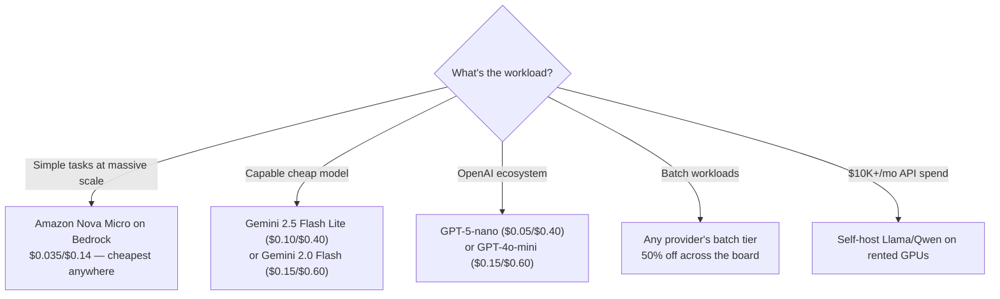

# LLM Provider Comparison Matrix

You've got a dozen providers, three clouds, and a CTO who wants a recommendation by Friday. This is your cheat sheet. Read this first, then dive into the individual guides for the details.

> **TL;DR**
>
> **Direct APIs** get new models first and have identical or lower pricing. **Cloud wrappers** (Azure, Bedrock, Vertex) add compliance, VPC, unified billing, and enterprise features — usually at the same per-token price (the "cloud tax" on token rates is mostly dead). Pick based on (1) which cloud you're already on, (2) which models you need, and (3) your compliance requirements.

---

## Direct API Providers

| | **OpenAI** | **Anthropic** | **Google** |
|---|---|---|---|
| **Flagship models** | GPT-5.2 ($1.75/$14), GPT-5.2 Pro ($21/$168) | Claude Opus 4.6 ($5/$25) | Gemini 3.1 Pro Preview ($2/$12) |
| **Mid-tier** | GPT-4.1 ($2/$8), o3 ($2/$8), o4-mini ($1.10/$4.40) | Claude Sonnet 4.6 ($3/$15) | Gemini 2.5 Pro ($1.25/$10) |
| **Value/fast** | GPT-5-mini ($0.25/$2), GPT-4.1-mini ($0.40/$1.60) | Claude Haiku 4.5 ($1/$5) | Gemini 2.5 Flash ($0.30/$2.50) |
| **Ultra-cheap** | GPT-5-nano ($0.05/$0.40), GPT-4.1-nano ($0.10/$0.40) | — | Gemini 2.5 Flash Lite ($0.10/$0.40), Gemini 2.0 Flash ($0.15/$0.60) |
| **Reasoning** | o3 ($2/$8), o3-pro ($20/$80), o4-mini ($1.10/$4.40) | Extended thinking on Opus/Sonnet | Extended thinking on Gemini 2.5 Pro/Flash |
| **Context window** | 128K–200K | 200K standard, 1M beta | 1M+ (Gemini 2.5/3 Pro) |
| **Batch discount** | 50% off | 50% off | 50% off |
| **Prompt caching** | Automatic (50–90% off cached input) | 5-min or 1-hour TTL, reads at 10% of input price | 90% off cached input, min 32K tokens |
| **Key strength** | Broadest model lineup, best tooling, fastest iteration | Best long-context, strong safety/reasoning | Cheapest flagship models, multimodal (video/audio/image), Google Search grounding |
| **Key weakness** | No VPC/private endpoints | Smaller model lineup | SDK churn, rate limit frustrations |

*All prices per 1M tokens: input/output.*

---

## Cloud Provider Wrappers

Here's where it gets interesting — three cloud giants, each with a different bet on how AI infrastructure should work.

| | **Azure OpenAI / Foundry** | **AWS Bedrock** | **GCP Vertex AI** |
|---|---|---|---|
| **Primary models** | Full OpenAI lineup (GPT-5.x, GPT-4.1, o3, o4-mini) | Claude family (Opus/Sonnet/Haiku 4.5–4.6), Amazon Nova, Llama 4, Mistral, DeepSeek | Gemini family (2.0–3.1), Claude via Model Garden |
| **Multi-model breadth** | 11,000+ via Foundry catalog (OpenAI, Claude, Llama, Mistral, etc.) | 18+ providers (Anthropic, Meta, Mistral, DeepSeek, Qwen, NVIDIA, Cohere, etc.) | Gemini + Claude + Llama + Mistral via Model Garden |
| **Pricing vs direct** | **Identical** for Global Standard deployments | **Identical** for current Claude on global endpoints; Nova is Bedrock-exclusive | **Identical** for Gemini; regional endpoints carry ~10% premium |
| **Pricing tiers** | Pay-per-token (Global/DataZone/Regional Standard) + PTUs + Batch (50% off) | Standard (1x), Priority (1.75x), Flex (0.5x), Batch (0.5x) | Standard (1x), Priority (~1.8x), Flex/Batch (~50% off) |
| **Cheapest option** | GPT-5-nano ($0.05/$0.40) or GPT-4o-mini ($0.15/$0.60) | Nova Micro ($0.035/$0.14) — cheapest on any cloud | Gemini 2.0 Flash ($0.15/$0.60) or Flash Lite ($0.10/$0.40) |
| **Agent platform** | **Foundry Agent Service** — managed multi-model agent runtime with MCP tools, workflows, observability | **AgentCore** (new, 2025) — framework-agnostic serverless runtime; bring CrewAI, LangGraph, etc. Legacy: Bedrock Agents | **ADK** (open-source framework) + **Agent Engine** (managed runtime) + **Agent Builder** (umbrella product) |
| **RAG/search** | Foundry IQ (next-gen RAG over OneLake, S3, Snowflake) | Knowledge Bases (managed, $350/mo OpenSearch floor) | Vertex AI Search, RAG Engine, or custom |
| **Key differentiator** | Only cloud with native OpenAI models; deep M365/Teams/Copilot integration | Most model variety in one API; AgentCore's framework-agnostic infra; cross-region inference | Cheapest inference (Flash Lite); Google Search grounding; media models (Veo, Imagen, Lyria); TPU advantage |
| **Key weakness** | 2–8 week model lag; mandatory content filtering; fine-tuning has 24/7 hosting fees | Rate limits are brutal; docs often wrong; Knowledge Bases expensive | Low default quotas (15–60 RPM); SDK churn; constant product rebranding |

---

## Comparison Deep-Dive

### Model Availability Speed

How fast do you get new models? This matters more than you think — being stuck on an older model while competitors use the latest can mean real capability gaps.

| Provider | Speed | Notes |
|---|---|---|
| **OpenAI Direct** | ⚡ Day one | Always first for OpenAI models |
| **Anthropic Direct** | ⚡ Day one | Always first for Claude models |
| **Google Direct / Vertex AI** | ⚡ Day one | Same models, same time |
| **Azure OpenAI** | 🐢 2–8 weeks behind | Global deployments get models first; Regional lags further |
| **AWS Bedrock** | 🐢 Days to weeks | Claude availability has improved; non-Claude models vary |
| **GCP Vertex AI (3rd party)** | 🐢 Weeks to months for non-Gemini | Model Garden third-party lags |

### Pricing

The "cloud tax" on per-token rates is mostly dead. The real cost differences are operational.

| Provider | Markup vs Direct | Best Cost Optimization |
|---|---|---|
| **Azure OpenAI** | None (Global Standard = OpenAI pricing) | PTUs with 1-year reservation (~65% discount); Batch API (50% off) |
| **AWS Bedrock** | None for current Claude (global); older models may get "Extended Access" 2x pricing | Flex tier (50% off synchronous); Batch (50% off async); Nova Micro for simple tasks |
| **GCP Vertex AI** | None for Gemini; ~10% regional premium for Claude 4.5+ | Batch/Flex (50% off); Gemini 2.0 Flash at $0.15/$0.60 is cheapest capable model |

### Rate Limits

This is where the cloud wrappers lose their shine. Every single one has rate limit stories that would make you weep.

| Provider | Default Experience | Increase Process |
|---|---|---|
| **OpenAI Direct** | Auto-scales with spend tier (Tier 1→5) | Automatic — spend more, get more |
| **Anthropic Direct** | Tier-based, reasonable defaults | Request-based, days |
| **Google Direct** | Generous free tier; paid tiers decent | Request-based |
| **Azure OpenAI** | 200K–450K TPM default; per-region per-subscription | Support ticket; days to weeks; documented limits ≠ actual limits |
| **AWS Bedrock** | Absurdly low defaults (100–500 RPM) | Service Quotas form; days to weeks; non-prod often denied |
| **GCP Vertex AI** | 15–60 RPM per model per region | GCP support; days to weeks; "Quota Exhausted" common on new projects |

**Winner:** OpenAI Direct (auto-scales). **Worst:** AWS Bedrock (bureaucratic, catch-22 for non-prod).

### Agent/Orchestration Features

The agent platform wars are heating up — each cloud has a fundamentally different philosophy:

| Provider | Agent Platform | Maturity | Framework Lock-in |
|---|---|---|---|
| **Azure / Foundry** | Foundry Agent Service + Workflows | GA, multi-model, MCP tools | Medium — Foundry-specific but uses standard protocols |
| **AWS Bedrock** | **AgentCore** (new): framework-agnostic serverless. **Bedrock Agents** (legacy): proprietary | AgentCore: partially preview. Bedrock Agents: GA but maintenance-mode | AgentCore: **Low**. Bedrock Agents: High |
| **GCP Vertex AI** | ADK (open-source SDK) + Agent Engine (managed runtime) + A2A protocol | ADK: GA. Agent Engine: charging since Nov 2025 | Low — ADK is open-source, runs anywhere |

### Enterprise Features

All three clouds are mature for enterprise. Pick the one you're already on — the compliance story is equivalent.

| Feature | Azure OpenAI | AWS Bedrock | GCP Vertex AI |
|---|---|---|---|
| **VPC / Private Endpoints** | ✅ Private Endpoints (complex DNS setup) | ✅ VPC Endpoints, PrivateLink | ✅ VPC-SC, Private Google Access |
| **IAM** | Entra ID / RBAC (propagation delay gotcha) | IAM (native, well-understood) | Cloud IAM (specific roles needed) |
| **SLA** | 99.9% (Standard/Provisioned) | 99.9% | 99.9% (GA models) |
| **Compliance** | SOC 2, ISO 27001, HIPAA BAA, FedRAMP, GDPR | SOC 2, ISO 27001, HIPAA BAA, FedRAMP | SOC 2, ISO 27001, HIPAA BAA, FedRAMP |
| **Data residency** | Full control (Global/DataZone/Regional) | Region-based; cross-region can cross boundaries | Regional endpoints; VPC-SC for strict control |
| **Audit logging** | Azure Monitor, diagnostic logs | CloudTrail, CloudWatch | Cloud Audit Logs |
| **Data training opt-out** | Prompts never used for training | Prompts never used for training | Prompts never used for training |

### Content Filtering / Safety

| Provider | Approach | Impact |
|---|---|---|
| **Azure OpenAI** | **Mandatory** content filtering on all requests/responses | Adds 50–200ms latency; false positives in medical/legal; cannot fully disable without exemption |
| **AWS Bedrock** | **Optional** Guardrails service (PII detection, topic blocking, grounding checks) | Opt-in; adds ~100–200ms; configurable |
| **GCP Vertex AI** | Configurable safety settings per request | Flexible; adjustable thresholds |

Azure is the outlier — mandatory filtering is a deal-breaker for some workloads and a feature for others.

### Batch API Support

| Provider | Discount | Delivery | Notes |
|---|---|---|---|
| **Azure OpenAI** | 50% off (Global/DataZone Batch) | Within 24 hours | Content filtering still applies |
| **AWS Bedrock** | 50% off (Batch tier) | Async to S3, hours | No SLA on completion time |
| **GCP Vertex AI** | ~50% off (Flex/Batch tier) | Async, variable latency | Can be very slow during peak |
| **OpenAI Direct** | 50% off | Within 24 hours | Simplest implementation |
| **Anthropic Direct** | 50% off (Message Batches API) | Async | Same pricing as Bedrock Batch |

### Fine-Tuning Support

| Provider | Available Models | Cost Model | Gotchas |
|---|---|---|---|
| **OpenAI Direct** | GPT-4.1, GPT-4.1-mini/nano, o4-mini, GPT-4o | Per training token + per inference (no hosting fee) | Most flexible |
| **Azure OpenAI** | Same OpenAI models | Per training + **24/7 hosting fee (~$1.70/hr)** + per inference | Hosting fee is a major cost trap |
| **AWS Bedrock** | Llama, Amazon Nova (via Forge), Titan, Cohere | Provisioned Throughput required for serving | Cannot fine-tune Claude or Mistral Large |
| **GCP Vertex AI** | Gemini models | $1–3/M training tokens; serving on standard pricing | Limited hyperparameter control |

### Multi-Model Support

| Provider | Breadth | Notes |
|---|---|---|
| **AWS Bedrock** | ⭐⭐⭐⭐⭐ | 18+ providers, one API — most variety by far |
| **Azure / Foundry** | ⭐⭐⭐⭐ | 11,000+ models in catalog |
| **GCP Vertex AI** | ⭐⭐⭐ | Gemini + Claude + Llama + Mistral; narrower than Bedrock |
| **Direct APIs** | ⭐ each | One provider's models only |

---

## Decision Trees

### "I need the cheapest option"

### "I need enterprise compliance"

→ **Already on Azure:** Azure OpenAI — SOC 2, HIPAA BAA, FedRAMP, VNET, Entra ID
→ **Already on AWS:** AWS Bedrock — same compliance certifications, IAM, VPC endpoints
→ **Already on GCP:** GCP Vertex AI — VPC-SC, CMEK, Cloud IAM
→ **Not on any cloud yet:** All three are equivalent on compliance. Pick based on which models you need.

### "I need agents"

→ **Framework-agnostic, bring your own orchestration:** AWS Bedrock AgentCore
→ **Multi-model agents in Microsoft ecosystem:** Azure Foundry Agent Service + Workflows
→ **Google-first, open-source framework:** GCP ADK + Agent Engine
→ **Just need tool calling, no managed platform:** Direct APIs (OpenAI Responses API, Anthropic tool use, Gemini function calling)

### "I need the latest models fastest"

→ **OpenAI models:** OpenAI Direct API (always first; Azure lags 2–8 weeks)
→ **Claude models:** Anthropic Direct API (Bedrock lags days to weeks)
→ **Gemini models:** Google Direct API or Vertex AI (same day, identical pricing)

### "I'm already on [cloud]"

→ **Azure:** Use Azure OpenAI / Foundry. Only cloud with native OpenAI models. Add direct APIs for R&D.
→ **AWS:** Use Bedrock for Claude + multi-model. Use AgentCore for agents. Add direct APIs for day-one model access.
→ **GCP:** Use Vertex AI for Gemini. Use Model Garden for Claude. Add direct APIs for OpenAI models.
→ **Multi-cloud:** Use direct APIs as your primary path; cloud wrappers only where compliance forces it.

---

## Direct API vs Cloud Wrapper: The Real Decision

### Choose Direct APIs When

- You need **the latest models on release day**
- You're a **startup** without enterprise compliance needs
- You want **simpler rate limits** that auto-scale with spend (especially OpenAI)
- **Content filtering would break your use case** (Azure's is mandatory)
- You're **fine-tuning** and don't want 24/7 hosting fees (OpenAI Direct vs Azure)
- You primarily use **one model provider**

### Choose Cloud Wrappers When

- You need **VPC / private endpoints** (no direct API offers this)
- You have **regulatory requirements** (HIPAA, FedRAMP, EU data residency)
- You need **unified billing** with your existing cloud spend
- You want **multi-model access** under one API and one billing relationship
- You need **managed agent infrastructure** (AgentCore, Foundry Agent Service, Agent Engine)
- You're building in the **cloud ecosystem** (M365 Copilot → Azure; AWS-native apps → Bedrock)

### The Hybrid Approach (What Most Serious Teams Do)

Most production teams end up running both:
- **Direct API for R&D and non-sensitive work** — latest models, simplest DX
- **Cloud wrapper for production with regulated data** — compliance, networking, audit
- **Thin abstraction layer** between your app and the provider — OpenAI-compatible API format works across most providers and makes switching easy

---

## Quick-Reference: Model Pricing (Feb 2026)

### Flagship Models (per 1M tokens, input/output)

| Model | Price | Available On |
|---|---|---|
| GPT-5.2 | $1.75 / $14.00 | OpenAI, Azure (may lag) |
| GPT-5.2 Pro | $21.00 / $168.00 | OpenAI, Azure (may lag) |
| Claude Opus 4.6 | $5.00 / $25.00 | Anthropic, Bedrock |
| Claude Sonnet 4.6 | $3.00 / $15.00 | Anthropic, Bedrock |
| Gemini 3.1 Pro Preview | $2.00 / $12.00 | Google, Vertex AI |
| Gemini 2.5 Pro | $1.25 / $10.00 | Google, Vertex AI |
| o3 | $2.00 / $8.00 | OpenAI, Azure |
| o4-mini | $1.10 / $4.40 | OpenAI, Azure |

### Value Models (per 1M tokens, input/output)

| Model | Price | Available On |
|---|---|---|
| GPT-5-mini | $0.25 / $2.00 | OpenAI, Azure |
| GPT-5-nano | $0.05 / $0.40 | OpenAI, Azure |
| GPT-4.1-mini | $0.40 / $1.60 | OpenAI, Azure |
| Claude Haiku 4.5 | $1.00 / $5.00 | Anthropic, Bedrock |
| Gemini 2.5 Flash | $0.30 / $2.50 | Google, Vertex AI |
| Gemini 2.5 Flash Lite | $0.10 / $0.40 | Google, Vertex AI |
| Gemini 2.0 Flash | $0.15 / $0.60 | Google, Vertex AI |
| Nova Micro | $0.035 / $0.14 | Bedrock only |
| Nova 2 Lite | $0.30 / $2.50 | Bedrock only |

---

## Further Reading

For the full story on each provider, including pricing tables, gotchas, and decision frameworks:
- **[Azure OpenAI Guide](./azure-openai.md)** — Deployment types, PTU economics, content filtering, and 16 engineer gotchas
- **[AWS Bedrock Guide](./aws-bedrock.md)** — Service tiers, AgentCore deep-dive, cross-region inference, and 18 gotchas
- **[GCP Vertex AI Guide](./gcp-vertex-ai.md)** — Gemini pricing tiers, grounding costs, agent stack, and 14 gotchas
- **[Self-Hosted Guide](../choosing-your-llm-provider/self-hosted.md)** — When it makes sense to run your own GPUs
