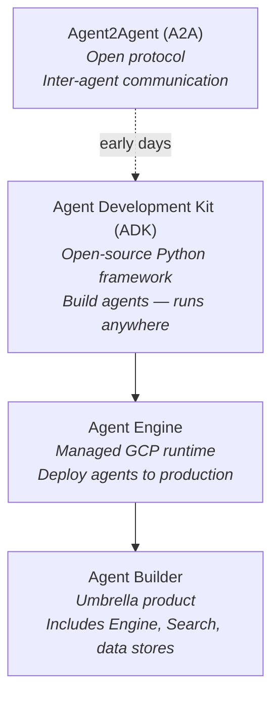
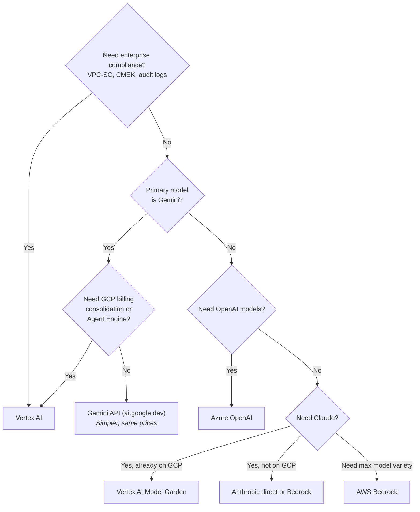

# GCP Vertex AI — The Real Guide

You're Googling how to use Google's AI. The irony isn't lost on anyone. You find three different products — Gemini API, Vertex AI, Google AI Studio — all serving the same models at the same prices, and you spend the first hour figuring out which one you're supposed to use. Welcome to the Google AI experience: incredible models wrapped in a branding layer cake that tests your patience.

> **TL;DR**
>
> Vertex AI is Google's enterprise ML platform wrapping Gemini models (and some third-party models) with IAM, VPC-SC, CMEK, and GCP billing integration. If Gemini is your model and GCP is your cloud, it's the obvious choice. If you need OpenAI models, go Azure. If you need maximum model breadth, go Bedrock. If you're a small team or prototyping, use the Gemini API at ai.google.dev directly — it's simpler and the token pricing is identical.

---

## Understanding Google's AI Strategy

Google's AI strategy has three layers, and confusing them causes most frustration:

1. **Gemini models** — Google's frontier LLMs. This is the strategic priority. Everything else serves Gemini adoption.
2. **Gemini API (ai.google.dev)** — Direct developer API. Free tier, simple auth (API key), no GCP project required. For startups, prototypes, and apps that don't need enterprise compliance.
3. **Vertex AI** — Enterprise wrapper. Same Gemini models, same token prices, but adds IAM, VPC-SC, CMEK, audit logging, SLAs, data residency, and integration with GCP services. Also hosts third-party models via Model Garden.

**The #1 confusion point:** Gemini API and Vertex AI are **two different API surfaces for the same models at the same token prices.** The difference is operational, not functional. Choose based on your enterprise requirements, not model access.

On top of this, Google has built an agent platform layer:

4. **Agent Development Kit (ADK)** — Open-source Python framework for building AI agents. Announced at Cloud Next 2025. Framework-agnostic: works with Gemini natively but also supports other models. Think of it as Google's LangChain alternative, but first-party.
5. **Vertex AI Agent Engine** — Managed runtime for deploying agents built with ADK (or other frameworks) to production. Handles scaling, session management, memory. Started charging for runtime usage November 6, 2025.
6. **Vertex AI Agent Builder** — The umbrella product name encompassing Agent Engine, Vertex AI Search, and related tooling. Google has rebranded this product multiple times (previously "AI Applications," "Vertex AI Search and Conversation," etc.).

**How to think about the agent stack:**
- **ADK** = how you *build* agents (open-source SDK, runs anywhere)
- **Agent Engine** = where you *deploy* agents (managed GCP runtime)
- **Agent Builder** = the broader product family (includes search, data stores, etc.)

Also announced at Cloud Next 2025: **Agent2Agent (A2A)**, an open protocol for inter-agent communication across frameworks and vendors. Early days, but signals Google wants to own the agent interop layer.

---

## Gemini API vs Vertex AI — Which One Do You Actually Need?

Before diving into Vertex AI specifics, let's settle this question — because it's the first one every team asks:

| Factor | Gemini API (ai.google.dev) | Vertex AI |
|--------|---------------------------|-----------|
| **Auth** | API key | GCP IAM (service accounts, OAuth) |
| **Billing** | Google AI billing | GCP billing (consolidated) |
| **Token pricing** | Identical | Identical |
| **Free tier** | Yes (generous) | No free tier for Gemini |
| **VPC-SC / CMEK** | No | Yes |
| **Audit logging** | Basic | Cloud Audit Logs |
| **Data residency** | No guarantees | Regional endpoints |
| **SLA** | None | 99.9% (GA models) |
| **Third-party models** | No | Yes (Claude, Llama, Mistral via Model Garden) |
| **Grounding with Search** | Yes (different pricing) | Yes |
| **Agent Engine** | No | Yes |
| **Setup time** | 5 minutes | Hours to days (IAM, networking) |

**Use Gemini API when:** prototyping, small team, no compliance requirements, want fastest time-to-value.

**Use Vertex AI when:** enterprise compliance needed, already on GCP, need third-party models, need Agent Engine, or need consolidated billing.

---

## Pricing Model

The good news: Vertex AI pricing **matches the Gemini API exactly** — the enterprise wrapper is free, you're paying for the models. The complexity is in Google's aggressive model iteration (4 generations available simultaneously) and grounding costs that differ by generation.

> For exact per-model pricing, see the [Vertex AI pricing page](https://cloud.google.com/vertex-ai/generative-ai/pricing). Prices shift with each model generation — what matters here is the *pricing structure*.

### The Three Tiers

- **Standard:** Pay-as-you-go per token. Start here.
- **Priority:** ~1.8× standard. Higher rate limits, lower latency. Worth it for latency-sensitive production.
- **Flex/Batch:** ~50% of standard. Async processing. **The single best cost optimization on the platform** — use it for evals, bulk classification, data enrichment.

### Key Pricing Callouts

| What | Why It Matters |
|------|---------------|
| **Google wins on cost at the bottom end** | Flash Lite at $0.10/$0.40 and Gemini 2.0 Flash at $0.15/$0.60 per M tokens are the cheapest capable models from any major provider. Period. |
| **Context window pricing has a cliff** | Most Gemini models charge **2× for input tokens beyond 200K context**. A 500K-token prompt costs significantly more than two 200K prompts. |
| **Grounding costs differ by generation** | Gemini 3: $14/1K *search queries*. Gemini 2.5: $35/1K *grounded prompts*. Different billing units, different free tiers. The Gemini 3 pricing is usually cheaper, but verify with your actual usage patterns. |
| **Live API re-bills the entire context every turn** | Each turn of a Live API conversation re-charges for all prior context tokens. A 10-turn conversation costs far more than 10× a single turn. Budget carefully for voice/video use cases. |
| **Batch = 50% off** | Same as OpenAI and Bedrock. If your workload tolerates async, always use batch. |
| **Gemini 2.0 Flash is absurdly cheap** | $0.15/$0.60 per M tokens. If your task doesn't need 2.5-level reasoning, this is the best value in the market. |
| **Prompt caching is meaningful** | Cached input on Gemini 2.5 Pro drops from $1.25 to $0.125 — a 10× reduction. Set up caching for system prompts. |

### How Gemini Compares on Price

| Tier | Gemini | Comparable | Gemini Price | Competitor Price |
|------|--------|------------|-------------|-----------------|
| Frontier | Gemini 2.5 Pro | Claude Sonnet 4.6, GPT-4.1 | $1.25/$10 | $3/$15 (Claude), $2/$8 (GPT-4.1) |
| Mid-tier | Gemini 2.5 Flash | GPT-4o-mini, Haiku 4.5 | $0.30/$2.50 | $0.15/$0.60 (4o-mini), $1/$5 (Haiku) |
| Budget | Flash Lite / 2.0 Flash | GPT-5-nano | $0.10/$0.40 | $0.05/$0.40 (nano) |

Google's pricing advantage is strongest at the Pro/Flash tier — Flash is cheaper than both Claude Sonnet and GPT-4.1 for comparable quality.

---

## Model Ecosystem

### First-Party (Gemini)

Google's model cadence has been ferocious — Gemini 2.0 → 2.5 → 3.0 → 3.1 in ~12 months, the fastest major model iteration among frontier labs.

- **Gemini 3.1 Pro Preview** — Latest frontier. Multimodal including native image generation.
- **Gemini 3.1 Flash Image Preview** — Fast image generation model.
- **Gemini 3 Pro/Flash Preview** — Previous frontier generation.
- **Gemini 2.5 Pro** — Stable/GA workhorse for production. Also available as Computer Use preview.
- **Gemini 2.5 Flash / Flash Lite** — Fast and cheap. Flash supports image output. Flash Lite is the budget king.
- **Gemini 2.5 Flash Live API** — Real-time conversational AI with audio/video input and audio output.
- **Gemini 2.0 Flash / Flash Lite** — Legacy but still absurdly cheap. Great for simple tasks.
- **Imagen 3** — Image generation
- **Veo** — Video generation
- **Lyria** — Music generation (announced Cloud Next 2025)
- **Chirp** — Speech-to-text
- Embedding models (text-embedding-005, etc.)

### Third-Party (Model Garden)

- **Anthropic Claude** — Claude Sonnet 4, Claude Haiku 4.5, and other Claude models available as managed API. Keeps data within GCP boundaries.
- **Meta Llama 3.1/3.2** — Self-hosted deployment on GCP GPUs. You pay compute, not per-token.
- **Mistral** — Mistral Large, Mixtral available.
- **Gemma** (Google's open model) — Available for self-deployment.

**Honest assessment:** Model Garden's third-party selection is narrower than AWS Bedrock. Bedrock gets new models faster. Azure has exclusive OpenAI models. Vertex's third-party story is "good enough to prevent churn" — not a reason to choose GCP.

---

## The Agent Stack — What's What

Google's agent story has solidified through 2025–2026 but the naming remains confusing. Here's the map:

### Agent Development Kit (ADK)
Open-source Python framework for building multi-agent systems. Model-agnostic — works with Gemini natively but supports other LLMs. Runs anywhere: local, Cloud Run, Docker, or Vertex AI Agent Engine. Think of it as Google's answer to LangChain, but first-party.

### Vertex AI Agent Engine
Managed runtime for deploying agents in production. Auto-scaling, session/memory management, managed infrastructure. Started charging November 6, 2025 for runtime usage (was free during preview).

### Agent2Agent (A2A) Protocol
Open protocol for inter-agent communication across frameworks and vendors. Early/preview. If adopted broadly, it'd let agents built on different platforms communicate — but it's vapor until there's real adoption.

**My take:** ADK is solid for new projects if you're Gemini-first. If you're already invested in LangChain/LangGraph, switching has limited payoff. Agent Engine is genuinely useful if you don't want to manage agent infrastructure.

---

## Vertex-Specific Features

### Grounding with Google Search — 7/10
Gives Gemini real-time web access with citations. Quality is good for current-events queries. But it's expensive at scale (see pricing above), and the pricing difference between Gemini 3 ($14/1K queries) and Gemini 2.5 ($35/1K prompts) makes model choice matter for grounded workloads.

### RAG Options — Three Flavors, Pick Carefully

Google offers **three** distinct RAG approaches, and choosing wrong costs you months:

1. **Vertex AI Search** (part of Agent Builder) — Fully managed search engine + retriever. Best out-of-box quality. Good for large document corpora, enterprise search. Limitations: expensive, opaque ranking, limited customization.

2. **Vertex AI RAG Engine** — Managed RAG pipeline using a "corpus" abstraction. Supports multiple vector backends. More customizable than Search, less hassle than building from scratch.

3. **Custom RAG** (pgvector, Pinecone, Weaviate on GKE, etc.) — Full control. Most teams doing serious RAG end up here because they need custom chunking, hybrid search, re-ranking, and debuggability.

**Recommendation:** Start with RAG Engine for prototypes. Evaluate Vertex AI Search if you have enterprise search needs. Build custom for production workloads where retrieval quality directly impacts revenue.

### Context Caching — 8/10
Cache large contexts and pay ~90% less for cached input tokens. Minimum 32K tokens to cache. Works well for apps that send the same large system prompt or document repeatedly. Clean implementation — arguably better UX than OpenAI's equivalent.

### Computer Use (Preview)
Gemini 2.5 Pro Computer Use Preview lets agents interact with browsers. Available as a preview at standard Gemini 2.5 Pro pricing. Early but signals Google's agent ambitions.

### Model Tuning — 5/10
Supervised fine-tuning available for Gemini models. Clunky UX, limited hyperparameter control. Tuning costs: $3/M training tokens for 2.0 Flash, $1/M for 2.0 Flash Lite. Most teams find prompting + few-shot sufficient.

---

## TPU Considerations

Google's TPU advantage is unique — no other cloud provider offers custom AI accelerators at this scale.

- **Ironwood (7th gen)** — Announced Cloud Next 2025. Built specifically for inference. 5× peak compute and 6× HBM vs prior generation.
- **TPU v5e** — Currently available. Good price/performance for inference workloads.

**When TPUs matter:** High-volume inference of open models (Gemma, Llama) where you want to avoid per-token pricing. Custom model serving. Workloads where you can optimize for TPU architecture.

**When they don't:** If you're using Gemini via API (you don't choose the hardware), or your workload is small enough that per-token pricing is cheaper than reserved compute.

For most teams using Gemini via Vertex AI API, TPUs are invisible — Google runs them on the backend. TPUs matter if you're self-hosting open models on GCP. The real impact: Google can offer lower token prices because they control the silicon.

---

## Rate Limits & Quotas — The Real Pain

This is Vertex AI's biggest operational headache, and the community frustration is well-documented.

- Default quotas are **15–60 RPM per model per region per project** for new projects
- Users report getting rate-limited at **3–5 requests/minute** even when documented limits say 60
- "Quota Exhausted" errors across **all Gemini models simultaneously** on new projects
- Quota increase requests require GCP support and can take days to weeks
- Regional variation is significant — us-central1 has highest limits; other regions may be much lower
- Priority tier provides higher effective rate limits (part of what you pay 1.8× for)

**Practical advice:**
1. Request quota increases **before** launch, not during
2. Spread across multiple regions if data residency allows
3. Use Gemini 2.0 Flash as a fallback (higher default limits than Pro)
4. Consider Priority tier if you need guaranteed throughput
5. Use batch/flex for anything that doesn't need real-time response

---

## The Gotchas Nobody Tells You

1. **Three-product confusion.** Google AI Studio, Gemini API (ai.google.dev), and Vertex AI all serve Gemini. Documentation cross-references between them are poor. You'll read a tutorial and realize halfway through it's for the wrong product.

2. **Grounding pricing differs by model generation.** Gemini 3: $14/1K search queries with per-query billing. Gemini 2.5: $35/1K grounded prompts with per-prompt billing. Different billing units. This is not obvious from the docs.

3. **Live API bills per-turn for the entire context window.** Tokens from previous turns are re-billed each turn. A 10-turn conversation costs far more than 10× a single turn.

4. **Default quotas are absurdly low for production.** New projects get 15–60 RPM. You'll hit this on day one.

5. **Agent Engine started charging November 2025.** If you built agents during the free preview, your bill may have surprised you.

6. **Model Garden deployments have compute costs.** Deploying Llama or Mistral = paying for GKE/GPU instances 24/7 unless you configure autoscaling to zero (not straightforward).

7. **SDK churn.** Google's Python SDK has gone through `google-cloud-aiplatform`, `google-generativeai`, `vertexai`, and now `google-adk`. Code examples from 6 months ago may use deprecated imports. This is genuinely frustrating.

8. **IAM complexity.** Vertex AI requires specific IAM roles (`aiplatform.user`, etc.) distinct from general GCP roles. VPC-SC setup is a multi-day exercise.

9. **Billing attribution is opaque.** Costs show as generic "Vertex AI API" line items. Breaking down by model, feature, or team requires BigQuery billing exports.

10. **Batch/Flex jobs can be very slow.** "No latency guarantee" means hours during peak times. Don't use for time-sensitive pipelines.

11. **Context caching minimum is 32K tokens.** Caches expire after configurable TTL. Useless if you don't reuse large contexts.

12. **Regional model availability varies.** Not all models available in all regions. Preview models are often us-central1 only. Check before committing to a data residency requirement.

13. **Web Grounding for Enterprise is a separate, more expensive product.** $45/1K vs $35/1K for standard grounding. You need it if you want to suppress Search Suggestions display.

14. **Product rebranding is constant.** "Agent Builder" was "AI Applications" was "Vertex AI Search and Conversation." Searching for docs or Stack Overflow answers requires knowing all the old names.

---

## Google's Strategic Direction

Google is pursuing **Gemini-everything + agents**. Here are the signals worth paying attention to:

- **Rapid model cadence:** Gemini 2.0 → 2.5 → 3.0 → 3.1 in ~12 months. Fastest iteration among frontier labs.
- **Vertical integration:** Gemini powers Workspace, Android, Chrome, Search, and Vertex AI. The moat is ecosystem, not just model quality.
- **Agent-first future:** ADK, Agent Engine, A2A protocol, Computer Use — Google is betting the next platform shift is agents.
- **Media model breadth:** Only platform with gen-AI for video (Veo), image (Imagen), speech (Chirp), and music (Lyria) — all accessible through Vertex AI.
- **Ironwood TPU:** Purpose-built for inference. Google can offer lower token prices because they control the silicon.
- **Aggressive pricing:** Flash Lite at $0.10/M input, 2.0 Flash at $0.15/M — designed to make switching economically irrational for high-volume workloads.
- **Third-party models are a retention hedge.** Model Garden exists so you don't leave for Bedrock. Google's incentive is to make Gemini so good you don't need Claude or GPT.

**What this means for you:** Betting on Vertex AI = betting on Gemini improving. The platform's third-party support will always lag. If Gemini is your primary model, the bet is good. If you need multi-provider flexibility as a core requirement, Vertex AI adds friction.

---

## Decision Tree

---

## Vertex AI vs. the Competition — Quick Take

**Vertex AI wins on:** pricing (Flash Lite/2.0 Flash are the cheapest capable models in the market), context caching, Google Search grounding, media model breadth (video/image/music/speech), and the agent tooling story (ADK/Agent Engine). Its weakness is quota management, SDK instability, and enterprise UX struggling to keep pace with the model team.

**Azure OpenAI wins on:** model quality for many tasks (GPT series), enterprise maturity, Microsoft ecosystem integration (365, Teams, Entra ID). Its weakness is higher pricing at equivalent tiers and OpenAI vendor dependency.

**AWS Bedrock wins on:** model breadth (Claude, Llama, Mistral, Cohere, Nova, and more), operational maturity, unified multi-model API, and AgentCore's framework-agnostic infrastructure. Its weakness is that Amazon's own models (Nova) aren't frontier-competitive — you're essentially proxying Anthropic and Meta.

---

## Further Reading

- **[Vertex AI Generative AI Pricing](https://cloud.google.com/vertex-ai/generative-ai/pricing)** — The definitive pricing reference, including the confusing grounding costs
- **[Google Cloud Next 2025 Announcement](https://blog.google/innovation-and-ai/infrastructure-and-cloud/google-cloud/next-2025/)** — Ironwood, ADK, A2A, Lyria, and the full Cloud Next recap
- **[Agent Development Kit Docs](https://google.github.io/adk-docs/)** — If you're building agents on Google, start here
- **[Agent Engine Docs](https://docs.cloud.google.com/agent-builder/agent-engine/develop/adk)** — Managed agent runtime reference
- **[Vertex AI RAG Engine Overview](https://docs.cloud.google.com/vertex-ai/generative-ai/docs/rag-engine/rag-overview)** — Managed RAG pipeline documentation
- **[The GCP RAG Spectrum (Medium)](https://medium.com/google-cloud/the-gcp-rag-spectrum-vertex-ai-search-rag-engine-and-vector-search-which-one-should-you-use-f56d50720d5a)** — Excellent breakdown of Search vs. RAG Engine vs. custom
- **[Claude on Vertex AI](https://platform.claude.com/docs/en/build-with-claude/claude-on-vertex-ai)** — How to use third-party models through Model Garden
- **[Vertex AI Quotas](https://docs.cloud.google.com/vertex-ai/generative-ai/docs/quotas)** — Know your rate limits before launch day
- **[Vertex AI Release Notes](https://docs.cloud.google.com/vertex-ai/docs/release-notes)** — Track Agent Engine pricing changes and model updates
- **[Agent Builder Release Notes](https://docs.cloud.google.com/agent-builder/release-notes)** — Product changes and rebrands documented here
- **[Reddit: Rate Limit Frustrations](https://www.reddit.com/r/googlecloud/comments/1ho1688/how_tf_does_vertex_generatvie_ai_rate_limiting/)** — Community discussion worth reading before production deployment
- **[AI API Pricing Comparison (IntuitionLabs)](https://intuitionlabs.ai/articles/ai-api-pricing-comparison-grok-gemini-openai-claude)** — Useful for cross-provider price verification
