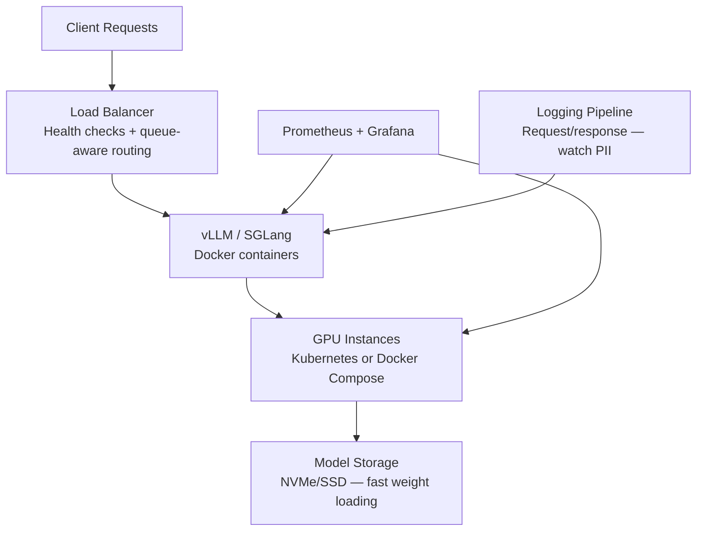

# Self-Hosted LLMs — The Real Guide

> **TL;DR:** Self-hosting makes financial sense only at scale (~$5K+/month API spend) or when you have hard privacy/compliance requirements. Below that, you're paying an engineer $150K/yr to save $3K/month on API costs. The tooling has matured enormously — vLLM is production-ready, Ollama is great for dev — but "production-ready tooling" and "production-ready deployment" are very different things.

You've seen the Reddit posts. Someone spins up Ollama on a rented H100, points their app at it, and proudly announces they've "eliminated their OpenAI dependency." Three weeks later, they're debugging CUDA driver mismatches at 2 AM on a Saturday.

Self-hosting LLMs is genuinely viable in 2026. But "viable" and "good idea for your team" are different conversations. Let's have the honest one.

---

## Why Self-Host (And Why You Think You Want To)

There are three legitimate reasons to self-host:

1. **Data privacy/compliance.** Your data cannot leave your infrastructure — healthcare, defense, regulated finance. This is the only reason that justifies self-hosting at *any* scale.
2. **Cost at scale.** You're spending $10K+/month on API calls with consistent, predictable traffic. A dedicated GPU can serve the same volume for less.
3. **Customization.** You need to serve fine-tuned models, custom architectures, or control inference parameters that APIs don't expose (speculative decoding configs, custom sampling, etc.).

And one reason people don't admit out loud:

4. **It's fun and you want to learn.** Totally valid for personal projects. Not a business justification.

Here's the uncomfortable truth: most teams that self-host for "cost savings" haven't done the math correctly. They count GPU rental costs but forget engineering time, ops overhead, monitoring, on-call burden, and the opportunity cost of what that engineer could be building instead.

---

## The Inference Engines Compared

| Feature | vLLM | SGLang | TGI (HuggingFace) | Ollama | llama.cpp |
|---------|------|--------|--------------------|--------|-----------|
| **Primary use case** | Production serving | Production + structured generation | Production serving | Local dev / simple deploy | Local / edge / CPU inference |
| **Continuous batching** | ✅ | ✅ | ✅ | ❌ | ❌ |
| **Tensor parallelism** | Multi-GPU | Multi-GPU | Multi-GPU | Single GPU | Limited |
| **PagedAttention** | ✅ (invented it) | ✅ | Own implementation | ❌ | ❌ |
| **Speculative decoding** | ✅ | ✅ | ✅ | ❌ | ✅ |
| **OpenAI-compatible API** | ✅ | ✅ | ✅ | ✅ | ✅ (server mode) |
| **Quantization support** | AWQ, GPTQ, FP8, GGUF (limited) | AWQ, GPTQ, FP8 | AWQ, GPTQ, bitsandbytes | GGUF (primary) | GGUF (primary) |
| **Structured output** | JSON mode | Best-in-class | Grammar | JSON mode | Grammar/GBNF |
| **Ease of setup** | Medium (CUDA deps) | Medium | Easy (Docker) | Very easy | Easy (single binary) |
| **Model support breadth** | Excellent (most HF models) | Good | Excellent | Good (via registry) | Good (GGUF ecosystem) |
| **Maturity** | Production-proven | Rapidly maturing | Production-proven | Dev/small prod | Battle-tested |

### Performance Benchmarks

These numbers are for **Llama 3 70B on a single H100 80GB**, FP16, drawn from community benchmarks and official reports:

| Engine | Throughput (tok/s, batch=32) | Time-to-first-token (ms) | Max concurrent users |
|--------|------------------------------|--------------------------|---------------------|
| **vLLM** | ~2,500–3,500 | ~150–300 | Hundreds (with batching) |
| **SGLang** | ~2,800–3,800 | ~120–250 | Hundreds |
| **TGI** | ~2,000–2,800 | ~200–400 | Hundreds |
| **Ollama** | ~500–800 (no batching) | ~300–500 | 1–5 (sequential) |
| **llama.cpp** | ~400–700 (GPU offload) | ~200–400 | 1–10 |

> **Caveat:** Benchmarks vary wildly by model, quantization, hardware, batch size, and sequence length. Treat these as directional. Always benchmark *your* specific workload.

### Which Engine Should You Pick?

- **vLLM** is the default choice for production GPU serving. Largest community, most battle-tested, best docs. Start here unless you have a specific reason not to.
- **SGLang** wins if you need best-in-class structured generation or you're doing complex multi-turn / tree-of-thought workloads. Slightly higher throughput than vLLM in many benchmarks, but a less mature ecosystem.
- **TGI** makes sense if you're already deep in the HuggingFace ecosystem and want easy Docker deployment. Solid, but has fallen behind vLLM/SGLang in performance and features.
- **Ollama** is perfect for local development, demos, and simple single-user deployments. **Not for production multi-user serving.** No continuous batching means throughput collapses under concurrent load.
- **llama.cpp** is the choice for CPU inference, edge deployment, Apple Silicon, or when you need a single self-contained binary. The GGUF quantization ecosystem revolves around it. Surprisingly good on M-series Macs.

---

## The Cost Breakeven Math

Let's do the actual calculation, because this is where most self-hosting pitches fall apart.

### The Setup

- **Workload:** ~100K requests/day, average 500 input + 500 output tokens per request
- **Monthly tokens:** ~3B input + 3B output
- **Model need:** Something Llama-3-70B class (comparable to GPT-4o-mini for most tasks)

### Option A: API (OpenAI GPT-4o-mini)

| | |
|---|---|
| Input | 3B tokens × $0.15/M = $450/month |
| Output | 3B tokens × $0.60/M = $1,800/month |
| **Total** | **~$2,250/month** |
| Engineering cost | Near zero (it's an API call) |

### Option A2: API (Gemini 2.5 Flash Lite)

| | |
|---|---|
| Input | 3B tokens × $0.10/M = $300/month |
| Output | 3B tokens × $0.40/M = $1,200/month |
| **Total** | **~$1,500/month** |

### Option B: Self-Hosted (Llama 3 70B on rented H100)

| | |
|---|---|
| H100 rental (on-demand) | ~$2.50/hr × 730 hrs = **$1,825/month** |
| H100 rental (reserved) | ~$1.80/hr × 730 hrs = **$1,314/month** |
| Monitoring/infra overhead | ~$100–200/month |
| **Subtotal** | **$1,500–2,000/month** |
| Engineering (10–20 hrs/month @ $100/hr) | **$1,000–2,000/month** |
| **True total** | **$2,500–4,000/month** |

### The Verdict

At 100K requests/day with a 70B model, **self-hosting is MORE expensive than APIs** when you honestly account for engineering time. The breakeven only works when:

1. **Volume is 3–5× higher** (~300K–500K requests/day), where GPU cost stays flat but API cost scales linearly
2. **You already have GPU infrastructure** (no rental costs, just electricity + depreciation)
3. **You amortize engineering across multiple models** (serving 5 models on 4 GPUs is much more efficient per-model)
4. **You use smaller models with quantization** — a Llama 3 8B Q4 on an L40S ($0.85/hr) can handle enormous throughput

### The Real Breakeven

**Self-hosting starts saving money at roughly $5,000–10,000/month in API spend**, assuming:

- You have (or are willing to hire) MLOps expertise
- Your traffic is consistent (not bursty)
- You're willing to run quantized or smaller models
- You've already validated that open models meet your quality bar

Below $5K/month: use APIs. Above $10K/month: seriously evaluate self-hosting. In between: it depends on your team.

---

## GPU Rental Options

### On-Demand Pricing

| GPU | VRAM | RunPod (Serverless Flex) | RunPod (Pods) | Vast.ai (Community) | Lambda Labs |
|-----|------|------------------------|---------------|---------------------|-------------|
| **B200** | 180GB | $8.64/hr | ~$9–10/hr | N/A | N/A |
| **H200** | 141GB | $5.58/hr | ~$6–7/hr | N/A | N/A |
| **H100 SXM** | 80GB | $4.18/hr | ~$3.50–4.50/hr | ~$2.50–3.50/hr | ~$2.49/hr |
| **A100 SXM** | 80GB | $2.72/hr | ~$2.50–3.00/hr | ~$1.50–2.50/hr | ~$1.29/hr |
| **L40S** | 48GB | $1.90/hr | ~$1.50–2.00/hr | ~$0.80–1.20/hr | ~$0.99/hr |
| **RTX 4090** | 24GB | $1.10/hr | ~$0.74/hr | ~$0.30–0.50/hr | N/A |

### Reserved/Committed Pricing

- **RunPod** offers Active workers at ~70% of Flex pricing
- **CoreWeave** reserved contracts: typically 30–50% below on-demand, 1–12 month commitments
- **Lambda Labs** reserved: ~20–30% discount, requires commitment
- **Vast.ai**: no formal reservations, spot-like pricing fluctuates

### How to Think About These Options

- **Vast.ai** is cheapest but you get random community hardware. Fine for experimentation, not for production SLAs.
- **RunPod** is the sweet spot — reasonable pricing, good reliability, and a serverless option that means you don't pay for idle.
- **Lambda Labs** has the best developer experience and reliability but limited availability (GPUs sell out).
- **CoreWeave** is for serious production workloads with dedicated clusters and SLAs. Not for experimenting.
- **Cloud providers (GCP/AWS/Azure)** charge 2–4× the above. Only use them if you need the cloud integration or have committed spend to burn.

---

## Quantization Guide

Quantization reduces model precision to save memory and increase speed, at some quality cost. Think of it as the JPEG of model weights — you're trading fidelity for size.

### Format Comparison

| Format | Bits | Quality vs FP16 | Memory Savings | Speed Impact | Best Engine | Notes |
|--------|------|-----------------|----------------|-------------|-------------|-------|
| **FP16/BF16** | 16 | Baseline | None | Baseline | vLLM, TGI, SGLang | Full quality, full memory |
| **FP8** | 8 | ~99% | ~50% | 10–30% faster | vLLM, SGLang | Best quality/memory tradeoff. Requires Hopper+ (H100/H200) |
| **AWQ** | 4 | ~95–97% | ~75% | 20–50% faster | vLLM, SGLang, TGI | Activation-aware, good quality. Preferred for GPU serving |
| **GPTQ** | 4 | ~93–96% | ~75% | 20–50% faster | vLLM, TGI | Older but well-supported. Slightly lower quality than AWQ |
| **GGUF Q4_K_M** | ~4.5 | ~94–96% | ~70% | CPU-optimized | llama.cpp, Ollama | The llama.cpp native format. Excellent CPU performance |
| **GGUF Q5_K_M** | ~5.5 | ~97–98% | ~65% | CPU-optimized | llama.cpp, Ollama | Sweet spot for quality on CPU |
| **GGUF Q8_0** | 8 | ~99% | ~50% | CPU-optimized | llama.cpp, Ollama | Negligible quality loss |
| **GGUF Q2_K/Q3_K** | 2–3 | ~80–90% | ~85% | CPU-optimized | llama.cpp, Ollama | Noticeable degradation. Last resort |

### Practical Guidance

- **Production GPU serving:** Use FP8 on H100/H200 (best quality/speed). Use AWQ 4-bit on A100/L40S.
- **Local development:** GGUF Q4_K_M is the community standard. Good enough quality, fits on consumer GPUs.
- **Edge/mobile:** GGUF Q4_K_S or lower. Accept quality loss for deployability.
- **Don't go below Q4 unless desperate.** The quality cliff is real — Q3 and Q2 models produce noticeably worse output for reasoning tasks.
- **Model size > quantization for quality.** A 70B Q4 model generally beats an 8B FP16 model. Bigger model + quantization > smaller model + full precision.

---

## Production Deployment Reality

Here's what the timeline actually looks like. Nobody's blog post tells you this part.

### Day 1: "This is Easy"

Pull a Docker image, load a model, get an OpenAI-compatible endpoint. Run some test queries — looks great. ~4 hours of work. You feel like a genius.

### Week 1: "Oh Wait"

You need health checks and readiness probes (model loading takes 2–5 minutes). You need to handle OOM kills gracefully (70B models are tight on 80GB VRAM with long contexts). Request queuing, timeout handling, basic monitoring (GPU utilization, queue depth, latency percentiles). ~20–40 hours of work.

### Month 1: "This is a Job"

Model updates (new Llama release = retest, re-quantize, redeploy). Autoscaling (scale-to-zero saves money but cold starts take 2–5 minutes). Load balancing across multiple GPU instances. Prompt template management (different models need different chat templates). Cost monitoring and optimization. On-call rotation for GPU-related incidents. ~40–80 hours/month ongoing.

### The Stack You'll Need

Key components:
1. **Inference engine** — vLLM or SGLang in Docker
2. **Orchestration** — Kubernetes (GKE, EKS) or simpler Docker Compose + Nginx for <5 GPUs
3. **Load balancer** — with health checks and queue-aware routing
4. **Monitoring** — Prometheus + Grafana tracking GPU utilization, VRAM usage, queue depth, P50/P95/P99 latency, tokens/sec, error rate
5. **Model storage** — fast storage for weights. Downloading a 70B model from HuggingFace takes 20+ minutes on slow connections
6. **Logging** — request/response logging for debugging (careful with PII)

---

## The Gotchas Nobody Tells You

These are hard-won lessons from teams that have actually done this in production.

1. **CUDA version hell is real.** vLLM requires specific CUDA versions. Your GPU driver, CUDA toolkit, PyTorch, and vLLM versions must all be compatible. Upgrading one can break others. *Always use the official Docker images.* Never install from pip on bare metal unless you enjoy pain.

2. **OOM is not an error, it's a lifestyle.** Long sequences on 70B models will OOM on 80GB GPUs. vLLM's `--max-model-len` is your friend. Set it lower than the model's theoretical maximum. Expect occasional OOM kills and handle them gracefully.

3. **Cold starts kill user experience.** Loading a 70B model into GPU memory takes 2–5 minutes. Quantized models are faster but still 30–60 seconds. If you scale to zero, your first user waits 2+ minutes. Keep at least one instance warm.

4. **Ollama is NOT a production server.** It's fantastic for local dev. But without continuous batching, throughput collapses with >2–3 concurrent users. If your "production deployment" is a single Ollama instance, you'll be fine — until you have actual traffic.

5. **Model updates are operational events.** When Llama 4 drops, you can't just swap it in. New models may need different quantization, different VRAM, different prompt templates, and different vLLM versions. Plan model updates like any other infrastructure change.

6. **Networking bandwidth matters more than you think.** Downloading model weights (70B = ~140GB in FP16, ~35GB in Q4) takes significant time. If you're on Vast.ai or ephemeral instances, you download the model *every time* you start. Use persistent storage or a model cache.

7. **Multi-GPU coordination is fragile.** Tensor parallelism across 2–4 GPUs works but adds latency and complexity. NVLink vs PCIe matters enormously — cross-PCIe tensor parallel is 30–50% slower. Always check your GPU interconnect topology.

8. **The quality gap is closing but not closed.** Open models (Llama 4 Scout/Maverick, Qwen 3 235B) are competitive with GPT-4o-mini and Gemini Flash for many tasks. They are *not* competitive with GPT-5, Claude Sonnet 4, or Gemini 2.5 Pro for complex reasoning, coding, or long-context tasks. Know your quality requirements before committing.

9. **Monitoring GPU utilization is different from CPU.** Standard APM tools don't understand GPU metrics. You need DCGM exporter or nvidia-smi scrapers. GPU memory fragmentation can degrade performance even when "utilization" looks fine.

10. **You're now a model operations team.** Self-hosting means you own the entire stack: model selection, quantization, deployment, scaling, monitoring, incident response, and model lifecycle management. This is a full-time job, not a side project.

11. **Speculative decoding is amazing when it works.** Using a small draft model to speed up a large model can give 2–3× throughput improvement. But it requires careful tuning and not all model pairs work well together. Don't count on it in your initial capacity planning.

12. **Prompt template mismatches silently degrade quality.** Each model family has specific chat template formatting (Llama uses `<|begin_of_text|>`, Mistral uses `[INST]`, etc.). Using the wrong template doesn't crash — it just produces subtly worse output. vLLM auto-detects most templates, but verify.

---

## When to Self-Host

- **Hard compliance requirements** — data cannot leave your infrastructure, period
- **Cost at scale** — you're spending >$10K/month on API calls with predictable, consistent traffic
- **You have ML/infra engineering capacity** — at least one person who can own the stack
- **Open models meet your quality bar** — you've validated Llama/Qwen/Mistral for your use case
- **You need custom model modifications** — fine-tuned models, merged models, custom architectures
- **Latency control** — you need guaranteed P99 latency that API providers can't commit to
- **Offline/air-gapped environments** — no internet access available

## When NOT to Self-Host

- **Your API spend is under $5K/month** — the engineering cost alone exceeds the savings
- **Your traffic is bursty/unpredictable** — you'll either over-provision (waste money) or under-provision (drop requests)
- **You need frontier model quality** — GPT-5, Claude Sonnet 4, and Gemini 2.5 Pro are still meaningfully better than open models for hard tasks
- **Your team doesn't have GPU/ML ops experience** — the learning curve is steep and the failure modes are exotic
- **You're a startup trying to move fast** — every hour spent on model ops is an hour not spent on product
- **You need multiple model types** — serving one model is manageable; serving 5 different models on shared GPU infrastructure is a full-time job
- **You're doing it because it's "cooler"** — your investors/customers don't care how you serve the model, they care that it works

---

## Further Reading

- [vLLM Documentation](https://docs.vllm.ai/) — Official docs and deployment guides, the best starting point for production serving
- [SGLang GitHub](https://github.com/sgl-project/sglang) — Benchmarks and feature comparison for structured generation workloads
- [Ollama](https://ollama.ai/) — The easiest way to run LLMs locally for development
- [llama.cpp](https://github.com/ggerganov/llama.cpp) — The engine behind CPU/GGUF inference and the quantization ecosystem
- [HuggingFace TGI](https://huggingface.co/docs/text-generation-inference) — Text Generation Inference documentation
- [RunPod Pricing](https://www.runpod.io/pricing) — GPU rental prices and serverless options
- [Lambda Labs GPU Cloud](https://lambdalabs.com/service/gpu-cloud) — GPU cloud with strong developer experience
- [Vast.ai](https://vast.ai/) — Community GPU marketplace for budget experimentation
- [CoreWeave](https://www.coreweave.com/) — Enterprise GPU cloud for production workloads with SLAs
- r/LocalLLaMA and HackerNews — Community benchmarks and real-world deployment experiences
