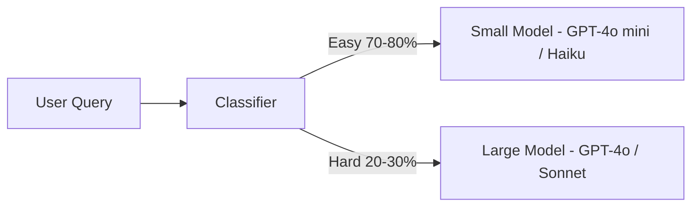
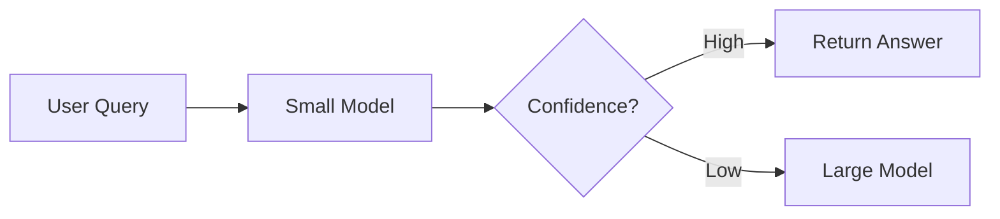

# GPU Cost Optimization for AI Inference and Training

Your inference bill just came in. It's ugly. You're running a 70B model on H100s at full FP16 precision, serving one request at a time, and paying retail API prices for your system prompt on every single call. You know there's a better way — you just don't know which optimizations actually move the needle and which ones are academic distractions.

This guide is the answer. Every technique here is production-proven, with real benchmarks and dollar amounts. Most teams can cut their GPU spend by 80–95% by stacking 3–4 of these together.

> **TL;DR:** The biggest cost lever isn't your cloud provider — it's what you do with the GPU. Industry-wide, LLM inference costs are dropping ~10× per year for equivalent performance. But you don't have to wait. Combining quantization (INT4 → 82% GPU cost reduction), continuous batching (5–10× throughput), prompt caching (90% input token savings), and model routing (50×+ cost difference between small/large models) can reduce your inference bill by 80–95% *today*.

---

## The Optimization Landscape

Before diving deep, here's the decision matrix. Every technique has a cost-quality-complexity tradeoff — pick the ones that match your situation:

| Technique | Typical Savings | Complexity | Quality Impact | Time to Implement |
|-----------|----------------|------------|----------------|-------------------|
| **Right-sizing GPU** | 60–80% | Low (config change) | None | Hours |
| **Quantization (INT4)** | 75–82% on GPU cost | Low–Medium | 1–3% accuracy loss on most tasks | 1–2 days |
| **Quantization (FP8)** | ~50% on GPU cost | Low (H100+ only) | <0.5% accuracy loss | Hours |
| **Continuous batching** | 5–10× throughput/GPU | Low (use vLLM/SGLang) | None | Hours |
| **Prompt caching** | Up to 90% on input tokens | Low–Medium | None | 1–2 days |
| **Model routing/cascade** | 40–70% on API costs | Medium–High | Minimal if well-tuned | 1–2 weeks |
| **Speculative decoding** | 2–3× latency reduction | Medium | None (mathematically lossless) | Days |
| **Model distillation** | 5–20× inference cost | High | 1–5% task-dependent | 2–4 weeks |
| **KV cache optimization** | 30–50% memory savings | Low–Medium | None–minimal | Hours–days |
| **SwiftKV** | Up to 75% inference cost | Medium | Negligible on Llama models | Days |
| **Spot/preemptible for training** | 50–70% | Medium (needs checkpointing) | None | Days |

---

## 1. Quantization: The Highest-ROI Optimization

If you only do one thing on this list, do this. Quantization reduces model weight precision, shrinking memory footprint and boosting inference speed. It's the single most impactful optimization for self-hosted inference.

### Memory Impact by Precision

| Precision | Bytes/Param | 7B Model | 13B Model | 70B Model | 405B Model |
|-----------|-------------|----------|-----------|-----------|------------|
| FP32 | 4 | 28 GB | 52 GB | 280 GB | 1,620 GB |
| FP16/BF16 | 2 | 14 GB | 26 GB | 140 GB | 810 GB |
| FP8 (H100+) | 1 | 7 GB | 13 GB | 70 GB | 405 GB |
| INT8 (W8A8) | 1 | 7 GB | 13 GB | 70 GB | 405 GB |
| INT4 (GPTQ/AWQ) | 0.5 | 3.5 GB | 6.5 GB | 35 GB | 203 GB |

*Weight-only sizes. Add 2–8 GB for KV cache, activations, and framework overhead depending on context length and batch size.*

### Does Quality Actually Suffer?

Less than you'd think. Studies consistently show 4-bit quantized LLMs perform on par with FP16 counterparts across diverse tasks. Here's the nuanced picture:

| Quantization | Accuracy Loss | Best For | Avoid For |
|-------------|--------------|----------|-----------|
| FP16 → FP8 (H100 native) | **<0.5%** | Everything on H100+ — zero calibration needed | N/A (always safe) |
| FP16 → INT8 (W8A8) | **<0.5%** | General purpose, production-safe | Rarely an issue |
| FP16 → INT4 (AWQ) | **0.5–2%** | Chat, summarization, RAG, classification (7B+) | Math-heavy tasks on <7B models |
| FP16 → INT4 (GPTQ) | **1–3%** | Same as AWQ, slightly worse quality | Small models, precision-critical tasks |
| FP16 → GGUF Q4_K_M | **1–2%** | CPU+GPU hybrid with llama.cpp | Very long context (>32K) |
| FP16 → INT2/NF2 | **5–15%** | Rough prototyping only | Production |

### The Dollar Translation

Here's the math that should make this decision obvious:

A 70B model in FP16 needs ~140 GB VRAM → **2× H100 80 GB** (~$13.76/hr on AWS p5).
Same model in INT4 needs ~35 GB VRAM → **1× A100 80 GB** (~$2.45/hr on AWS p4d).

**That's an 82% cost reduction** with 1–3% quality loss. For most production use cases — chatbots, RAG, summarization — this is a no-brainer.

### Quantization Decision Matrix

| Model Size | Recommended Precision | Target GPU | Monthly Cost (24/7) | Rationale |
|-----------|----------------------|------------|--------------------|----|
| ≤7B | INT4 (AWQ) | L4 24 GB or T4 16 GB | ~$360–576 | Fits easily; max cost efficiency |
| 7B–13B | INT4 | L4 24 GB | ~$576 | INT4 on L4 is the sweet spot |
| 13B–34B | INT4 | A100 80 GB | ~$1,764 | Room for KV cache |
| 70B | INT4 | A100 80 GB | ~$1,764 | 35 GB weights + KV cache fits in 80 GB |
| 70B | FP8 | H100 80 GB | ~$4,954 | Best latency, minimal quality loss |
| 200B+ / MoE | FP8 or INT8 | 4–8× H100/H200 | ~$19,816+ | Multi-GPU unavoidable |

### Your Toolkit

- **AWQ:** Best quality-per-bit for INT4. Use `autoawq`.
- **GPTQ:** Mature, widely supported. Use `auto-gptq`.
- **llama.cpp GGUF:** Best for CPU+GPU hybrid. Q4_K_M is the sweet spot.
- **FP8 (H100+ native):** Negligible quality loss, ~2× speedup over FP16, zero calibration.
- **TensorRT-LLM:** NVIDIA's optimized runtime with FP8/INT4 built-in.

---

## 2. Batching: Turn 1 GPU Into 10

A single GPU serving one request at a time wastes 80–95% of its compute. If you're not batching, you're essentially lighting money on fire.

### Batching Strategies Compared

| Strategy | Throughput Gain | Latency Impact | Complexity |
|----------|----------------|----------------|------------|
| **No batching** | 1× (baseline) | Lowest | None |
| **Static batching** | 3–5× | Moderate increase | Low |
| **Continuous batching** | 5–10× | Minimal | Medium |
| **Chunked prefill** | 8–15× | Optimized for mixed workloads | High |

### Real Throughput Numbers

From production benchmarks on H100 GPUs:

| Framework | Model | GPU | Concurrency | Throughput |
|-----------|-------|-----|-------------|------------|
| vLLM | GPT-OSS-120B | H100 | 100 concurrent | **4,741 tok/s** |
| SGLang | Llama-3.1-70B | H100 | batch 64 | **460 tok/s** |
| vLLM (FlashInfer) | 7B models | A100 | High concurrency | **~12,500 tok/s** |

### The Cost Math

**Without batching:** 1 H100 serves ~30 req/min for Llama-70B INT4.
**With continuous batching (batch 32):** Same H100 → ~200+ req/min.

Same GPU, **6–7× more throughput** → cost per request drops from ~$3.40 to ~$0.50 per 1K requests.

### Which Framework to Pick

- **vLLM:** Best overall throughput at high concurrency. Production-proven. Start here.
- **SGLang:** Strong at moderate concurrency, excellent for structured generation. Built-in EAGLE speculative decoding.
- **TensorRT-LLM:** Best raw performance on NVIDIA GPUs but harder to set up.
- **TGI (HuggingFace):** Easy to deploy, good enough for moderate loads.

---

## 3. Prompt Caching: Stop Paying for the Same Tokens

If your app sends the same system prompt, few-shot examples, or RAG context repeatedly, you're paying full price for redundant computation every single time. Prompt caching stores the computed KV cache for shared prefixes and reuses it across requests.

### Provider Comparison (February 2026)

| Feature | OpenAI | Anthropic (Claude) | Google (Gemini) |
|---------|--------|--------------------|-----------------|
| Caching mode | Automatic | Explicit API flag | Explicit API flag |
| Cache lifetime | 5–10 min | 5 min | 15 min |
| Min prefix size | 1,024 tokens | 1,024 tokens | 2,048 tokens |
| **Cached input discount** | **90%** | **90%** | **75%** |
| Latency improvement | 50–80% TTFT | 60–85% TTFT | 40–70% TTFT |
| Longer cache option | Yes (GPT-5.1 Pro) | No | Yes (Gemini 3 Pro) |

The key insight: cached input tokens are **10× cheaper** than regular input tokens for both OpenAI and Anthropic.

### When Caching Pays Off

**Use caching if:**
- You send 1,024+ tokens of shared context per request
- You can reuse the exact prefix across multiple calls in a short window
- Bursty workloads: batch jobs, queued tasks
- Multi-turn chats with the same system prompt

**Skip caching if:**
- Your prefix changes every request (even small changes invalidate the cache)
- Prompts are short (<1,024 tokens)
- Calls are too spread out (cache expires between requests)
- You personalize the system prompt per user

### Implementation

```python
# Structure your messages for maximum cache reuse:
# 1. System prompt (STATIC - gets cached)
# 2. Few-shot examples (STATIC - gets cached)
# 3. RAG context (SEMI-STATIC - cache if shared across users)
# 4. User query (DYNAMIC - never cached)

# Anthropic: explicit cache control
messages = [
    {"role": "system", "content": SYSTEM_PROMPT,
     "cache_control": {"type": "ephemeral"}},  # Mark for caching
    {"role": "user", "content": user_query}
]
```

For self-hosted inference, vLLM and SGLang support prefix caching natively:

```bash
# vLLM: enable with a flag
vllm serve model --enable-prefix-caching
```

For a 2K-token system prompt on Llama-70B, this saves ~0.6 GB KV cache per request and eliminates prefill latency for the shared portion. Free performance.

---

## 4. Model Routing: Use the Cheapest Model That Works

Not every query needs GPT-4 or Claude Opus. Routing simple queries to smaller, cheaper models while reserving the heavy hitters for hard problems can yield massive savings.

### The Cost Spread Is Enormous

The difference between model tiers is staggering — **over 50× between Claude Haiku and Opus**:

| Model | Input $/1M tokens | Output $/1M tokens | Relative Cost |
|-------|-------------------|---------------------|---------------|
| GPT-4o mini | $0.15 | $0.60 | 1× |
| GPT-4o | $2.50 | $10.00 | ~17× |
| GPT-4.1 | $3.00 | $12.00 | ~20× |
| Claude 3 Haiku | $0.25 | $1.25 | 1× (baseline) |
| Claude Opus 4 | $15.00 | $75.00 | **60×** |

### Three Routing Patterns

**Pattern 1 — Simple Router:**



**Pattern 2 — Cascade (Try Small First):**



**Pattern 3 — Task-Based Routing:**
- Classification/extraction → Small model (always)
- Summarization → Small model (usually fine)
- Complex reasoning/coding → Large model
- Creative/nuanced writing → Large model

### Expected Savings

If 70% of your queries can be handled by a model that's 20× cheaper, your blended cost drops by ~65%. Real-world implementations report **40–70% cost reduction** while maintaining >95% quality on the queries that matter.

---

## 5. Speculative Decoding: Faster Without Quality Loss

This one's clever. A small "draft" model proposes multiple tokens, then the large "target" model verifies them in parallel. The output distribution is identical to the target model — it's **mathematically lossless**.

### Benchmarked Speedups

| Method | Target Model | Draft Model | Speedup |
|--------|-------------|-------------|---------|
| Standard speculative | 70B | 7B | **2–3×** |
| EAGLE-3 | Llama 4 Scout 17B | EAGLE head | **2–3× latency, significant throughput gains** |
| Standard speculative | GPT-2 Large | GPT-2 | 1.1× (too small ratio — not worth it) |

The key insight: speculative decoding works best with large draft-to-target size ratios (e.g., 7B drafting for 70B). For small models, the overhead isn't worth it.

### When to Use

- Latency-sensitive applications (chat, real-time)
- Large target models (70B+) with available small draft models
- Single-request or low-batch scenarios where batching alone isn't enough
- **Not** for high-throughput batch processing (batching is more effective)
- **Not** for small target models (<13B)

### Implementation

SGLang has built-in EAGLE-3 support. vLLM supports standard speculative decoding:

```bash
# vLLM with speculative decoding
vllm serve meta-llama/Llama-3-70B \
  --speculative-model meta-llama/Llama-3-8B \
  --num-speculative-tokens 5
```

---

## 6. Model Distillation: The Long Game

Distillation compresses a large "teacher" into a smaller "student" model. It's higher effort than anything else on this list, but yields the largest long-term savings.

### The Numbers

- Distilled models can retain ~97% of original performance on targeted tasks.
- A 13B distilled model can often replace a 70B for domain-specific applications → **5×+ inference cost savings**.
- OpenAI's distillation API lets you distill from GPT-4o to GPT-4o mini, with the mini being ~17× cheaper per token.
- 74% of organizations planned to use LLM distillation in 2024 to create compact production models.

### The Distillation Playbook

1. **Identify your task.** Distillation works best for narrow, well-defined tasks (classification, extraction, summarization).
2. **Generate training data.** Run your large model on 5K–50K examples to create teacher outputs.
3. **Fine-tune a small model.** Use the teacher outputs as training data for a 7B–13B model.
4. **Evaluate on YOUR data.** Don't trust general benchmarks — measure on your production distribution.
5. **Deploy with quantization.** Stack distillation + INT4 for maximum savings.

### When NOT to Distill

- You need broad, general-purpose capabilities
- Your task distribution shifts frequently
- You can't generate enough training data
- Quality requirements are absolute (medical, legal)

---

## 7. Right-Sizing: The Most Common Waste

The most expensive mistake in GPU computing: renting an H100 to serve a 7B model. You're paying 8× too much.

### Decision Tree

```
Is your model ≤13B parameters?
  └─ YES → L4 24 GB with INT4. Done. ($0.50–0.80/hr)
  └─ NO → Is it ≤70B?
       └─ YES → Does INT4 quality work?
            └─ YES → A100 80 GB with INT4 ($2–3/hr)
            └─ NO → H100 80 GB with FP8 ($3–7/hr)
       └─ NO → Multi-GPU required.
            └─ min_GPUs = ceil(model_size_GB / (GPU_VRAM × 0.8))
            └─ (0.8 factor = 20% headroom for KV cache)
```

### GPU Pricing Quick Reference (February 2026)

| Model | Precision | Min VRAM | Recommended GPU | $/hr (AWS) | $/hr (Lambda) |
|-------|-----------|----------|-----------------|------------|---------------|
| Llama-3-8B | INT4 | ~6 GB | L4 24 GB | ~$0.80 | — |
| Llama-3-8B | FP16 | ~16 GB | L4 24 GB | ~$0.80 | — |
| Llama-3-70B | INT4 | ~38 GB | A100 80 GB | ~$2.45 | ~$1.10 |
| Llama-3-70B | FP8 | ~70 GB | H100 80 GB | ~$6.88 | ~$2.86 |
| Llama-3-70B | FP16 | ~140 GB | 2× H100 | ~$13.76 | ~$5.72 |
| Llama-3-405B | INT4 | ~210 GB | 4× A100 80 GB | ~$9.80 | ~$4.40 |
| DeepSeek-R1 (671B MoE) | INT8 | ~700 GB | 8× H200 | ~$39.80 | — |

---

## 8. KV Cache Optimization

For long-context inference (32K+ tokens), KV cache can consume MORE memory than the model weights themselves. This is the hidden cost that catches teams off guard.

### KV Cache Size Formula

```
KV cache per request = 2 × num_layers × num_kv_heads × head_dim × seq_len × bytes_per_element
```

**Llama-70B FP16:** 8K context → ~2.5 GB/request. 128K context → ~40 GB/request. That's half an H100 for a *single request*.

### Optimization Techniques

| Technique | Memory Savings | Quality Impact | How |
|-----------|---------------|----------------|-----|
| **PagedAttention** (vLLM) | 30–50% waste reduction | None | Default in vLLM |
| **KV cache quantization** (INT8) | 50% | <0.1% | `--kv-cache-dtype int8` in vLLM |
| **SwiftKV** (Snowflake) | **Up to 75% inference cost** | Negligible | Open-source, works with Llama 3.x |
| **GQA** | 4–8× vs MHA | Built into model | Model architecture choice |
| **Prefix caching** | Avoids recomputing shared prefixes | None | `--enable-prefix-caching` |
| **Sliding window** | Bounds cache size | Loses distant context | Model-dependent |

### SwiftKV: Worth Watching

Snowflake AI Research's SwiftKV reduced inference costs by up to 75% on Llama 3.3 70B and Llama 3.1 405B with no accuracy compromise, while cutting prefill compute by 50%. It works by eliminating redundant KV computations in later transformer layers by reusing earlier layers' key-value pairs. It's open-source and integrates with vLLM.

---

## 9. Real-World Case Studies

### Snowflake — SwiftKV on Llama (75% Cost Reduction)

Snowflake AI Research applied SwiftKV to Llama 3.3 70B and Llama 3.1 405B on Cortex AI. Result: up to **75% reduction in inference costs** with no accuracy degradation and prefill compute cut by 50%.

### Industry-Wide — LLMflation (10× Annual Cost Decline)

a16z analyzed per-token costs of equivalent-performance models from 2021–2024. For equivalent performance, inference cost decreases ~10× per year. GPT-3-level quality went from $60/M tokens (2021) to $0.06/M tokens (2024) — a 1,000× reduction in 3 years.

**The implication:** If you optimized your LLM costs a year ago and haven't revisited, you're likely overpaying by 10×. Re-evaluate models quarterly.

### Distillation in Practice (5×+ Savings)

Multiple companies have distilled 70B models into 13B domain-specific models for production use. A distilled 13B on an L4 ($0.80/hr) replaces a 70B on an A100 ($2.45/hr) — plus the 13B serves 3–4× more requests per GPU. That's easily a **5×+ cost reduction** with negligible quality loss on targeted tasks.

### Prompt Caching at Scale (90% Input Token Savings)

Applications with heavy system prompts (2K–4K tokens) adopting prompt caching across OpenAI/Anthropic APIs see **90% reduction in input token costs** with 50–85% faster time-to-first-token. For an app processing 10M requests/month with 3K-token system prompts, this saves ~$7,500–$45,000/month depending on model tier.

### EAGLE-3 on Vertex AI (2–3× Speedup)

LMSYS and Google deployed EAGLE-3 speculative decoding with Llama 4 Scout 17B on Vertex AI. Result: **2–3× speedup in decoding latency** and significant throughput gains, with zero quality loss.

---

## 10. The Optimization Checklist

Run through this before deploying any GPU workload:

- [ ] **Right-size first.** Match model to the smallest sufficient GPU. (Biggest single savings.)
- [ ] **Quantize.** INT4 for serving (AWQ preferred). FP8 on H100+. BF16 minimum for training.
- [ ] **Batch.** Use vLLM/SGLang with continuous batching. Never serve single requests.
- [ ] **Cache prompts.** Enable prefix caching (self-hosted) or use API prompt caching. Structure prompts for cache reuse.
- [ ] **Route models.** Send simple queries to cheap models. Reserve expensive models for hard queries.
- [ ] **Consider speculative decoding.** 2–3× latency win for large models at batch-1.
- [ ] **Quantize KV cache.** Free memory savings (INT8 KV cache) with near-zero quality loss.
- [ ] **Profile utilization.** `nvidia-smi` — if GPU util is <50%, you're wasting money.
- [ ] **Spot instances for training.** Always, unless deadline-critical. 50–70% savings.
- [ ] **Reserved instances for serving.** If running 24/7, commit for 1-year minimum.
- [ ] **Re-evaluate quarterly.** Costs are dropping 10× per year. Your optimization from 6 months ago may be obsolete.

---

## Gotchas That'll Bite You in Production

1. **Quantization + long context = OOM.** INT4 models leave less VRAM headroom for KV cache. A 70B INT4 on A100 80 GB works at 4K context but OOMs at 32K with large batch sizes. Use KV cache quantization (INT8) or reduce max batch size for long-context workloads.

2. **vLLM pre-allocates aggressively.** Default `--gpu-memory-utilization` is 90%. If you're seeing OOM on startup, tune this down. If you're seeing low throughput, tune it up.

3. **Tensor parallelism overhead.** Splitting a 70B across 2 GPUs adds 10–20% overhead vs. 1 GPU. Across 8 GPUs: you get ~5–6× throughput, not 8×. Only split when the model doesn't fit.

4. **FP8 is H100+ only.** A100 doesn't have native FP8. Stick to INT8 on Ampere.

5. **MoE models are harder to quantize.** Mixtral and DeepSeek MoE models degrade more from aggressive quantization than dense models. Always benchmark YOUR model with YOUR prompts.

6. **Prompt caching is prefix-sensitive.** Even a single token change in the prefix invalidates the cache. Put dynamic content LAST. Put static content (system prompt, examples) FIRST.

7. **Model routing needs evaluation infrastructure.** You need a way to measure whether the small model's output was "good enough." Without this, you're flying blind. Build evaluation before building routing.

8. **Speculative decoding hurts at high batch sizes.** At batch-32+, the overhead of running the draft model exceeds the latency savings. Use it for latency-sensitive, low-batch scenarios only.

9. **Don't optimize prematurely.** At 10 req/min, an $0.80/hr L4 is fine. Don't spend a week optimizing for scale you don't have. The cost of engineering time usually exceeds the cost of GPUs at low scale.

10. **Re-evaluate your model choice.** A newer, smaller model may outperform your quantized older model. Llama-3-8B-INT4 often beats Llama-2-70B-FP16 while costing 10× less. Check benchmarks quarterly.

---

## Further Reading

- [a16z: "Welcome to LLMflation"](https://a16z.com/llmflation-llm-inference-cost/) — The definitive analysis of how inference costs are falling ~10× per year
- [Snowflake: SwiftKV Cuts LLM Inference Costs by 75%](https://www.snowflake.com/en/blog/up-to-75-lower-inference-cost-llama-meta-llm/) — How SwiftKV achieves dramatic savings on Llama models
- [LMSYS: EAGLE-3 on Vertex AI](https://lmsys.org/blog/2025-12-01-eagle3-vertex/) — Production deployment of speculative decoding with real speedup numbers
- [Rohan Paul: Reducing LLM Inference Costs](https://www.rohan-paul.com/p/reducing-llm-inference-costs-while) — Comprehensive walkthrough of quantization and distillation with benchmarks
- [Clarifai: SGLang vs vLLM vs TensorRT-LLM](https://www.clarifai.com/blog/comparing-sglang-vllm-and-tensorrt-llm-with-gpt-oss-120b) — Head-to-head framework benchmarks on GPT-OSS-120B
- [PromptBuilder: Prompt Caching Guide](https://promptbuilder.cc/blog/prompt-caching-token-economics-2025) — Deep dive on token economics of caching across providers
- [ETH Zürich (ICLR 2025): Unified Routing and Cascading for LLMs](https://arxiv.org/abs/2410.10347) — Academic foundations for model routing with production-relevant findings
- [Epoch AI: LLM Inference Price Trends](https://epoch.ai/data-insights/llm-inference-price-trends) — Data-driven analysis of how prices fall unevenly across task types
- [vLLM documentation](https://docs.vllm.ai/) — Continuous batching, prefix caching, and KV cache management
- [OpenAI: Model Distillation API](https://openai.com/index/api-model-distillation/) — How to distill from GPT-4o to GPT-4o mini via the API
