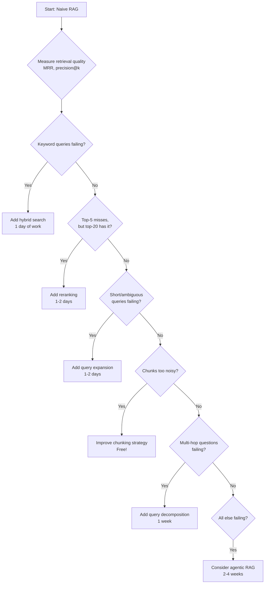

# Naive vs. Advanced RAG: When Complexity Actually Pays Off

> **TL;DR:** Most production RAG systems don't need advanced techniques. Start with naive RAG (embed → retrieve → generate), measure where it fails, then add complexity only where retrieval quality provably degrades. The 80/20 rule applies hard here: 80% of RAG quality comes from data quality and chunking strategy, not from HyDE or query decomposition. Advanced RAG adds 2–5× latency and 3–10× cost per query. Only ~15–20% of production use cases genuinely benefit.

You built a RAG prototype over a weekend. It works — mostly. Now you're reading about HyDE, agentic retrieval, graph RAG, and a dozen other techniques that promise to fix the 15% of queries that don't work. Before you reach for complexity, let's talk about when that complexity actually pays for itself.

---

## What Is Naive RAG?

Naive RAG is the straightforward pipeline:

1. **Chunk** your documents (fixed-size or recursive splitting)
2. **Embed** chunks using an embedding model
3. **Store** embeddings in a vector database
4. **Retrieve** top-k chunks via cosine similarity on query embedding
5. **Generate** answer by stuffing retrieved chunks into an LLM prompt

This is what 90% of tutorials teach and what most LangChain/LlamaIndex quickstarts produce. And for a surprising number of real-world use cases, it's all you need.

### Where Naive RAG Shines

- **Narrow domain, clean docs** — internal knowledge bases, product documentation, HR policies
- **Query-document language alignment** — users ask questions using the same terminology as the source docs
- **Factoid retrieval** — "What's our parental leave policy?" where a single chunk has the answer
- **Small-to-medium corpus** — under 100K documents where top-k retrieval stays relevant
- **Low-stakes applications** — where 85–90% accuracy is acceptable

### Where Naive RAG Falls Apart

| Failure Mode | Example | Why It Fails |
|---|---|---|
| **Vocabulary mismatch** | User asks "PTO" but docs say "paid time off" | Embedding similarity misses synonyms in domain jargon |
| **Multi-hop reasoning** | "Compare warranty for Model A vs Model B" | Answer spans multiple chunks that won't co-retrieve |
| **Temporal reasoning** | "What changed in last quarter's policy?" | No awareness of document recency |
| **Negation/specificity** | "What is NOT covered by insurance?" | Embeddings struggle with negation semantics |
| **Large result sets** | Corpus has 50 similar chunks; top-5 misses the best one | Flat cosine similarity can't distinguish fine-grained relevance |

If you're seeing these failures in your logs, *then* it's time to look at advanced techniques — not before.

---

## Advanced RAG Techniques (In the Order You Should Try Them)

### Tier 1: Low-Hanging Fruit

These are cheap, fast to implement, and almost always help. Add them first.

#### Reranking

After retrieving top-20–50 candidates via vector search, use a cross-encoder model to re-score and pick the true top-5. Think of it as the "are you sure?" step after your initial retrieval.

- **Models:** [Cohere Rerank](https://cohere.com/rerank) ($1/1K searches), Jina Reranker, `bge-reranker-v2`, ColBERT
- **Improvement:** +5–15% on retrieval precision in benchmarks (BEIR, MTEB)
- **Cost:** +50–200ms latency, +$1–3/1K queries for API-based rerankers
- **Add when:** Your top-5 chunks frequently miss the best answer but it exists in top-20
- **Skip when:** Your corpus is small enough (<10K docs) that top-5 is usually right

#### Hybrid Search (Vector + BM25/Keyword)

Combine dense vector similarity with sparse keyword matching. Vector search is great at understanding meaning; keyword search is great at finding exact terms. Together, they cover each other's blind spots.

- **Implementation:** Most vector DBs support this natively — Weaviate, Qdrant, Pinecone all offer hybrid modes
- **Improvement:** +5–20% on queries with specific terms, codes, acronyms, product names
- **Cost:** Minimal — just enable it in your vector DB config
- **Add when:** Users search for specific identifiers, error codes, product SKUs
- **Skip when:** Purely conversational queries on narrative text

### Tier 2: Moderate Complexity

#### Query Transformation

- **Query expansion:** LLM rewrites the user query into 2–3 variants, retrieve for each, merge results
- **Step-back prompting:** Ask the LLM to generate a more general query first
- **Cost:** +1 LLM call per query ($0.001–0.01 with GPT-4o-mini)
- **Improvement:** +5–10% for ambiguous or short queries
- **Add when:** Users frequently type terse, underspecified queries

#### Contextual Compression

After retrieval, use an LLM to extract only the relevant sentences from each chunk — trimming the fat before it reaches your generation model.

- **Cost:** +1 LLM call processing retrieved chunks
- **Add when:** Your chunks are large (>1000 tokens) and contain a lot of noise around the relevant info

### Tier 3: Significant Complexity

#### HyDE (Hypothetical Document Embeddings)

The LLM generates a hypothetical answer document, and you embed *that* instead of the query. The theory: a fake-but-plausible answer is semantically closer to real answer documents than the question itself.

- **Cost:** +1 LLM call per query + embedding call. Adds 500–2000ms latency.
- **Improvement:** Mixed results. +10–15% on some benchmarks, negligible on others.
- **Add when:** Massive semantic gap between how users ask and how docs are written (customer queries vs. technical manuals)
- **Skip when:** Most cases. Modern embedding models (text-embedding-3, Cohere v3) already handle this gap well.
- **Honest take:** HyDE was a breakthrough in 2023, but it's increasingly unnecessary with better embedding models. It lives in the "cool paper, rarely needed" category now.

#### Query Decomposition / Multi-Step Retrieval

Break complex queries into sub-queries, retrieve for each, then synthesize. Effective for comparative and analytical questions.

- **Cost:** N × (embedding + retrieval + optional rerank) where N = number of sub-queries. 2–5× total cost.
- **Add when:** Your application genuinely requires comparative analysis or multi-document synthesis
- **Skip when:** Most chatbots. Let the user ask follow-up questions instead.

### Tier 4: Maximum Complexity

#### Agentic RAG

An LLM agent decides what to retrieve, evaluates results, decides whether to retrieve more, and may use tools. It's RAG with a brain — and a brain that bills by the token.

- **Frameworks:** LlamaIndex agents, LangGraph, CrewAI
- **Cost:** 3–10× a naive RAG query (multiple LLM calls, multiple retrievals)
- **Latency:** 5–30 seconds per query
- **Add when:** Research-grade applications, complex analysis, when users expect GPT-level "thinking"
- **Skip when:** Most production chatbots where users expect sub-2-second responses

#### Graph RAG

Build a knowledge graph from documents, use graph traversal + vector search. Powerful for domains with rich entity relationships.

- **Cost:** Significant upfront investment in graph construction + ongoing maintenance
- **Add when:** Highly connected domains — legal precedents, medical literature, scientific papers
- **Skip when:** Your documents don't have meaningful entity relationships

---

## The Progression Path

Follow this order. Seriously — don't skip ahead.

**Critical insight:** At each step, re-measure. If your accuracy goes from 88% to 89% but latency doubles, it's probably not worth it.

---

## Does Advanced RAG Actually Help? The Honest Benchmarks

| Technique | Typical Improvement | When It Doesn't Help |
|---|---|---|
| Reranking | +5–15% precision@5 | Small, clean corpus with distinct topics |
| Hybrid search | +5–20% on keyword-heavy queries | Purely conversational domains |
| HyDE | +0–15% (highly variable) | When embedding model is already strong |
| Query decomposition | +10–25% on multi-hop | Single-fact lookups (the majority of queries) |
| Agentic RAG | +15–30% on complex tasks | Simple Q&A (massive overkill) |

Here's what those benchmark papers don't tell you: most of them use academic datasets with deliberately challenging multi-hop questions. In production:

- **~70%** of user queries are simple factoid lookups
- **~20%** are moderately complex but solvable with good chunking + reranking
- **~10%** genuinely need multi-step retrieval or agentic approaches

Optimizing for the 10% at the expense of the 90% is bad engineering.

---

## Chunking Strategies (The Real Lever)

Before investing in advanced retrieval, optimize your chunking. This is free and often has more impact than any Tier 2+ technique.

| Strategy | Best For | Chunk Size | Notes |
|---|---|---|---|
| **Fixed-size** (500–1000 tokens) | General purpose, fast to implement | 500–1000 tokens with 50–100 overlap | Good baseline, most tutorials use this |
| **Recursive character** | Structured text with natural boundaries | Splits on paragraphs → sentences → words | LangChain default, solid for most docs |
| **Semantic chunking** | Long-form narrative content | Variable (groups by topic shift) | Better quality but slower to process |
| **Document-aware** | PDFs, HTML with structure | Respects headers, tables, sections | Best for structured documents |
| **Late chunking** (Jina, 2024) | When you need full document context in embeddings | Embed full doc, then chunk the embedding | Preserves cross-chunk context; newer technique |

### What Actually Works

1. **Start with recursive character splitting at 512–1024 tokens, 10–20% overlap**
2. **Add metadata** (source, section title, document date) to every chunk
3. **Test with your actual queries** — run 50–100 real queries and check retrieval
4. **If structured docs:** Use document-aware chunking that respects headers/sections
5. **Semantic chunking** is worth it for long-form content (legal docs, research papers) but overkill for FAQs

---

## Embedding Model Selection

| Model | Dimensions | MTEB Score | Price/1M tokens | Best For |
|---|---|---|---|---|
| `text-embedding-3-small` | 1536 | ~62.3 | $0.02 | Cost-sensitive, high-volume |
| `text-embedding-3-large` | 3072 | ~64.6 | $0.13 | Quality-sensitive applications |
| Cohere `embed-v3` | 1024 | ~64.5 | $0.10 | Multilingual, strong reranking ecosystem |
| Voyage AI `voyage-3` | 1024 | ~67.1 | $0.06 | Best quality/price ratio |
| `nomic-embed-text-v1.5` | 768 | ~62.2 | Free (self-host) | Budget-conscious, privacy-sensitive |
| Jina `jina-embeddings-v3` | 1024 | ~65.5 | $0.02 | Multilingual, late chunking support |

**Opinionated take:** Start with `text-embedding-3-small` for prototyping. Move to [Voyage `voyage-3`](https://www.voyageai.com/) or [Cohere `embed-v3`](https://cohere.com/) for production if retrieval quality matters. The cost difference is negligible at scale — the quality difference is not.

---

## Gotchas

1. **Don't skip evaluation.** If you can't measure retrieval quality, you can't improve it. Build a test set of 50–100 query-answer pairs before optimizing anything. This is non-negotiable.
2. **Advanced RAG ≠ better RAG.** Every technique you add is a new failure mode, a new thing to debug, and more latency. Complexity has a cost beyond dollars.
3. **Garbage in, garbage out.** No amount of HyDE or reranking will fix poorly structured source documents. Fix your data first.
4. **Embedding lock-in is real.** Changing embedding models means re-embedding your entire corpus. Choose carefully upfront.
5. **Context window growth is eating RAG's lunch.** With 1M+ token context windows (Gemini, Claude), "just stuff everything in" is increasingly viable for smaller corpora. RAG still wins on cost and freshness, but the bar for "when you need RAG" is rising.

---

## Opinionated Recommendations

1. **For 80% of teams:** Naive RAG + hybrid search + reranking is your ceiling. Invest the saved engineering time in data quality.
2. **For the remaining 20%:** Query expansion + contextual compression before you touch agentic RAG.
3. **Never start with agentic RAG.** It's a debugging nightmare and your users will hate the latency.
4. **The best advanced RAG technique is better chunking.** It's free, it's fast, and it has the biggest impact.
5. **Measure before you optimize.** Always.

---

## Further Reading

- [LlamaIndex Documentation](https://docs.llamaindex.ai/) — Comprehensive RAG framework with advanced retrieval patterns and benchmarks
- [RAGAS Evaluation Framework](https://docs.ragas.io/) — The standard for measuring RAG quality (retrieval precision, answer faithfulness, relevance)
- [Anthropic's RAG Best Practices](https://docs.anthropic.com/) — Practical guidance from one of the frontier labs
- [Cohere Reranking](https://cohere.com/rerank) — Benchmarks and API docs for the most popular reranking service
- [MTEB Embedding Leaderboard](https://huggingface.co/spaces/mteb/leaderboard) — Compare embedding model quality across tasks and languages
