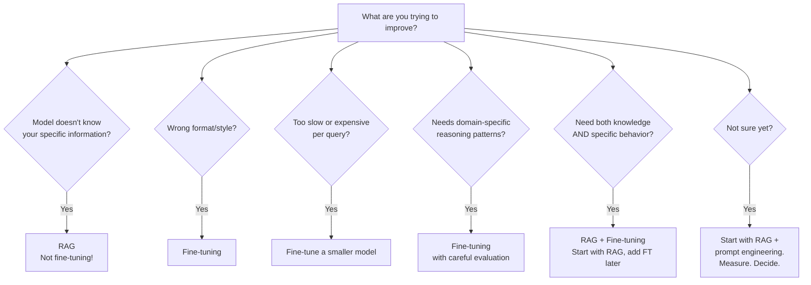

# RAG vs. Fine-Tuning: A Decision Framework

> **TL;DR:** RAG gives your model access to external knowledge at query time. Fine-tuning changes how your model behaves, writes, or reasons. They solve different problems. Most teams should start with RAG. Fine-tuning is for style/behavior/format adaptation, not knowledge injection. The most common mistake is fine-tuning when you should be using RAG — because fine-tuning *feels* more "AI" but costs 10–100× more for knowledge tasks. When you need both: RAG for knowledge, fine-tuning for behavior.

"Should we fine-tune or use RAG?" is the wrong question. It's like asking "should we use a database or an API?" — they do different things. But almost every team asks it, so let's build a framework for getting the answer right.

---

## The Core Distinction

| | RAG | Fine-Tuning |
|---|---|---|
| **What it changes** | What the model *knows* (at query time) | How the model *behaves* |
| **Knowledge freshness** | Always up-to-date (fetched live) | Frozen at training time |
| **Setup cost** | Low ($100–1K for pipeline) | Medium-High ($500–50K for training) |
| **Per-query cost** | Higher (embedding + retrieval + LLM) | Lower (just LLM inference, possibly cheaper model) |
| **Latency** | Higher (retrieval adds 100–500ms) | Lower (single model call) |
| **Hallucination risk** | Lower (grounded in retrieved docs) | Higher (may confabulate "learned" facts) |
| **Accuracy on knowledge tasks** | Higher (verifiable sources) | Lower (facts baked into weights unreliably) |
| **Accuracy on style/format tasks** | Lower (prompt engineering only) | Higher (learned behavior) |

Think of it this way: RAG is giving someone a reference book before asking them a question. Fine-tuning is teaching someone to think and write like a specialist. Both are useful — for completely different reasons.

---

## Decision Framework

### Use RAG When:

1. **Your knowledge base changes frequently.** Product docs, pricing, policies, news — anything that updates weekly or more.
2. **You need source attribution.** "Based on document X, section Y..." — only RAG can do this reliably.
3. **Accuracy on facts is critical.** Legal, medical, financial — where hallucination has consequences.
4. **Your corpus is large (>100 pages).** Fine-tuning can't reliably memorize large document sets.
5. **You need to support multiple knowledge domains.** Swap the retrieval corpus, same model.
6. **You want to start fast.** A basic RAG pipeline takes days; fine-tuning takes weeks to get right.

### Use Fine-Tuning When:

1. **You need consistent output format/style.** JSON schemas, specific writing tone, domain-specific language patterns.
2. **The model needs to "think" differently.** Medical reasoning, legal analysis, code in a specific framework.
3. **You have repetitive, pattern-based tasks.** Classification, extraction, structured output generation.
4. **Latency is critical.** Fine-tuned models skip the retrieval step.
5. **Per-query cost matters at massive scale.** Fine-tuned smaller models can replace larger models + RAG.
6. **You need the model to follow complex instructions consistently.** Fine-tuning on examples beats prompt engineering for complex behaviors.

### Use Both When:

1. **Domain-expert chatbot.** Fine-tune for medical/legal reasoning style + RAG for specific knowledge retrieval.
2. **Structured extraction from custom docs.** Fine-tune for extraction format + RAG for document retrieval.
3. **Customer support at scale.** Fine-tune a smaller model for your company's voice + RAG for product knowledge.

---

## Cost Comparison: Real Numbers

### Scenario: Internal Knowledge Bot (10K docs, 1K queries/day)

#### RAG Approach

| Cost Component | Monthly Cost |
|---|---|
| Embedding (one-time, amortized) | ~$2/mo |
| Vector DB ([Pinecone](https://www.pinecone.io/) Standard) | ~$50/mo minimum |
| Query embeddings | ~$0.30/mo |
| Reranking (optional, [Cohere](https://cohere.com/rerank)) | ~$30/mo |
| LLM (GPT-4o-mini, ~2K tokens/query) | ~$54/mo |
| **Total** | **~$135–165/mo** |

#### Fine-Tuning Approach

| Cost Component | Monthly Cost |
|---|---|
| Training (GPT-4o-mini, 1M tokens) | ~$3 per run (one-time) |
| Training (GPT-4.1, 1M tokens) | ~$25 per run (one-time) |
| Inference (fine-tuned GPT-4o-mini) | ~$27/mo |
| **Problem** | Knowledge not reliably encoded. Model may hallucinate facts. |
| **Total** | **~$27–30/mo** — but lower accuracy on knowledge tasks |

#### Hybrid Approach (Best of Both Worlds)

| Cost Component | Monthly Cost |
|---|---|
| RAG pipeline (minus expensive LLM) | ~$85/mo |
| Fine-tuned GPT-4o-mini inference | ~$27/mo |
| Training (amortized) | ~$3–5/mo |
| **Total** | **~$115–120/mo** with the best quality |

### Scenario: High-Volume Classification (100K docs/day)

| Approach | Monthly Cost | Accuracy |
|---|---|---|
| GPT-4o + RAG | ~$6,000/mo | ~95% |
| GPT-4o-mini + RAG | ~$900/mo | ~90% |
| Fine-tuned GPT-4o-mini (no RAG) | ~$300/mo | ~93% (after good training) |
| Fine-tuned GPT-4.1-nano (no RAG) | ~$80/mo | ~88% |

**Key insight:** For classification and extraction tasks, fine-tuning a smaller model often beats RAG + big model on both cost *and* latency, while matching accuracy. This is the sweet spot for fine-tuning.

---

## Fine-Tuning Cost Reality Check

### Training Costs (OpenAI)

| Model | Training Cost/1M tokens | Typical Training Set | Total Training Cost |
|---|---|---|---|
| GPT-4.1-nano | $1.50 | 500K–2M tokens | $0.75–3.00 |
| GPT-4o-mini | $3.00 | 500K–2M tokens | $1.50–6.00 |
| GPT-4.1-mini | $5.00 | 500K–2M tokens | $2.50–10.00 |
| GPT-4.1 | $25.00 | 500K–2M tokens | $12.50–50.00 |
| GPT-4o | $25.00 | 500K–2M tokens | $12.50–50.00 |

Inference costs for fine-tuned models run at **1.5× the base model rate** (except with data sharing enabled, which cuts it in half).

**Anthropic fine-tuning** is available through Amazon Bedrock at ~$20–30/1M training tokens, with a minimum of ~1K examples recommended.

### The Hidden Costs Nobody Budgets For

1. **Data preparation:** 40–60% of total project cost. Cleaning, formatting, creating training examples. This is where the real work lives.
2. **Iteration:** You rarely nail it on the first run. Budget for 3–5 training iterations.
3. **Evaluation:** Building eval suites to know if your fine-tune actually improved things.
4. **Maintenance:** Models degrade as your domain changes. Plan to re-train quarterly.
5. **Expertise:** Someone on your team needs to understand ML evaluation, not just API calls.

---

## Common Mistakes (And How to Avoid Them)

### Mistake 1: Fine-Tuning for Knowledge

*"We want the model to know our product documentation."*

LLMs don't reliably memorize facts through fine-tuning. They'll learn the *style* of your docs but confabulate specific details — pricing, dates, feature names. You end up with a model that *sounds* authoritative but is frequently wrong. The confident wrongness is worse than a model that says "I don't know."

**The fix:** RAG. Always RAG for factual knowledge.

### Mistake 2: RAG for Style/Behavior

*"We want the model to always respond in our brand voice and use specific formatting."*

You can't reliably control output format with retrieval alone. You'll spend forever tweaking system prompts, adding "IMPORTANT: always respond in JSON" in seventeen places, and still get inconsistent results.

**The fix:** Fine-tune for style. Even 200–500 examples of your desired input/output format will dramatically improve consistency.

### Mistake 3: Starting with Fine-Tuning

*"We're building an AI assistant, let's fine-tune a model."*

Fine-tuning is expensive to iterate on. You spend weeks preparing data, training, evaluating — only to discover RAG would have gotten you 90% there in 2 days.

**The fix:** Always start with RAG + prompt engineering. Only fine-tune after you've proven the task needs it and you have clear eval metrics.

### Mistake 4: Ignoring the "Good Enough" Threshold

*"RAG gets us to 88% accuracy, let's fine-tune to get to 95%."*

That 7% improvement may cost $20K+ in data prep, training, and maintenance — and may only last until the model provider updates their base model. Is 88% actually good enough for your use case? Often, it is.

### Mistake 5: Not Evaluating Properly

Both RAG and fine-tuning need evaluation frameworks. Without them, you're flying blind.

- **RAG evaluation:** Use [RAGAS](https://docs.ragas.io/), TruLens, or similar. Measure retrieval precision, answer faithfulness, answer relevance.
- **Fine-tuning evaluation:** Hold out a test set. Measure before and after training. Use human evaluation for subjective quality.

---

## Decision Tree

---

## Gotchas

1. **Context window growth changes the calculus.** With 1M+ token windows, you can stuff a lot of knowledge into the prompt without RAG. For small corpora (<50 pages), "just put it in the system prompt" is increasingly viable and cheaper than maintaining a RAG pipeline.
2. **Fine-tuning doesn't remove the need for guardrails.** Fine-tuned models can still hallucinate, especially on edge cases outside the training distribution.
3. **RAG quality is bounded by retrieval quality.** If your retriever can't find the right documents, the LLM can't generate a good answer. Invest in retrieval before generation.
4. **Model provider updates can break your fine-tune.** When OpenAI deprecates a base model, your fine-tuned checkpoint may need retraining.
5. **The best approach changes as models improve.** GPT-5-nano at $0.05/1M input may make some fine-tuning use cases obsolete by being cheap enough to use directly.

---

## Opinionated Recommendations

1. **Default to RAG.** It's faster to build, easier to debug, and handles knowledge tasks better.
2. **Fine-tune only with evidence.** Don't fine-tune because it feels like the "AI" thing to do. Fine-tune because you've measured that prompt engineering can't achieve the behavior you need.
3. **The hybrid approach is underrated.** Fine-tuned GPT-4o-mini + RAG often beats vanilla GPT-4o + RAG at lower cost.
4. **Invest in data quality over model complexity.** Whether RAG or fine-tuning, clean data beats clever architecture every time.
5. **Build evaluation first.** If you can't measure improvement, you can't make the RAG vs. fine-tuning decision rationally.

---

## Further Reading

- [OpenAI Fine-Tuning Guide](https://platform.openai.com/docs/guides/fine-tuning) — Official documentation with pricing, best practices, and example datasets
- [OpenAI API Pricing](https://platform.openai.com/docs/pricing) — Current pricing for base and fine-tuned model inference
- [Anthropic Fine-Tuning via Bedrock](https://docs.aws.amazon.com/bedrock/latest/userguide/) — How to fine-tune Claude models through AWS
- [RAGAS Evaluation Framework](https://docs.ragas.io/) — The standard for measuring RAG pipeline quality end-to-end
