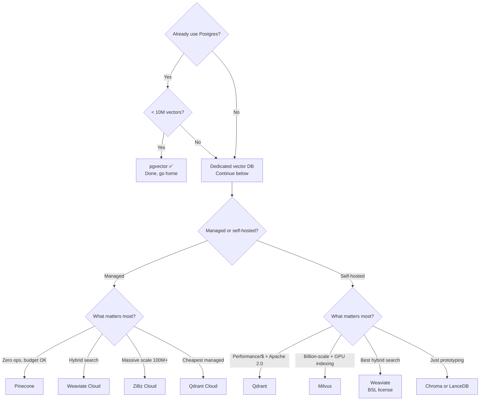

# Vector Database Comparison: An Architect's Guide

> **TL;DR:** Start with pgvector if you're already on Postgres and have <1M vectors. Move to Qdrant (self-hosted) or Pinecone (managed) when you outgrow it. Pinecone is the easiest managed option but the most expensive at scale. Weaviate has the best hybrid search. Qdrant has the best price/performance for self-hosted. Milvus/Zilliz for massive scale (100M+ vectors). Chroma and LanceDB for prototyping only.

Every team building RAG eventually asks: "which vector database?" The honest answer is that it matters less than you think — until it matters a lot. At 50K vectors, they're all fine. At 50M vectors with sub-50ms latency requirements, the choice is load-bearing.

Here's how to think about it without getting lost in feature matrices.

---

## Quick Comparison

| Feature | Pinecone | Weaviate | Qdrant | Milvus/Zilliz | pgvector | Chroma | LanceDB |
|---|---|---|---|---|---|---|---|
| **Type** | Managed only | Managed + self-hosted | Managed + self-hosted | Managed + self-hosted | Postgres extension | Embedded/server | Embedded |
| **Min monthly cost** | $0 (starter) / $50 (standard) | $0 (sandbox) / ~$25+ | $0 (1GB free) | $0 (self-host) / ~$65 (Zilliz) | Cost of your Postgres | Free | Free |
| **Cost at 10M vectors (1536d)** | ~$70–150/mo | ~$100–200/mo | ~$50–100/mo (cloud) | ~$65–150/mo (Zilliz) | ~$50–100/mo (RDS) | Free (self-host) | Free (self-host) |
| **Cost at 100M vectors** | ~$500–2000/mo | ~$500–1500/mo | ~$200–600/mo (self-host) | ~$300–800/mo (Zilliz) | Struggles | Not designed for this | Not designed for this |
| **Hybrid search** | Yes (keyword + vector) | Best-in-class (BM25 + vector) | Yes (sparse + dense) | Yes | Limited (with `tsvector`) | No | No |
| **Filtering** | Excellent | Excellent | Excellent | Excellent | SQL (best flexibility) | Basic | Basic |
| **Max vectors** | Billions (serverless) | Billions | Billions | Billions | ~10–50M practical | ~1–5M | ~1–10M |
| **Latency (p99, 1M vectors)** | <50ms | <100ms | <50ms | <100ms | 50–500ms | <50ms (in-process) | <50ms (in-process) |
| **Multi-tenancy** | Namespaces | Native (excellent) | Collections + payload filtering | Partitions | Schemas/row-level security | Collections | Tables |

---

## Detailed Breakdown

### Pinecone — "It Just Works"

The fully-managed option that abstracts away everything. You get an API endpoint, you send vectors, you query them. No clusters to manage, no knobs to tune.

**Pricing:**
- **Starter (Free):** 5 indexes, 2 GB storage, 2M write units/mo, 1M read units/mo
- **Standard:** $50/mo minimum, pay-as-you-go beyond — storage at $0.33/GB/month, reads at $8.25/million RUs, writes at $2.00/million WUs
- **Enterprise:** $500/mo minimum, same usage-based pricing + SLA, private networking, CMEK
- **Pods (legacy):** s1/p1/p2 pod types starting ~$70/mo. Being phased out in favor of serverless.

**Why choose it:** Zero operational overhead. Best developer experience and documentation. Scales to billions without you thinking about infrastructure. Good metadata filtering, namespace isolation.

**Watch out for:**
- Read unit costs surprise people. A single query can consume 5–50 RUs depending on top-k and metadata filtering. At 10K queries/day with top-10 retrieval, expect ~$15–50/mo just in read units.
- No self-hosted option — your data lives in Pinecone's cloud.
- Vendor lock-in is real. Migrating away means re-indexing everything.
- Serverless cold starts on infrequently accessed indexes.
- Their "keyword" search is not true BM25.

**Best for:** Teams that want zero ops, have budget for managed services, and are building on AWS/GCP/Azure.

---

### Weaviate — Best Hybrid Search, Strong Multi-Tenancy

The Swiss Army knife of vector databases. Does more out of the box than any competitor — hybrid search, built-in vectorizers, multi-modal support — but that breadth comes with operational weight.

**Pricing:**
- **Serverless Cloud:** Starting ~$0.095/million vector dimensions stored/month. Sandbox is free but limited and expires.
- **Dedicated Cloud:** Custom pricing, starts around $200–500/mo for production clusters
- **Self-hosted:** Free (BSL license since 2023 — read the license carefully)

**Why choose it:** Best-in-class hybrid search with true BM25 + vector fusion and a configurable alpha parameter. Excellent native multi-tenancy with hot/warm/cold storage tiers. Flexible GraphQL API. Built-in vectorizers, rerankers, and generative modules. Strong multi-modal support.

**Watch out for:**
- BSL license means you can self-host, but you can't offer Weaviate *as a service* to others.
- More resource-hungry than Qdrant for the same dataset.
- Cloud pricing is confusing — "per million vector dimensions" means 1M vectors × 1536 dims = 1.536 billion vector dimensions. Do the math carefully.
- Non-trivial to tune for self-hosted; Kubernetes recommended.

**Best for:** Applications needing strong hybrid search, multi-tenant SaaS products, teams already in the Weaviate ecosystem.

---

### Qdrant — Best Price/Performance, Truly Open Source

If you want to self-host and you care about performance per dollar, Qdrant is probably your answer. Written in Rust, Apache 2.0 licensed, and consistently tops ANN benchmarks.

**Pricing:**
- **Cloud (Free):** 1 GB cluster, no credit card
- **Cloud (Pay-as-you-go):** Based on CPU, memory, disk. Starts ~$0.014/hour for small clusters (~$10/mo). Typical 4 GB RAM cluster: ~$25–50/mo.
- **Self-hosted:** Free and fully open source (Apache 2.0)
- **Hybrid Cloud:** $0.014/hr base + infrastructure costs

**Why choose it:** Truly open source with no license gotchas. Rust-based and extremely fast — consistently tops ANN benchmarks. Excellent binary quantization with rescoring gives 32× storage reduction at ~96% accuracy. Clean REST and gRPC APIs. Low memory footprint with efficient disk-backed indexes. Native sparse vector support for hybrid search.

**Watch out for:**
- Cloud offering is newer and less polished than Pinecone's.
- Managed cloud is resource-based pricing (CPU/RAM/disk), not usage-based — you pay for capacity, not queries.
- Horizontal scaling is manual for self-hosted (you manage sharding).
- Smaller ecosystem than Pinecone/Weaviate.

**Best for:** Self-hosted production deployments, cost-conscious teams who can manage infrastructure, performance-critical applications, anyone who cares about Apache 2.0.

---

### Milvus / Zilliz Cloud — Built for Massive Scale

If you're dealing with hundreds of millions or billions of vectors, Milvus is purpose-built for that world. It separates storage and compute, supports GPU-accelerated indexing, and has been doing this since 2019.

**Pricing:**
- **Milvus (self-hosted):** Free, open source (Apache 2.0)
- **Zilliz Cloud:** Free tier (1 collection, 1M vectors). Serverless starting ~$0.15/million vector queries. Dedicated starting ~$65/mo. Enterprise: custom.

**Why choose it:** Designed for billion-scale with separation of storage and compute. Fastest indexing for large datasets via GPU acceleration. Multiple index types (IVF, HNSW, DiskANN, GPU indexes). One of the oldest purpose-built vector databases.

**Watch out for:**
- Operationally complex for self-hosted — requires etcd, MinIO/S3, Pulsar/Kafka. Not a single binary.
- Milvus Lite exists for dev/test but isn't production-grade.
- Zilliz Cloud pricing can be opaque — use the calculator, but expect real costs to depend on usage patterns.

**Best for:** Large-scale deployments (100M+ vectors), teams needing GPU-accelerated search, organizations already in the Milvus ecosystem.

---

### pgvector — "Just Use Postgres"

If you already run Postgres, pgvector lets you add vector search without introducing a single new piece of infrastructure. That simplicity is its superpower.

**Pricing:**
- **Self-hosted:** Cost of your Postgres server
- **AWS RDS:** db.r6g.large (~$175/mo) handles ~5–10M vectors at 1536 dimensions
- **Supabase:** Free tier includes pgvector; Pro at $25/mo
- **Neon:** Free tier includes pgvector; paid starts at $19/mo

**Why choose it:** You already have Postgres — no new infrastructure, no new vendor, no new operational burden. SQL is your query language, so you can JOIN vector search results with your application data (this is a genuine superpower). ACID transactions keep vectors and metadata consistent. Every ORM, migration tool, and monitoring solution works. HNSW and IVFFlat indexes provide decent performance. Version 0.8+ brought significant improvements including parallel index building and quantization support.

**Watch out for:**
- Performance degrades beyond ~10–20M vectors with HNSW. Query latency climbs; you'll need to shard or move to a dedicated vector DB.
- Memory-hungry for HNSW — 10M vectors × 1536d ≈ 60 GB RAM for the index alone.
- No native hybrid search. You can combine `tsvector` with pgvector, but it's not as elegant as Weaviate's fusion.
- Index build time is slow — HNSW on 10M vectors can take hours.
- Missing vector-specific features: limited native quantization (pre-0.8), no native sparse vectors.

**The "Just Use Postgres" decision:**

| Use pgvector when... | Move to a dedicated vector DB when... |
|---|---|
| You have <10M vectors | You exceed 10–20M vectors |
| You need JOINs with relational data | You need <20ms p99 latency |
| You already run Postgres | You need advanced quantization or hybrid search |
| You want to minimize infrastructure | Vector search is a core product feature |
| Your latency requirement is >50ms | |

---

### Chroma — The SQLite of Vector Databases

`pip install chromadb` and you're running. That's the pitch, and it delivers.

- **Pricing:** Free, open source (Apache 2.0). Cloud version in preview/early access.
- **Why choose it:** Simplest possible setup. Embedded mode runs in-process. Good Python API. Zero to working RAG in 5 minutes.
- **Watch out for:** Single-node only, limited to a few million vectors. No horizontal scaling — if you outgrow a single machine, you're migrating. No hybrid search, basic filtering. Earlier versions had persistence bugs.
- **Best for:** Prototyping, local development, small-scale apps (<1M vectors), educational projects.

---

### LanceDB — Embedded, Columnar, Surprisingly Capable

The newest entrant, built on the Lance columnar format. Interesting for data science workflows and multi-modal applications.

- **Pricing:** Free, open source (Apache 2.0). Cloud in early access.
- **Why choose it:** Columnar format for efficient storage and fast scans. Zero-copy reads for analytical queries. Embedded mode, no server. Multi-modal (stores images, text, embeddings natively). Integrates with Arrow/Parquet ecosystem.
- **Watch out for:** Young project — API stability still maturing. Smaller community. Limited managed offering. ANN performance is good but not best-in-class.
- **Best for:** Data science workflows, multi-modal applications, embedded use cases, teams that want a modern data format.

---

## Decision Flowchart

**Special cases:**
- Multi-modal (images + text)? → Weaviate or LanceDB
- Multi-tenant SaaS? → Weaviate (best native multi-tenancy)
- Edge/embedded deployment? → LanceDB or Chroma

---

## Cost Comparison at Scale

### 10M Vectors, 1536 Dimensions (~60 GB raw)

| Provider | Monthly Cost | Notes |
|---|---|---|
| Pinecone Serverless | ~$70–150 | Depends on query volume (RU-based) |
| Weaviate Cloud | ~$100–200 | Depends on compression and tier |
| Qdrant Cloud | ~$50–100 | Resource-based (CPU/RAM) |
| Zilliz Cloud | ~$65–150 | Serverless or dedicated |
| pgvector (RDS) | ~$175 | But you already pay for Postgres |
| Qdrant self-hosted | ~$30–60 | 8 GB RAM VM on any cloud |
| Chroma self-hosted | ~$30–60 | Single VM, scaling limited |

### 100M Vectors, 1536 Dimensions (~600 GB raw)

| Provider | Monthly Cost | Notes |
|---|---|---|
| Pinecone Serverless | ~$500–2000 | Storage + heavy RU consumption |
| Weaviate Cloud | ~$500–1500 | Dedicated cluster recommended |
| Qdrant Cloud | ~$200–500 | Need larger cluster |
| Zilliz Cloud | ~$300–800 | Dedicated tier |
| Qdrant self-hosted | ~$150–400 | 64–128 GB RAM, quantization critical |
| Milvus self-hosted | ~$200–500 | Multi-node with DiskANN |
| pgvector | **Not recommended** | Performance degrades significantly |

---

## Gotchas

1. **Pricing calculators lie.** They show best-case scenarios. Your actual bill depends on query patterns, metadata filtering complexity, and update frequency.
2. **Migration is painful.** There's no standard vector DB format. Switching means re-embedding or writing custom export/import scripts. Choose carefully.
3. **Quantization is not optional at scale.** Without binary or product quantization, storage costs dominate. Plan for it from day one.
4. **Embedding dimension matters more than you think.** 3072-dim embeddings cost 2× the storage of 1536-dim. Consider `text-embedding-3-small` (1536d) before reaching for `text-embedding-3-large` (3072d).
5. **Backup and disaster recovery.** Not all managed services include backups in their base pricing. Ask about it before you need it.
6. **Monitoring blind spots.** Most vector DBs have weaker observability than traditional databases. Plan for custom monitoring dashboards.

---

## Opinionated Recommendations

1. **Startup (prototyping):** pgvector or Chroma. Don't overthink it.
2. **Startup (production):** pgvector if <5M vectors. Pinecone Standard if you want zero ops. Qdrant Cloud if cost-sensitive.
3. **Growth stage:** Qdrant (self-hosted or cloud) for best price/performance. Weaviate if hybrid search is critical.
4. **Enterprise:** Pinecone Enterprise or Zilliz Enterprise for support/SLAs. Qdrant/Milvus self-hosted if you have an infra team.
5. **The sleeper pick:** pgvector on [Supabase](https://supabase.com/) or [Neon](https://neon.tech/) for teams who just want vectors alongside their app data.

---

## Further Reading

- [Pinecone Documentation](https://www.pinecone.io/pricing/) — Pricing details and serverless architecture docs
- [Weaviate Cloud Pricing](https://weaviate.io/blog/weaviate-cloud-pricing-update) — Detailed breakdown of their dimension-based pricing model
- [Qdrant Cloud](https://qdrant.tech/pricing/) — Pricing and self-hosted deployment guides
- [Zilliz / Milvus](https://zilliz.com/pricing) — Managed Milvus pricing and scale benchmarks
- [ANN Benchmarks](https://ann-benchmarks.com/) — Independent performance comparisons across vector search engines
- [pgvector Changelog](https://github.com/pgvector/pgvector/blob/master/CHANGELOG.md) — Track the rapid improvements in Postgres vector support
