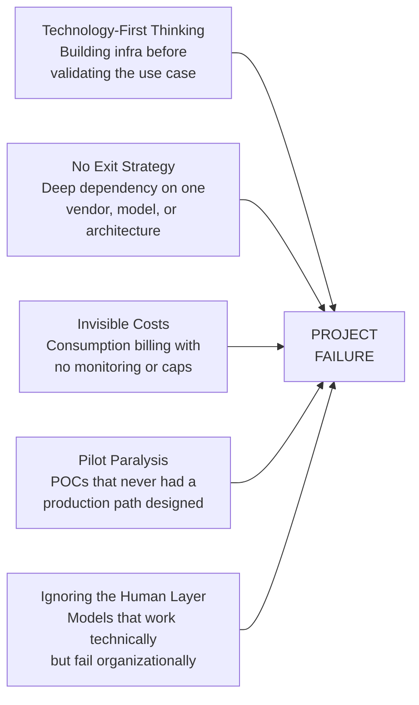

# Real-World AI Infrastructure Failures

The graveyard of AI projects is filled with beautiful architectures that never served a single user. These are real failures from real companies — not hypotheticals, not thought exercises. They cost real money, and the lessons are painful.

---

**TL;DR:** 95% of enterprise AI pilots fail. 42% of companies scrapped most of their AI initiatives in 2025. The pattern is always the same: technology-first thinking, invisible costs, and nobody planning for production. The companies that win start with a specific business problem, not a shiny architecture diagram.

---

## The 95% Failure Rate

MIT's NANDA initiative surveyed 150 leaders, 350 employees, and analyzed 300 public AI deployments. Their finding: **only 5% of enterprise generative AI pilots achieve rapid revenue acceleration**. The other 95% stall, delivering "little to no measurable impact on P&L."

The root cause is almost comically predictable. Companies pour over half their GenAI budgets into sales and marketing tools, but MIT found the biggest ROI was in **back-office automation** — eliminating BPO, cutting agency costs, streamlining operations. Everyone's building chatbots; nobody's automating invoice processing.

Here's the finding that should sting: companies that *purchased* AI tools from specialized vendors succeeded ~67% of the time. Companies that built internally succeeded only about one-third as often. The "build vs. buy" instinct in engineering culture is actively destroying AI ROI.

**Cost**: Hundreds of billions industry-wide in failed pilots.

> [MIT NANDA Report, 2025](https://nanda.media.mit.edu) · [Fortune](https://fortune.com/2025/08/18/mit-report-95-percent-generative-ai-pilots-at-companies-failing-cfo/)

---

## The Great Abandonment

S&P Global Market Intelligence's 2025 survey of 1,000+ enterprises across North America and Europe found that **42% of companies abandoned most of their AI initiatives in 2025** — up from 17% in 2024. The average organization scrapped **46% of AI proof-of-concepts** before they reached production.

The stated reasons were cost overruns, data privacy concerns, and security risks. But the deeper pattern was "pilot paralysis" — teams launched POCs in safe sandboxes but never designed a path to production. Integration challenges (auth, compliance, real-user training) were ignored until leadership asked for a go-live date.

RAND's analysis confirms the broader picture: [over 80% of AI projects fail](https://www.rand.org/pubs/research_reports/RRA2680-1.html) — twice the failure rate of non-AI technology projects.

**Cost**: Millions per enterprise in abandoned POCs, plus the opportunity cost of teams working on dead-end projects for months.

> [S&P Global / CIO Dive](https://www.ciodive.com/news/AI-project-fail-data-SPGlobal/742590/) · [WorkOS](https://workos.com/blog/why-most-enterprise-ai-projects-fail-patterns-that-work)

---

## The $42,600 Azure Surprise

Meridian Healthcare, a mid-sized healthcare provider, saw their monthly Azure bill **jump from $14,000 to $42,600 in February 2025** — a 3× increase with no warning.

AI-related services were scaling in ways the team didn't anticipate or monitor. Consumption-based billing meant costs grew silently until someone checked the invoice.

This is the thing about AI costs: they don't scale linearly with usage. Token costs, embedding regeneration, vector DB scaling, and GPU autoscaling can create compounding cost spikes. Without billing alerts and cost caps, you're flying blind.

**Cost**: ~$28,600 in unexpected charges in a single month. Likely more before they caught it.

> [MarkAICode, March 2025](https://markaicode.com/azure-cost-increase-2025/)

---

## The Shadow AI Epidemic

[WorkOS's analysis](https://workos.com/blog/why-most-enterprise-ai-projects-fail-patterns-that-work) of enterprise deployments consistently found a pattern: **duplicate vector databases, orphaned GPU clusters, and partially assembled MLOps stacks** created by enthusiastic teams without central coordination. Cloud billing reports revealed parallel AI infrastructures across departments, each solving the same problem differently.

As [CIO Dive reported](https://www.ciodive.com/news/generative-ai-drives-unmanageable-cloud-cost-finops/729126/): "Consumption-based billing just makes it easier to have rogue IT — departments can just put it on their purchasing card and off they go."

Organizations typically discover 3–5 separate AI initiatives doing overlapping work, with combined spend 2–4× what a coordinated effort would cost. A 2025 study found [**85% of companies miss their AI cost forecasts by more than 10%**](https://www.prnewswire.com/news-releases/2025-state-of-ai-cost-management-research-finds-85-of-companies-miss-ai-forecasts-by-10-302551947.html), often because of untracked shadow AI spend.

---

## The Gemini API Billing Spike

A developer [reported an "unexpected and large billing increase"](https://discuss.ai.google.dev/t/unexpected-billing-spike-for-gemini-api-2025-10-15-to-2025-10-18-request-logs-billing-review-requested/107972) for the Gemini API over just three days (October 15–18, 2025). They opened a billing support case and posted publicly on Google's developer forum, unable to explain the charges.

The root cause? Unclear — which is exactly the problem. AI API billing is opaque. Token counting is approximate. Retries on errors generate duplicate charges. Embedding regeneration on index updates multiplies costs. Without granular logging, you can't even *explain* your own bill.

**The lesson**: If you're using AI APIs in production, you need:
1. Per-request cost logging
2. Daily cost alerts
3. Hard spending caps
4. Circuit breakers that stop calls when costs exceed thresholds

---

## The $50M Success (And What It Teaches About Failure)

While most AI projects fail, Lumen Technologies projected [**$50 million in annual savings**](https://www.microsoft.com/en/customers/story/1771760434465986810-lumen-microsoft-copilot-telecommunications-en-united-states) from AI tools that save their sales team four hours per week per person. Air India's AI assistant handles **97% of 4 million+ customer queries** with full automation.

Why include successes in a failure article? Because they show what the failures are leaving on the table. Both share one pattern: they started with a **specific, measurable business problem** — not with "let's deploy AI and see what happens."

The 95% that fail typically start with the technology ("We need a RAG pipeline!") rather than the problem ("Our sales team wastes 4 hours/day on research"). The infrastructure comes first; the use case comes second. It never works.

---

## The Contact Center Graveyard

WorkOS documented a recurring pattern: **contact center AI summarization tools with 90%+ accuracy scores gather dust** because supervisors don't trust auto-generated notes and instruct agents to continue typing manually.

Engineering teams spent quarters optimizing F1-scores while integration tasks sat in the backlog. When initiatives finally surfaced for business review, the compliance requirements looked insurmountable, the training was nonexistent, and the business case was theoretical.

Technical accuracy is necessary but not sufficient. Change management, user trust, and workflow integration are harder problems than model performance — and they get zero engineering attention.

**Cost**: Typically $500K–2M+ in development costs for tools that nobody uses.

> [WorkOS, July 2025](https://workos.com/blog/why-most-enterprise-ai-projects-fail-patterns-that-work)

---

## CoreWeave: The GPU Bet

CoreWeave, the AI cloud infrastructure provider, accumulated [**$12.9 billion in debt in just two years**](https://www.reuters.com/markets/deals/cloud-firm-coreweave-files-us-ipo-2025-03-03/), betting big on GPU capacity. Their March 2025 IPO targeted a $35 billion valuation but was forced to slash expectations to $23 billion when market reality set in.

The entire AI infrastructure market bet on exponential demand growth. But as models got more efficient — quantization, distillation, better architectures — the GPU-hours-per-task dropped. The demand materialized, but not at the prices and margins the infrastructure buildout assumed.

**The lesson for your team**: If even billion-dollar GPU providers can over-invest in capacity, you should be deeply skeptical of "we need to reserve GPUs now before they're gone" arguments. The scarcity narrative benefits GPU sellers, not GPU buyers.

**Cost**: $12.9 billion in debt, $12 billion in valuation haircut.

> [Development Corporate, Nov 2025](https://developmentcorporate.com/saas/the-ai-infrastructure-bubble-4-surprising-reasons-the-90-billion-data-center-boom-could-end-in-a-bust/)

---

## The Meta-Pattern

Every failure above shares one or more of these root causes:

The companies that succeed do the opposite: start with pain, build the minimum viable AI, measure obsessively, and plan for change.

---

## Further Reading

- [MIT NANDA Report](https://nanda.media.mit.edu) — The definitive 2025 study on why enterprise AI pilots fail, with data from 300+ deployments.
- [Why Most Enterprise AI Projects Fail](https://workos.com/blog/why-most-enterprise-ai-projects-fail-patterns-that-work) — WorkOS's pattern analysis of what separates the 5% that succeed.
- [RAND: Why AI Projects Fail](https://www.rand.org/pubs/research_reports/RRA2680-1.html) — RAND Corporation's research on AI project failure rates vs. traditional IT projects.
- [S&P Global AI Survey](https://www.ciodive.com/news/AI-project-fail-data-SPGlobal/742590/) — The 2025 enterprise survey showing 42% abandonment rates, via CIO Dive.
- [2025 State of AI Cost Management](https://www.prnewswire.com/news-releases/2025-state-of-ai-cost-management-research-finds-85-of-companies-miss-ai-forecasts-by-10-302551947.html) — Why 85% of companies miss their AI cost forecasts.
- [The AI Infrastructure Bubble](https://developmentcorporate.com/saas/the-ai-infrastructure-bubble-4-surprising-reasons-the-90-billion-data-center-boom-could-end-in-a-bust/) — A look at whether the GPU buildout has overshot actual demand.
